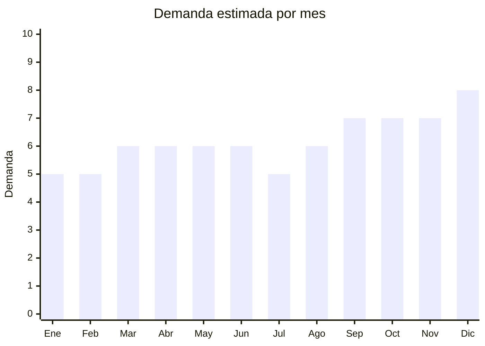

# Felpudos de entrada

> **Capítulo NCM 57** — Alfombras y demás revestimientos textiles para el suelo | **Temporada:** Atemporal

## Qué es y por qué importarlo

Los felpudos de entrada incluyen felpudos de fibra de coco con base de goma (el más clásico), felpudos de PVC con diseño, felpudos antideslizantes de fibra sintética y felpudos personalizables con frases o logos. Formatos estándar: 60x40cm y 75x45cm. Producto de compra para el hogar con demanda constante.

## Datos clave

| Dato | Valor |
|------|-------|
| **Posiciones NCM típicas** | 5703.20.00 (alfombras de nylon), 5703.30.00 (fibras sintéticas), 5702.42.00 (fibra de coco) |
| **Derecho de importación** | 20% (DIE) + 3% tasa estadística |
| **Rango FOB típico** | USD 1.00 — USD 5.00 por unidad |
| **Precio de venta en Argentina** | ARS 5.000 — ARS 18.000 |
| **Margen bruto estimado** | 150% — 300% |
| **MOQ típico** | 100 — 500 unidades |
| **Demanda en MercadoLibre** | Alta (10,300+ resultados) |
| **Competencia en MercadoLibre** | Media |
| **Dificultad para importar** | Fácil |
| **Certificaciones necesarias** | Etiquetado básico |
| **Antidumping** | No |

## Variantes y subtipos más comunes

| Subtipo / Variante | FOB aprox. | Venta AR aprox. | Nota |
|--------------------|-----------|-----------------|------|
| Felpudo fibra de coco 60x40cm | USD 1.50 — 3.00 | ARS 5.000 — 12.000 | **Clásico** |
| Felpudo PVC con diseño 60x40cm | USD 1.00 — 3.00 | ARS 4.000 — 10.000 | Decorativo |
| Felpudo antideslizante cocina 120x45cm | USD 2.00 — 5.00 | ARS 6.000 — 15.000 | Cocina |
| Felpudo frase/mensaje personalizable | USD 1.50 — 4.00 | ARS 5.000 — 15.000 | Tendencia |
| Felpudo exterior resistente agua 75x45cm | USD 2.00 — 5.00 | ARS 6.000 — 18.000 | Exteriores |

## Regulaciones y requisitos

<Tabs>
  <Tab title="Certificaciones">
    Sin certificaciones especiales. Felpudos de coco natural podrían tener inspección SENASA fitosanitaria (fibra natural).
  </Tab>
  <Tab title="Etiquetado">
    Composición, tamaño, país de origen, datos importador.
  </Tab>
  <Tab title="Restricciones">
    Sin restricciones generales. Felpudos de fibra de coco: posible SENASA.
  </Tab>
</Tabs>

## Logística

| Dato | Valor |
|------|-------|
| **Peso típico por unidad** | 0.50 — 2.00 kg |
| **Volumen típico** | Medio (no se comprimen, base de goma rígida) |
| **Fragilidad** | Baja |
| **Envío recomendado** | Marítimo LCL |
| **Tiempo total estimado** | 50 — 80 días (marítimo) |

## Estacionalidad



| Aspecto | Detalle |
|---------|---------|
| **Meses pico** | Septiembre-Diciembre (renovación hogar, mudanzas, regalos) |

## Ventajas y riesgos

<CardGroup cols={2}>
  <Card title="Ventajas" icon="circle-check">
    - Demanda constante
    - Producto de decoración funcional
    - Personalizable (frases, logos)
    - Sin regulaciones complejas
  </Card>
  <Card title="Riesgos" icon="triangle-exclamation">
    - Base de goma puede ser pesada
    - Felpudos de coco: posible SENASA
    - Competencia con marcas locales
    - Voluminoso para su valor
  </Card>
</CardGroup>

## Palabras clave para buscar en Alibaba

```
doormat wholesale, coir doormat, PVC door mat, entrance mat rubber,
custom doormat, welcome mat wholesale, kitchen floor mat
```

## Fuentes

- [MercadoLibre Argentina — Felpudos](https://listado.mercadolibre.com.ar/felpudo)
- [Alibaba — Doormat wholesale](https://www.alibaba.com/showroom/doormat-wholesale.html)
