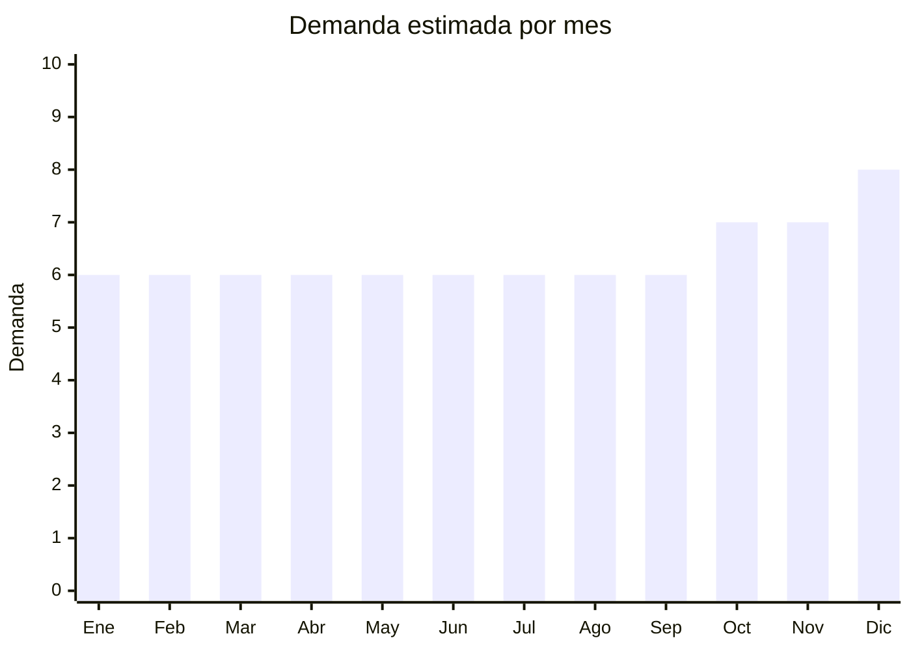

# Pisos de goma EVA encastrables

> **Capítulo NCM 57** — Alfombras y demás revestimientos textiles para el suelo | **Temporada:** Atemporal

## Qué es y por qué importarlo

Los pisos de goma EVA (etileno-vinil acetato) encastrables tipo puzzle son baldosas blandas que se interconectan para cubrir pisos. Se usan para áreas de bebés/niños, gimnasios (home gym, CrossFit), artes marciales (tatami), guarderías y salas de juegos. Se venden por packs de 4-10 piezas de 60x60cm o 30x30cm.

China es el principal productor mundial de EVA foam. El producto tiene demanda constante por seguridad infantil y fitness.

## Datos clave

| Dato | Valor |
|------|-------|
| **Posiciones NCM típicas** | 3918.90.00 (revestimientos para suelo de plástico), 5705.00.00 (demás alfombras) |
| **Derecho de importación** | 18-20% (DIE) + 3% tasa estadística |
| **Rango FOB típico** | USD 0.50 — USD 3.00 por pieza 60x60cm |
| **Precio de venta en Argentina** | ARS 3.000 — ARS 15.000 por pack (4-10 piezas) |
| **Margen bruto estimado** | 150% — 300% |
| **MOQ típico** | 200 — 1,000 piezas |
| **Demanda en MercadoLibre** | Alta (2,277+ resultados) |
| **Competencia en MercadoLibre** | Media |
| **Dificultad para importar** | Fácil-Moderada |
| **Certificaciones necesarias** | IRAM 3583 si se comercializa como juguete infantil |
| **Antidumping** | No |

## Variantes y subtipos más comunes

| Subtipo / Variante | FOB aprox. | Venta AR aprox. | Nota |
|--------------------|-----------|-----------------|------|
| Pack x4 piezas 60x60cm lisos (fitness) | USD 2.00 — 6.00 | ARS 5.000 — 12.000 | **Home gym** |
| Pack x9 piezas 30x30cm letras/números (bebé) | USD 2.00 — 5.00 | ARS 4.000 — 10.000 | **Infantil estrella** |
| Tatami EVA 100x100cm (artes marciales) | USD 3.00 — 8.00 | ARS 8.000 — 20.000 | Profesional |
| Pack x6 piezas 60x60cm colores surtidos | USD 3.00 — 7.00 | ARS 6.000 — 15.000 | Guarderías |
| Pisos EVA madera/simil piso (decorativo) | USD 1.50 — 4.00 | ARS 5.000 — 12.000 | Estético |

## Regulaciones y requisitos

<Tabs>
  <Tab title="Certificaciones">
    | Organismo | Requiere | Detalle |
    |-----------|----------|---------|
    | IRAM 3583 | **Posible** | Si se vende como piso infantil/juguete, puede requerir certificación de seguridad de juguetes. Verificar si la posición NCM clasifica como juguete |
    | INTI | No | No requiere certificación INTI estándar |
  </Tab>
  <Tab title="Etiquetado">
    Material (EVA), cantidad de piezas, tamaño por pieza, espesor, país de origen, datos importador. Si es infantil: advertencia de edad recomendada.
  </Tab>
  <Tab title="Restricciones">
    Si se comercializa para bebés/niños, verificar límites de formamida (sustancia que puede emitir el EVA). La UE tiene límite de 200 mg/kg. Argentina no tiene regulación específica pero es buena práctica solicitar certificado al proveedor.
  </Tab>
</Tabs>

## Logística

| Dato | Valor |
|------|-------|
| **Peso típico por pack x4 (60x60cm)** | 1.00 — 3.00 kg |
| **Volumen típico** | Medio-Alto (piezas no se comprimen) |
| **Fragilidad** | Baja (EVA es flexible y resistente) |
| **Envío recomendado** | Marítimo LCL |
| **Tiempo total estimado** | 50 — 80 días (marítimo) |

## Estacionalidad



| Aspecto | Detalle |
|---------|---------|
| **Meses pico** | Octubre-Diciembre (regalos infantiles, armado de home gym para verano) |
| **Meses valle** | Demanda base estable todo el año |

## Ventajas y riesgos

<CardGroup cols={2}>
  <Card title="Ventajas" icon="circle-check">
    - Demanda constante (bebés + fitness)
    - Producto funcional con compra planificada
    - Sin regulaciones complejas (salvo infantil)
    - Resistente al transporte
  </Card>
  <Card title="Riesgos" icon="triangle-exclamation">
    - Posible regulación como juguete si es infantil
    - Olor a EVA nuevo (formamida)
    - Voluminoso para su valor
    - Competencia con marcas establecidas
  </Card>
</CardGroup>

## Palabras clave para buscar en Alibaba

```
EVA foam mat wholesale, interlocking foam tiles, baby play mat EVA,
gym floor mat puzzle, tatami mat EVA, foam puzzle mat kids,
EVA exercise mat, rubber floor tiles gym
```

## Fuentes

- [MercadoLibre Argentina — Pisos goma EVA](https://listado.mercadolibre.com.ar/piso-goma-eva)
- [Alibaba — EVA foam mat wholesale](https://www.alibaba.com/showroom/eva-foam-mat-wholesale.html)
