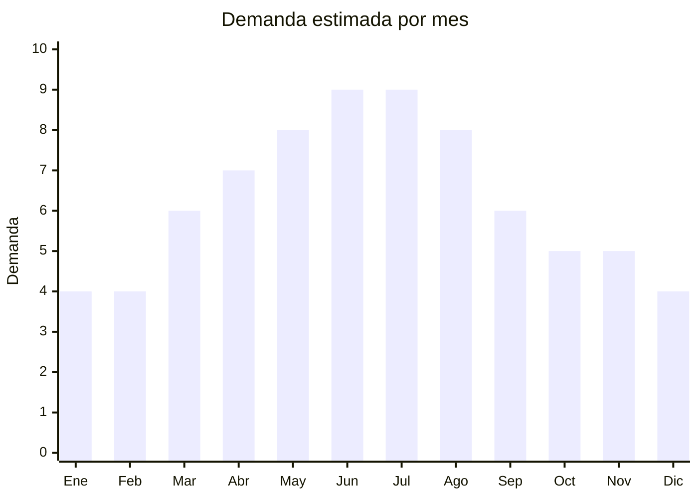

# Buzos y hoodies de punto

> **Capítulo NCM 61** — Prendas y complementos de vestir, de punto | **Temporada:** Atemporal (con pico otoño-invierno)

<Warning>
**ANTIDUMPING VIGENTE:** Verificar siempre el NCM exacto en la [CNCE](https://www.argentina.gob.ar/cnce/investigaciones/medidasvigentes). Los derechos antidumping sobre prendas de punto de China son adicionales al arancel normal.
</Warning>

## Qué es y por qué importarlo

Los buzos y hoodies incluyen buzos canguro con capucha (el formato más vendido), hoodies oversize (tendencia streetwear), buzos sin capucha crew neck, buzos con cierre y camperas de frisa. Son básicos universales con demanda todo el año. Se pueden marcar con marca propia.

## Datos clave

| Dato | Valor |
|------|-------|
| **Posiciones NCM típicas** | 6110.20.00 (prendas de punto de algodón), 6110.30.00 (de fibras sintéticas) |
| **Derecho de importación** | 20% (DIE) + 3% tasa estadística + **posible antidumping** |
| **Rango FOB típico** | USD 3.00 — USD 10.00 por unidad |
| **Precio de venta en Argentina** | ARS 12.000 — ARS 35.000 |
| **Margen bruto estimado** | 100% — 200% (variable por antidumping) |
| **MOQ típico** | 50 — 300 unidades por diseño/talle |
| **Demanda en MercadoLibre** | Alta (25,000+ resultados) |
| **Competencia en MercadoLibre** | Alta |
| **Dificultad para importar** | Moderada-Difícil |
| **Certificaciones necesarias** | Etiquetado textil IRAM 12560 |
| **Antidumping** | **Verificar NCM exacto** |

## Variantes y subtipos más comunes

| Subtipo / Variante | FOB aprox. | Venta AR aprox. | Nota |
|--------------------|-----------|-----------------|------|
| Buzo canguro con capucha algodón frisa | USD 4.00 — 8.00 | ARS 12.000 — 25.000 | **Más vendido** |
| Hoodie oversize unisex | USD 4.00 — 9.00 | ARS 15.000 — 30.000 | Tendencia streetwear |
| Buzo crew neck sin capucha | USD 3.00 — 6.00 | ARS 10.000 — 20.000 | Clásico |
| Buzo con cierre completo | USD 4.00 — 9.00 | ARS 12.000 — 28.000 | Versátil |
| Conjunto buzo + pantalón jogger | USD 6.00 — 14.00 | ARS 20.000 — 45.000 | Set completo |

## Regulaciones y requisitos

<Tabs>
  <Tab title="Certificaciones">
    Etiquetado textil IRAM 12560 obligatorio. Verificar antidumping en CNCE.
  </Tab>
  <Tab title="Etiquetado">
    **Obligatorio:** Composición con % (ej: "80% Algodón, 20% Poliéster"), talle, instrucciones de lavado, país de origen, datos importador.
  </Tab>
  <Tab title="Restricciones">
    Derechos antidumping vigentes. Verificar NCM exacto. El algodón peinado frisa premium tiene menor riesgo de antidumping que la frisa sintética básica.
  </Tab>
</Tabs>

## Logística

| Dato | Valor |
|------|-------|
| **Peso típico por unidad** | 0.35 — 0.70 kg |
| **Volumen típico** | Bajo-Medio |
| **Fragilidad** | Baja |
| **Envío recomendado** | Marítimo LCL |
| **Tiempo total estimado** | 50 — 80 días (marítimo) |

## Estacionalidad



| Aspecto | Detalle |
|---------|---------|
| **Meses pico** | Abril-Agosto (otoño-invierno) |
| **Meses valle** | Noviembre-Febrero (verano) |
| **Cuándo pedir** | Enero-Febrero para stock en abril (inicio otoño) |

## Ventajas y riesgos

<CardGroup cols={2}>
  <Card title="Ventajas" icon="circle-check">
    - Básico universal con demanda permanente
    - Alto ticket promedio
    - Personalizable con marca propia
    - Hoodie oversize es tendencia fuerte
  </Card>
  <Card title="Riesgos" icon="triangle-exclamation">
    - **Antidumping puede anular el margen**
    - Etiquetado estricto obligatorio
    - Problemas de talles
    - Competencia alta con industria textil local
  </Card>
</CardGroup>

## Palabras clave para buscar en Alibaba

```
hoodie wholesale, pullover hoodie blank, oversized hoodie unisex,
crew neck sweatshirt, zip up hoodie, fleece hoodie wholesale,
custom hoodie printing, blank hoodie bulk
```

## Fuentes

- [MercadoLibre Argentina — Buzos hoodies](https://listado.mercadolibre.com.ar/buzo-hoodie)
- [CNCE — Medidas antidumping vigentes](https://www.argentina.gob.ar/cnce/investigaciones/medidasvigentes)
