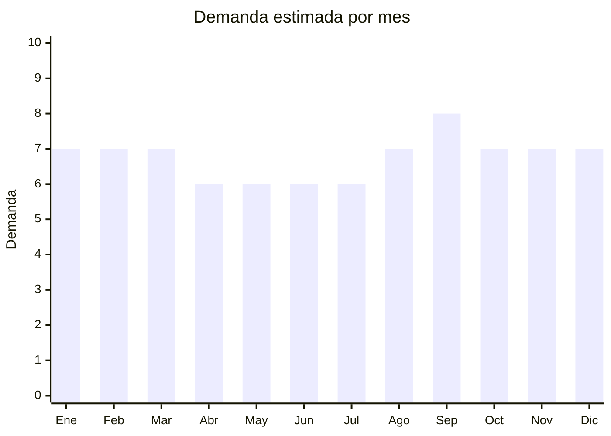

# Calzas y leggings deportivos de mujer

> **Capítulo NCM 61** — Prendas y complementos de vestir, de punto | **Temporada:** Atemporal

<Warning>
**ANTIDUMPING:** Verificar el NCM exacto en la [CNCE](https://www.argentina.gob.ar/cnce/investigaciones/medidasvigentes). El antidumping sobre prendas de punto de China es adicional al arancel.
</Warning>

## Qué es y por qué importarlo

Las calzas y leggings deportivos incluyen calzas de suplex, leggings con cintura alta, calzas con bolsillo lateral, leggings de compresión y conjuntos deportivos (calza + top). La tendencia athleisure (ropa deportiva como vestimenta casual) expandió el mercado más allá del gimnasio.

## Datos clave

| Dato | Valor |
|------|-------|
| **Posiciones NCM típicas** | 6114.30.00 (demás prendas de punto de fibras sintéticas) |
| **Derecho de importación** | 20% (DIE) + 3% tasa estadística + **posible antidumping** |
| **Rango FOB típico** | USD 2.00 — USD 6.00 por unidad |
| **Precio de venta en Argentina** | ARS 8.000 — ARS 22.000 |
| **Margen bruto estimado** | 100% — 250% |
| **MOQ típico** | 100 — 500 unidades |
| **Demanda en MercadoLibre** | Alta (16,200+ resultados) |
| **Competencia en MercadoLibre** | Alta |
| **Dificultad para importar** | Moderada-Difícil |
| **Certificaciones necesarias** | Etiquetado textil IRAM 12560 |
| **Antidumping** | **Verificar NCM exacto** |

## Variantes y subtipos más comunes

| Subtipo / Variante | FOB aprox. | Venta AR aprox. | Nota |
|--------------------|-----------|-----------------|------|
| Calza deportiva cintura alta lisa | USD 2.00 — 4.00 | ARS 8.000 — 15.000 | **Más vendida** |
| Legging con bolsillo lateral | USD 2.50 — 5.00 | ARS 10.000 — 18.000 | Funcional |
| Conjunto calza + top deportivo | USD 4.00 — 8.00 | ARS 15.000 — 25.000 | Set completo |
| Calza compresión running | USD 3.00 — 6.00 | ARS 10.000 — 22.000 | Rendimiento |
| Calza estampada sublimada | USD 2.50 — 5.00 | ARS 10.000 — 18.000 | Diseño |

## Regulaciones y requisitos

<Tabs>
  <Tab title="Certificaciones">
    Etiquetado textil IRAM 12560 obligatorio. Verificar antidumping CNCE.
  </Tab>
  <Tab title="Etiquetado">
    Composición (ej: "80% Poliamida, 20% Elastano"), talle, instrucciones lavado, país de origen, datos importador.
  </Tab>
  <Tab title="Restricciones">
    Antidumping vigente sobre prendas de punto. El talle y calce son factores críticos — solicitar tabla de medidas y muestras antes de producción.
  </Tab>
</Tabs>

## Logística

| Dato | Valor |
|------|-------|
| **Peso típico por unidad** | 0.15 — 0.30 kg |
| **Volumen típico** | Muy bajo |
| **Fragilidad** | Baja |
| **Envío recomendado** | Marítimo LCL |
| **Tiempo total estimado** | 50 — 80 días (marítimo) |

## Estacionalidad



| Aspecto | Detalle |
|---------|---------|
| **Meses pico** | Septiembre-Marzo (primavera/verano + propósitos fitness) |
| **Meses valle** | Abril-Agosto (demanda base se mantiene por athleisure) |

## Ventajas y riesgos

<CardGroup cols={2}>
  <Card title="Ventajas" icon="circle-check">
    - Tendencia athleisure en alza
    - Liviano y compacto
    - Alta demanda femenina permanente
    - Personalizable con marca propia
  </Card>
  <Card title="Riesgos" icon="triangle-exclamation">
    - **Antidumping puede destruir margen**
    - Talle y calce son críticos
    - Transparencia de tela: reclamos frecuentes
    - Competencia alta
  </Card>
</CardGroup>

## Palabras clave para buscar en Alibaba

```
leggings wholesale, women gym leggings, high waist yoga pants,
compression leggings, sportswear leggings set, fitness leggings pocket,
seamless leggings wholesale, athletic leggings bulk
```

## Fuentes

- [MercadoLibre Argentina — Calzas deportivas](https://listado.mercadolibre.com.ar/calzas-deportivas-mujer)
- [CNCE — Medidas antidumping](https://www.argentina.gob.ar/cnce/investigaciones/medidasvigentes)
