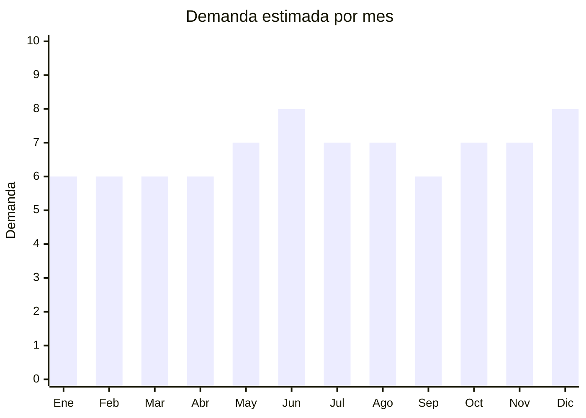

# Medias y calcetines

> **Capítulo NCM 61** — Prendas y complementos de vestir, de punto | **Temporada:** Atemporal

## Qué es y por qué importarlo

Las medias y calcetines son producto de consumo básico con reposición permanente. Se venden por packs de 6-12 pares. Incluyen medias casuales, deportivas, de vestir, tobilleras y medias de compresión. China es el mayor productor mundial con FOB desde USD 0.15 por par.

## Datos clave

| Dato | Valor |
|------|-------|
| **Posiciones NCM típicas** | 6115.95.00 (medias de algodón), 6115.96.00 (de fibras sintéticas) |
| **Derecho de importación** | 20% (DIE) + 3% tasa estadística |
| **Rango FOB típico** | USD 0.15 — USD 0.80 por par |
| **Precio de venta en Argentina** | ARS 3.000 — ARS 10.000 por pack x6-12 |
| **Margen bruto estimado** | 150% — 300% |
| **MOQ típico** | 500 — 3,000 pares |
| **Demanda en MercadoLibre** | Muy Alta (63,600+ resultados) |
| **Competencia en MercadoLibre** | Alta |
| **Dificultad para importar** | Fácil |
| **Certificaciones necesarias** | Etiquetado textil |
| **Antidumping** | Verificar NCM exacto (menor riesgo que prendas) |

## Variantes y subtipos más comunes

| Subtipo / Variante | FOB aprox. | Venta AR aprox. | Nota |
|--------------------|-----------|-----------------|------|
| Pack x12 medias tobilleras deportivas | USD 1.80 — 4.00 | ARS 4.000 — 10.000 | **Más vendido** |
| Pack x6 medias casuales hombre | USD 1.00 — 3.00 | ARS 3.000 — 8.000 | Básico |
| Pack x6 medias de vestir | USD 1.50 — 4.00 | ARS 4.000 — 10.000 | Formal |
| Medias deportivas compresión (running) | USD 0.50 — 1.50/par | ARS 2.000 — 5.000/par | Nicho fitness |
| Medias divertidas con diseño | USD 0.30 — 0.80/par | ARS 1.000 — 3.000/par | Tendencia |

## Regulaciones y requisitos

<Tabs>
  <Tab title="Certificaciones">
    Etiquetado textil obligatorio.
  </Tab>
  <Tab title="Etiquetado">
    Composición de fibra con porcentajes, talle, país de origen, datos importador.
  </Tab>
  <Tab title="Restricciones">
    Verificar antidumping en NCM específico. Medias tienen menor riesgo de antidumping que prendas de vestir principales.
  </Tab>
</Tabs>

## Logística

| Dato | Valor |
|------|-------|
| **Peso típico por pack x12** | 0.15 — 0.40 kg |
| **Volumen típico** | Muy bajo |
| **Fragilidad** | Nula |
| **Envío recomendado** | Marítimo LCL (volumen) / Aéreo (lotes chicos) |
| **Tiempo total estimado** | 50 — 80 días (marítimo) |

## Estacionalidad



| Aspecto | Detalle |
|---------|---------|
| **Meses pico** | Junio (Día del Padre — packs regalo), Diciembre (Navidad), Mayo-Julio (invierno — medias térmicas) |

## Ventajas y riesgos

<CardGroup cols={2}>
  <Card title="Ventajas" icon="circle-check">
    - Consumo básico, reposición permanente
    - FOB muy bajo, ultraliviano
    - Packs x12 tienen buen margen
    - Sin regulaciones complejas
  </Card>
  <Card title="Riesgos" icon="triangle-exclamation">
    - Competencia extrema (producto commodity)
    - Ticket bajo
    - Calidad de elástico variable
    - Competencia con producción local
  </Card>
</CardGroup>

## Palabras clave para buscar en Alibaba

```
socks wholesale, men socks pack, sport socks bulk, ankle socks wholesale,
cotton socks pack 12, compression socks running, funny socks wholesale
```

## Fuentes

- [MercadoLibre Argentina — Medias hombre](https://listado.mercadolibre.com.ar/medias-hombre)
- [Alibaba — Socks wholesale](https://www.alibaba.com/showroom/socks-wholesale.html)
