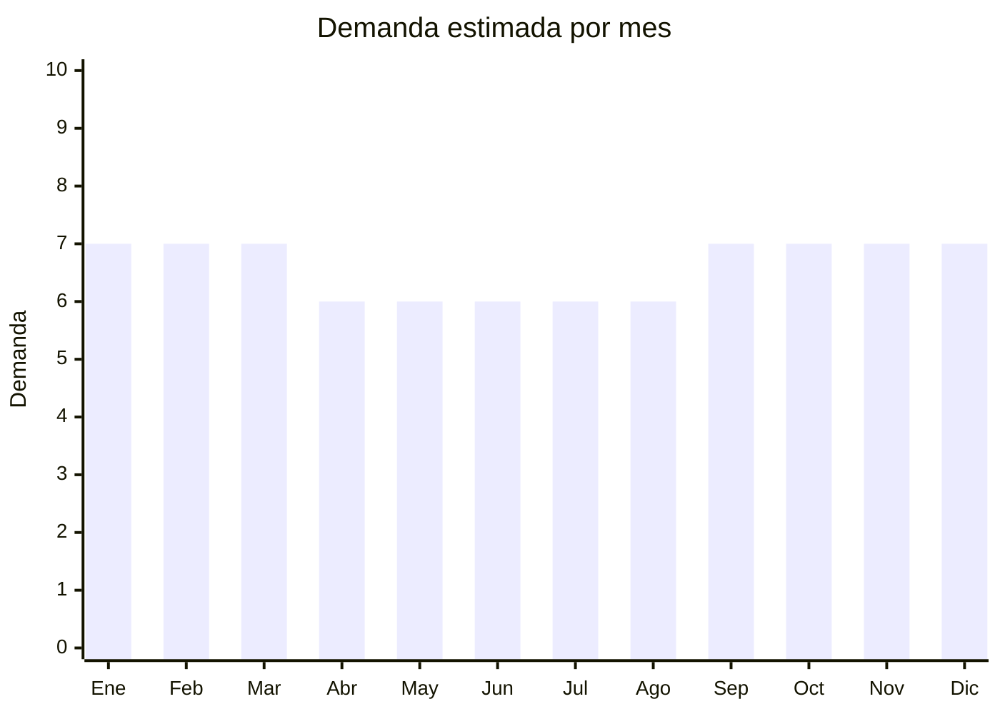

# Ropa deportiva de punto (dry fit, training)

> **Capítulo NCM 61** — Prendas y complementos de vestir, de punto | **Temporada:** Atemporal

<Warning>
**ANTIDUMPING VIGENTE:** Argentina mantiene derechos antidumping sobre diversas prendas de vestir de punto originarias de China. Los derechos son **adicionales** al arancel normal y pueden incrementar significativamente el costo. El Decreto 236/2025 redujo aranceles generales de 35% a 20%, pero los antidumping **siguen vigentes por separado**. Verificar siempre en la [CNCE](https://www.argentina.gob.ar/cnce/investigaciones/medidasvigentes) el NCM exacto.
</Warning>

## Qué es y por qué importarlo

La ropa deportiva de punto incluye remeras dry fit / training, musculosas, shorts deportivos y conjuntos de entrenamiento. Las telas técnicas (moisture wicking, quick dry) son el estándar. China (Guangdong, Fujian) es el centro mundial de producción de sportswear con capacidad de sublimación y telas tecnológicas.

## Datos clave

| Dato | Valor |
|------|-------|
| **Posiciones NCM típicas** | 6109.10.00 (camisetas de punto algodón), 6109.90.00 (de otras fibras), 6112.31.00 (conjuntos deportivos) |
| **Derecho de importación** | 20% (DIE) + 3% tasa estadística + **posible antidumping** |
| **Rango FOB típico** | USD 1.50 — USD 5.00 por unidad |
| **Precio de venta en Argentina** | ARS 5.000 — ARS 18.000 |
| **Margen bruto estimado** | 100% — 250% (variable por antidumping) |
| **MOQ típico** | 100 — 500 unidades por diseño/talle |
| **Demanda en MercadoLibre** | Muy Alta (240,000+ resultados) |
| **Competencia en MercadoLibre** | Alta |
| **Dificultad para importar** | Moderada-Difícil (antidumping + talles + etiquetado) |
| **Certificaciones necesarias** | Etiquetado textil obligatorio IRAM 12560 |
| **Antidumping** | **Verificar NCM exacto** |

## Variantes y subtipos más comunes

| Subtipo / Variante | FOB aprox. | Venta AR aprox. | Nota |
|--------------------|-----------|-----------------|------|
| Remera dry fit hombre/mujer | USD 1.50 — 3.00 | ARS 5.000 — 10.000 | **Más vendido** |
| Pack x4 remeras deportivas hombre | USD 5.00 — 10.00 | ARS 15.000 — 25.000 | Formato popular |
| Musculosa training | USD 1.00 — 2.50 | ARS 4.000 — 8.000 | Gym |
| Short deportivo hombre/mujer | USD 1.50 — 3.50 | ARS 5.000 — 12.000 | Running/gym |
| Conjunto deportivo (remera + short) | USD 3.00 — 7.00 | ARS 10.000 — 22.000 | Set completo |

## Regulaciones y requisitos

<Tabs>
  <Tab title="Certificaciones">
    | Requisito | Obligatorio | Detalle |
    |-----------|-------------|---------|
    | Etiquetado IRAM 12560 | **Sí** | Composición de fibra (%), talle, país de origen, datos importador, instrucciones de lavado (símbolos) |
    | Antidumping CNCE | **Verificar** | Consultar NCM exacto en CNCE. El antidumping es un costo adicional al DIE |
  </Tab>
  <Tab title="Etiquetado">
    **Obligatorio (Res. 287/2000):** Composición de fibra con porcentajes (ej: "100% Poliéster" o "90% Poliéster, 10% Elastano"), talle en sistema argentino, instrucciones de conservación con símbolos internacionales, país de origen, razón social e identificación fiscal del importador.
  </Tab>
  <Tab title="Restricciones">
    - Derechos antidumping vigentes sobre prendas de punto de China
    - Etiquetado textil obligatorio — incumplimiento = retención en aduana
    - Sistema de talles debe adaptarse a Argentina
  </Tab>
</Tabs>

## Logística

| Dato | Valor |
|------|-------|
| **Peso típico por unidad** | 0.10 — 0.25 kg |
| **Volumen típico** | Bajo (se comprime) |
| **Fragilidad** | Baja |
| **Envío recomendado** | Marítimo LCL |
| **Tiempo total estimado** | 50 — 80 días (marítimo) |

## Estacionalidad



| Aspecto | Detalle |
|---------|---------|
| **Meses pico** | Septiembre-Marzo (primavera/verano + propósitos año nuevo = gym) |
| **Meses valle** | Abril-Agosto — demanda base estable (gym no para) |

## Ventajas y riesgos

<CardGroup cols={2}>
  <Card title="Ventajas" icon="circle-check">
    - Demanda masiva permanente
    - Liviano (flete eficiente)
    - Tendencia fitness/athleisure consolidada
    - Personalizable con marca propia
    - Telas técnicas tienen alto valor percibido
  </Card>
  <Card title="Riesgos" icon="triangle-exclamation">
    - **Antidumping puede destruir el margen**
    - Etiquetado obligatorio estricto
    - Problemas de talles (adaptación ARG)
    - Competencia alta (marcas locales + importadores)
    - Devoluciones por talle incorrecto
  </Card>
</CardGroup>

## Palabras clave para buscar en Alibaba

```
dry fit t-shirt wholesale, sports training shirt, moisture wicking t-shirt,
gym tank top wholesale, running shorts men, sportswear set wholesale,
quick dry fitness wear, sublimation sport shirt
```

## Fuentes

- [MercadoLibre Argentina — Remeras deportivas](https://listado.mercadolibre.com.ar/remera-deportiva)
- [CNCE — Medidas antidumping vigentes](https://www.argentina.gob.ar/cnce/investigaciones/medidasvigentes)
