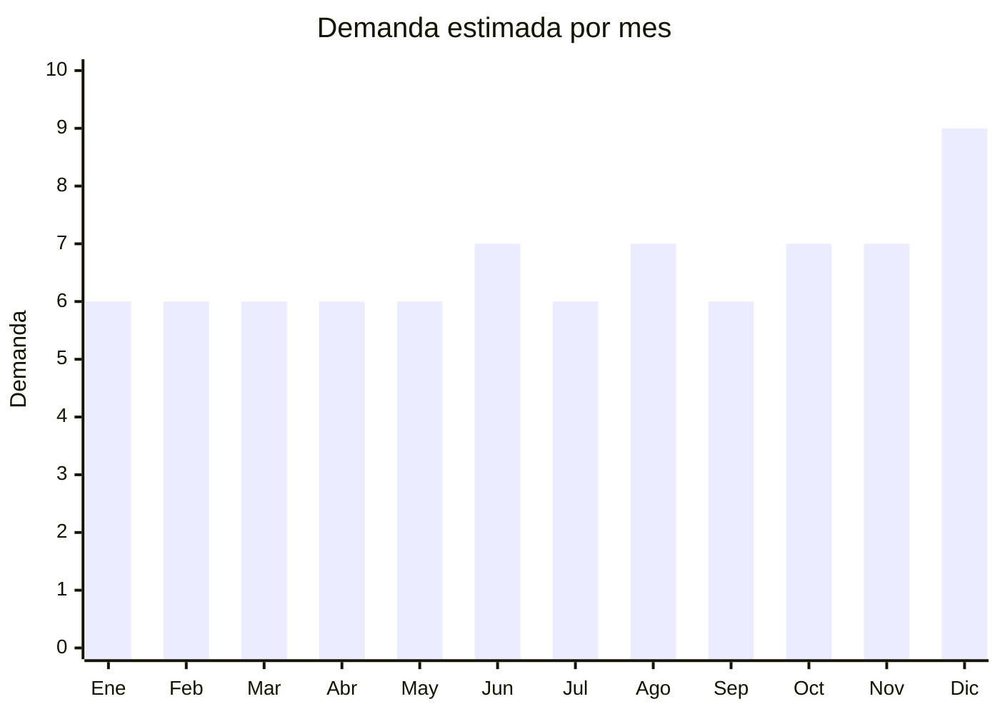

# Ropa interior de punto

> **Capítulo NCM 61** — Prendas y complementos de vestir, de punto | **Temporada:** Atemporal

## Qué es y por qué importarlo

La ropa interior de punto incluye boxers, bombachas, corpiños básicos (sin estructura), tangas, calzoncillos y ropa interior deportiva (sin costura / seamless). Se vende por packs de 3-6 unidades. China (Shantou, Guangdong) es el mayor productor mundial de ropa interior. Bajo costo FOB y altísima rotación.

## Datos clave

| Dato | Valor |
|------|-------|
| **Posiciones NCM típicas** | 6107.11.00 (calzoncillos de punto algodón), 6108.21.00 (bombachas de punto algodón) |
| **Derecho de importación** | 20% (DIE) + 3% tasa estadística |
| **Rango FOB típico** | USD 0.30 — USD 1.50 por unidad |
| **Precio de venta en Argentina** | ARS 3.000 — ARS 12.000 por pack x3-6 |
| **Margen bruto estimado** | 150% — 300% |
| **MOQ típico** | 300 — 2,000 unidades |
| **Demanda en MercadoLibre** | Muy Alta (150,000+ resultados) |
| **Competencia en MercadoLibre** | Alta |
| **Dificultad para importar** | Moderada |
| **Certificaciones necesarias** | Etiquetado textil IRAM 12560 |
| **Antidumping** | Verificar NCM exacto |

## Variantes y subtipos más comunes

| Subtipo / Variante | FOB aprox. | Venta AR aprox. | Nota |
|--------------------|-----------|-----------------|------|
| Pack x6 boxers hombre algodón | USD 2.00 — 5.00 | ARS 5.000 — 12.000 | **Más vendido** |
| Pack x6 bombachas algodón mujer | USD 1.50 — 4.00 | ARS 4.000 — 10.000 | Alta rotación |
| Pack x3 corpiños sin costura | USD 2.00 — 5.00 | ARS 5.000 — 12.000 | Seamless tendencia |
| Boxers deportivos (mesh / dry fit) | USD 0.50 — 1.50/u | ARS 2.000 — 5.000/u | Fitness |
| Ropa interior seamless sin costura | USD 0.40 — 1.00/u | ARS 1.500 — 4.000/u | Confort |

## Regulaciones y requisitos

<Tabs>
  <Tab title="Certificaciones">
    Etiquetado textil IRAM 12560 obligatorio.
  </Tab>
  <Tab title="Etiquetado">
    Composición de fibra (ej: "95% Algodón, 5% Elastano"), talle, instrucciones de lavado, país de origen, datos importador.
  </Tab>
  <Tab title="Restricciones">
    Verificar antidumping. Ropa interior de algodón tiene menor riesgo de antidumping que prendas de vestir exteriores.
  </Tab>
</Tabs>

## Logística

| Dato | Valor |
|------|-------|
| **Peso típico por pack x6** | 0.15 — 0.40 kg |
| **Volumen típico** | Muy bajo |
| **Fragilidad** | Nula |
| **Envío recomendado** | Marítimo LCL |
| **Tiempo total estimado** | 50 — 80 días (marítimo) |

## Estacionalidad



| Aspecto | Detalle |
|---------|---------|
| **Meses pico** | Junio (Día del Padre — packs regalo), Diciembre (Navidad), Agosto (Día del Amigo) |

## Ventajas y riesgos

<CardGroup cols={2}>
  <Card title="Ventajas" icon="circle-check">
    - Consumo básico universal
    - Reposición permanente
    - Ultraliviano
    - Packs regalo con demanda alta
  </Card>
  <Card title="Riesgos" icon="triangle-exclamation">
    - Competencia extrema
    - Ticket bajo
    - Calidad variable (elástico, tela)
    - Talle problemático sin muestras previas
  </Card>
</CardGroup>

## Palabras clave para buscar en Alibaba

```
men underwear wholesale, boxer briefs bulk, women panties wholesale,
seamless bra wholesale, cotton underwear pack, sports underwear men,
Shantou underwear factory, invisible underwear women
```

## Fuentes

- [MercadoLibre Argentina — Ropa interior](https://listado.mercadolibre.com.ar/ropa-interior)
- [Alibaba — Underwear wholesale](https://www.alibaba.com/showroom/underwear-wholesale.html)
