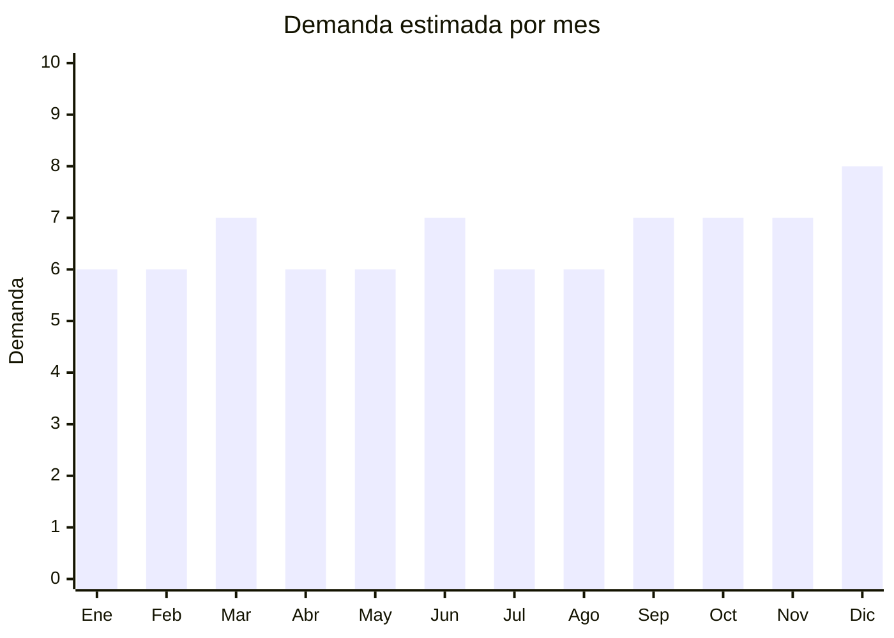

# Camisas de vestir y casual

> **Capítulo NCM 62** — Prendas y complementos de vestir (excepto punto) | **Temporada:** Atemporal

<Warning>
**ANTIDUMPING:** Verificar NCM exacto en la [CNCE](https://www.argentina.gob.ar/cnce/investigaciones/medidasvigentes).
</Warning>

## Qué es y por qué importarlo

Camisas de vestir (poplin, algodón), casuales (oxford, lino, chambray) y camisas manga corta. Guangdong y Zhejiang son centros de producción. Producto básico con demanda constante.

## Datos clave

| Dato | Valor |
|------|-------|
| **Posiciones NCM típicas** | 6205.20.00 (camisas algodón hombre), 6206.30.00 (camisas algodón mujer) |
| **Derecho de importación** | 20% (DIE) + 3% tasa estadística + **posible antidumping** |
| **Rango FOB típico** | USD 3.00 — USD 10.00 por unidad |
| **Precio de venta en Argentina** | ARS 15.000 — ARS 40.000 |
| **Margen bruto estimado** | 100% — 200% |
| **MOQ típico** | 100 — 500 unidades |
| **Demanda en MercadoLibre** | Alta |
| **Competencia en MercadoLibre** | Alta |
| **Dificultad para importar** | Difícil |
| **Certificaciones necesarias** | Etiquetado IRAM 12560 |
| **Antidumping** | **Verificar NCM exacto** |

## Variantes y subtipos más comunes

| Subtipo / Variante | FOB aprox. | Venta AR aprox. | Nota |
|--------------------|-----------|-----------------|------|
| Camisa vestir poplin hombre | USD 3.00 — 7.00 | ARS 15.000 — 30.000 | Clásica |
| Camisa oxford casual | USD 4.00 — 8.00 | ARS 18.000 — 35.000 | Casual premium |
| Camisa lino manga larga | USD 4.00 — 10.00 | ARS 20.000 — 40.000 | Tendencia verano |
| Camisa manga corta estampada | USD 3.00 — 7.00 | ARS 15.000 — 30.000 | Casual |

## Regulaciones y requisitos

<Tabs>
  <Tab title="Certificaciones">
    Etiquetado textil IRAM 12560 obligatorio. Verificar antidumping CNCE.
  </Tab>
  <Tab title="Etiquetado">
    Composición, talle, instrucciones de lavado, país de origen, datos importador.
  </Tab>
  <Tab title="Restricciones">
    Antidumping vigente sobre prendas de vestir. Riesgo alto.
  </Tab>
</Tabs>

## Logística

| Dato | Valor |
|------|-------|
| **Peso típico por unidad** | 0.20 — 0.35 kg |
| **Volumen típico** | Bajo |
| **Fragilidad** | Baja |
| **Envío recomendado** | Marítimo LCL |
| **Tiempo total estimado** | 50 — 80 días (marítimo) |

## Estacionalidad



| Aspecto | Detalle |
|---------|---------|
| **Meses pico** | Septiembre-Diciembre (primavera/verano + fiestas/eventos) |

## Ventajas y riesgos

<CardGroup cols={2}>
  <Card title="Ventajas" icon="circle-check">
    - Producto básico con demanda permanente
    - Alto ticket promedio
    - Marca propia viable
  </Card>
  <Card title="Riesgos" icon="triangle-exclamation">
    - **Antidumping riesgo principal**
    - Competencia con industria textil local
    - Talle y calce críticos
    - Mercado muy competitivo
  </Card>
</CardGroup>

## Palabras clave para buscar en Alibaba

```
dress shirt wholesale, oxford shirt men, linen shirt wholesale,
cotton poplin shirt, casual shirt bulk, men shirt factory
```

## Fuentes

- [MercadoLibre Argentina — Camisas](https://listado.mercadolibre.com.ar/camisa-hombre)
- [CNCE — Medidas antidumping](https://www.argentina.gob.ar/cnce/investigaciones/medidasvigentes)
