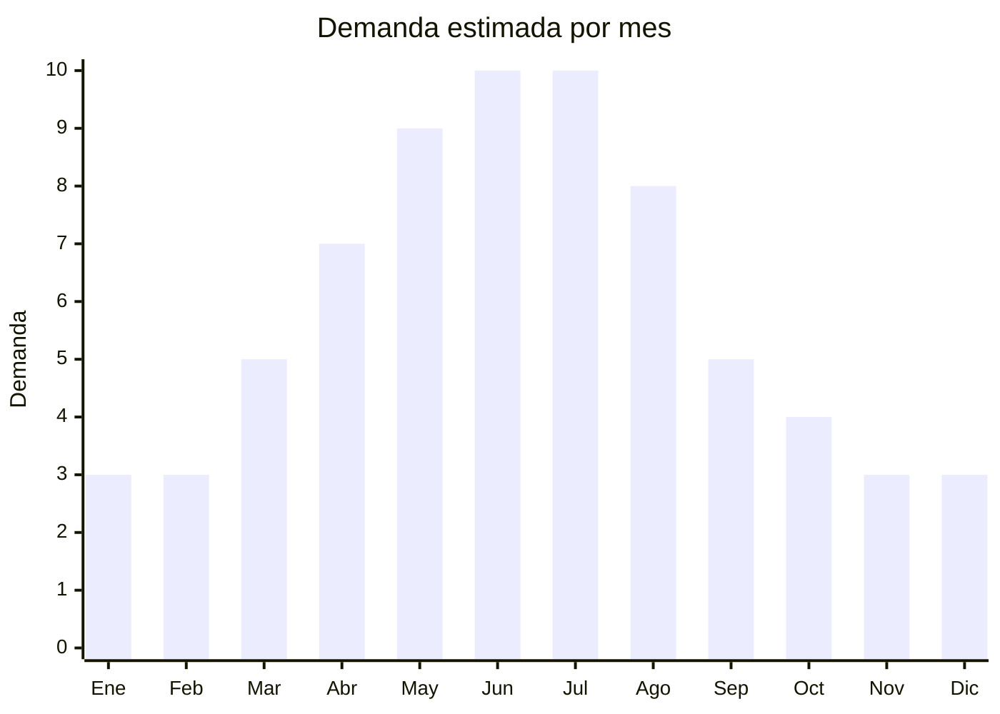

# Camperas impermeables y puffer

> **Capítulo NCM 62** — Prendas y complementos de vestir (excepto punto) | **Temporada:** Atemporal (pico otoño-invierno)

<Warning>
**ANTIDUMPING:** Argentina mantiene derechos antidumping sobre prendas de vestir no de punto de China. Verificar NCM exacto en la [CNCE](https://www.argentina.gob.ar/cnce/investigaciones/medidasvigentes).
</Warning>

## Qué es y por qué importarlo

Incluye camperas puffer (inflables con relleno sintético), camperas impermeables con capucha, parkas con piel interior, camperas rompeviento y camperas 2-en-1 (desmontable). China es líder mundial en producción de outerwear. Telas nylon y poliéster con relleno de poliéster hueco o pluma sintética.

## Datos clave

| Dato | Valor |
|------|-------|
| **Posiciones NCM típicas** | 6201.93.00 (anoraks de fibras sintéticas hombre), 6202.93.00 (mujer) |
| **Derecho de importación** | 20% (DIE) + 3% tasa estadística + **posible antidumping** |
| **Rango FOB típico** | USD 5.00 — USD 20.00 por unidad |
| **Precio de venta en Argentina** | ARS 25.000 — ARS 80.000 |
| **Margen bruto estimado** | 100% — 200% |
| **MOQ típico** | 50 — 200 unidades |
| **Demanda en MercadoLibre** | Alta |
| **Competencia en MercadoLibre** | Media-Alta |
| **Dificultad para importar** | Difícil (antidumping + etiquetado) |
| **Certificaciones necesarias** | Etiquetado textil IRAM 12560 |
| **Antidumping** | **Verificar NCM exacto** |

## Variantes y subtipos más comunes

| Subtipo / Variante | FOB aprox. | Venta AR aprox. | Nota |
|--------------------|-----------|-----------------|------|
| Campera puffer liviana mujer/hombre | USD 5.00 — 12.00 | ARS 25.000 — 50.000 | **Tendencia oversize** |
| Campera impermeable con capucha | USD 5.00 — 15.00 | ARS 25.000 — 55.000 | Todo clima |
| Parka con piel interior | USD 10.00 — 25.00 | ARS 40.000 — 80.000 | Premium invierno |
| Campera rompeviento liviana | USD 3.00 — 8.00 | ARS 15.000 — 35.000 | Primavera/otoño |
| Campera 2-en-1 desmontable | USD 8.00 — 18.00 | ARS 35.000 — 65.000 | Versátil |

## Regulaciones y requisitos

<Tabs>
  <Tab title="Certificaciones">
    Etiquetado IRAM 12560 obligatorio. Verificar antidumping CNCE por NCM exacto.
  </Tab>
  <Tab title="Etiquetado">
    Composición exterior e interior (ej: "Exterior: 100% Nylon. Relleno: 100% Poliéster"), talle, instrucciones de lavado, país de origen, datos importador.
  </Tab>
  <Tab title="Restricciones">
    Antidumping vigente. El riesgo es alto en prendas de vestir exteriores. Evaluar cuidadosamente el costo total landed.
  </Tab>
</Tabs>

## Logística

| Dato | Valor |
|------|-------|
| **Peso típico por unidad** | 0.30 — 1.00 kg |
| **Volumen típico** | Medio (camperas puffer son voluminosas) |
| **Fragilidad** | Baja |
| **Envío recomendado** | Marítimo LCL |
| **Tiempo total estimado** | 50 — 80 días (marítimo) |

## Estacionalidad



| Aspecto | Detalle |
|---------|---------|
| **Meses pico** | Mayo-Julio (pleno invierno) |
| **Cuándo pedir** | Enero-Febrero para stock en abril |

## Ventajas y riesgos

<CardGroup cols={2}>
  <Card title="Ventajas" icon="circle-check">
    - Alto ticket promedio
    - Buen margen en prendas premium
    - Marca propia viable
    - Puffer oversize es tendencia fuerte
  </Card>
  <Card title="Riesgos" icon="triangle-exclamation">
    - **Antidumping alto — riesgo principal**
    - Producto estacional fuerte
    - Problemas de talle
    - Stock que no se vende en temporada queda hasta el año siguiente
  </Card>
</CardGroup>

## Palabras clave para buscar en Alibaba

```
puffer jacket wholesale, waterproof jacket women, winter parka wholesale,
padded jacket men, windbreaker jacket bulk, down jacket wholesale,
2 in 1 jacket, lightweight puffer coat
```

## Fuentes

- [MercadoLibre Argentina — Camperas importadas](https://listado.mercadolibre.com.ar/campera-importada)
- [CNCE — Medidas antidumping](https://www.argentina.gob.ar/cnce/investigaciones/medidasvigentes)
