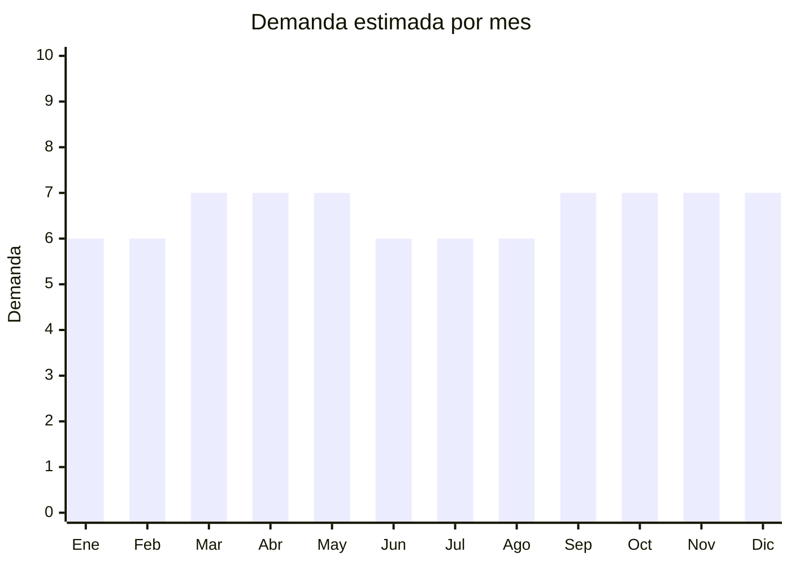

# Pantalones (jean, cargo, casual)

> **Capítulo NCM 62** — Prendas y complementos de vestir (excepto punto) | **Temporada:** Atemporal

<Warning>
**RIESGO ALTO — ANTIDUMPING:** Los pantalones de vestir y casual de China están sujetos a derechos antidumping que pueden **duplicar o triplicar** el costo. Verificar SIEMPRE el NCM exacto en la [CNCE](https://www.argentina.gob.ar/cnce/investigaciones/medidasvigentes) antes de importar.
</Warning>

## Qué es y por qué importarlo

Pantalones jean (denim), cargo, chino/gabardina y casual. Producto básico universal pero con altísima competencia de la industria textil argentina y antidumping vigente. Solo viable si el costo total (arancel + antidumping + flete) permite margen suficiente.

## Datos clave

| Dato | Valor |
|------|-------|
| **Posiciones NCM típicas** | 6203.42.00 (pantalones algodón hombre), 6204.62.00 (mujer) |
| **Derecho de importación** | 20% (DIE) + 3% tasa estadística + **antidumping alto** |
| **Rango FOB típico** | USD 4.00 — USD 12.00 por unidad |
| **Precio de venta en Argentina** | ARS 18.000 — ARS 45.000 |
| **Margen bruto estimado** | 50% — 150% (muy afectado por antidumping) |
| **MOQ típico** | 100 — 500 unidades |
| **Demanda en MercadoLibre** | Muy Alta |
| **Competencia en MercadoLibre** | Muy Alta |
| **Dificultad para importar** | Difícil |
| **Certificaciones necesarias** | Etiquetado IRAM 12560 |
| **Antidumping** | **SÍ — verificar valor exacto** |

## Variantes y subtipos más comunes

| Subtipo / Variante | FOB aprox. | Venta AR aprox. | Nota |
|--------------------|-----------|-----------------|------|
| Jean recto/slim hombre | USD 5.00 — 10.00 | ARS 20.000 — 40.000 | Antidumping alto |
| Pantalón cargo | USD 4.00 — 9.00 | ARS 18.000 — 35.000 | Tendencia |
| Pantalón chino/gabardina | USD 4.00 — 8.00 | ARS 18.000 — 30.000 | Casual |
| Jean mom/wide leg mujer | USD 5.00 — 12.00 | ARS 20.000 — 45.000 | Tendencia moda |

## Regulaciones y requisitos

<Tabs>
  <Tab title="Certificaciones">
    Etiquetado textil IRAM 12560. Antidumping CNCE.
  </Tab>
  <Tab title="Etiquetado">
    Composición, talle, instrucciones lavado, país de origen, datos importador.
  </Tab>
  <Tab title="Restricciones">
    **Antidumping significativo.** Puede hacer inviable la importación en muchas posiciones NCM. Evaluar costo total antes de comprar.
  </Tab>
</Tabs>

## Logística

| Dato | Valor |
|------|-------|
| **Peso típico por unidad** | 0.40 — 0.80 kg |
| **Volumen típico** | Bajo-Medio |
| **Fragilidad** | Baja |
| **Envío recomendado** | Marítimo LCL |
| **Tiempo total estimado** | 50 — 80 días (marítimo) |

## Estacionalidad



## Ventajas y riesgos

<CardGroup cols={2}>
  <Card title="Ventajas" icon="circle-check">
    - Demanda masiva permanente
    - Cargo/chino son tendencia
    - Alto ticket
  </Card>
  <Card title="Riesgos" icon="triangle-exclamation">
    - **Antidumping puede hacer inviable**
    - Competencia industria local fortísima
    - Talles problemáticos
    - Muy competitivo
  </Card>
</CardGroup>

## Palabras clave para buscar en Alibaba

```
cargo pants wholesale, men jeans bulk, chino pants wholesale,
wide leg jeans women, denim jeans factory, casual pants men
```

## Fuentes

- [MercadoLibre Argentina — Pantalones](https://listado.mercadolibre.com.ar/pantalon-hombre)
- [CNCE — Medidas antidumping](https://www.argentina.gob.ar/cnce/investigaciones/medidasvigentes)
