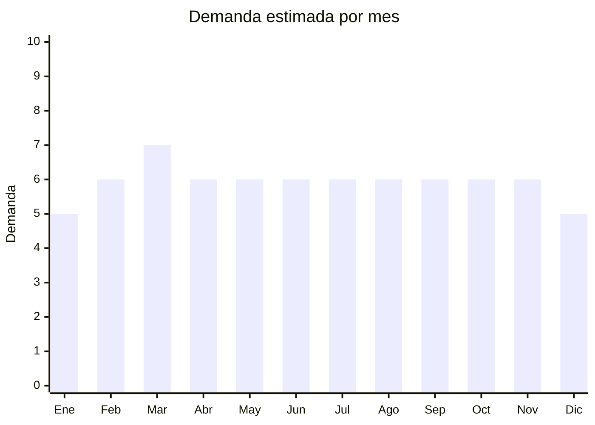

# Ropa de trabajo y uniformes

> **Capítulo NCM 62** — Prendas y complementos de vestir (excepto punto) | **Temporada:** Atemporal

## Qué es y por qué importarlo

Ropa de trabajo técnica: overoles, pantalones cargo de trabajo, chalecos reflectivos de seguridad, camisas de trabajo, batas/guardapolvos y uniformes de gastronomía. Nicho B2B con demanda estable y menor sensibilidad al diseño. **Menor riesgo de antidumping** que ropa de moda porque son prendas funcionales/técnicas en posiciones NCM diferentes.

## Datos clave

| Dato | Valor |
|------|-------|
| **Posiciones NCM típicas** | 6211.33.00 (demás prendas de vestir masculinas de fibras sintéticas), 6211.43.00 (femeninas) |
| **Derecho de importación** | 20% (DIE) + 3% tasa estadística |
| **Rango FOB típico** | USD 3.00 — USD 12.00 por unidad |
| **Precio de venta en Argentina** | ARS 10.000 — ARS 35.000 |
| **Margen bruto estimado** | 100% — 250% |
| **MOQ típico** | 100 — 500 unidades |
| **Demanda en MercadoLibre** | Media |
| **Competencia en MercadoLibre** | Media |
| **Dificultad para importar** | Moderada |
| **Certificaciones necesarias** | Etiquetado textil + normas de seguridad si es EPP |
| **Antidumping** | Menor riesgo (verificar NCM) |

## Variantes y subtipos más comunes

| Subtipo / Variante | FOB aprox. | Venta AR aprox. | Nota |
|--------------------|-----------|-----------------|------|
| Chaleco reflectivo seguridad | USD 1.00 — 3.00 | ARS 3.000 — 10.000 | Alta rotación |
| Overol / mameluco trabajo | USD 5.00 — 12.00 | ARS 15.000 — 35.000 | Industrial |
| Camisa de trabajo manga larga | USD 3.00 — 7.00 | ARS 10.000 — 22.000 | Construcción |
| Chaqueta chef/gastronomía | USD 3.00 — 8.00 | ARS 10.000 — 25.000 | B2B gastro |
| Pantalón cargo de trabajo reforzado | USD 4.00 — 9.00 | ARS 12.000 — 28.000 | Industrial |

## Regulaciones y requisitos

<Tabs>
  <Tab title="Certificaciones">
    Etiquetado textil obligatorio. Si el producto es EPP (Equipo de Protección Personal) puede requerir certificación adicional de seguridad.
  </Tab>
  <Tab title="Etiquetado">
    Composición, talle, instrucciones de lavado, país de origen, datos importador.
  </Tab>
  <Tab title="Restricciones">
    Chalecos reflectivos deben cumplir normas de visibilidad si se comercializan como EPP. Menor riesgo de antidumping que ropa casual.
  </Tab>
</Tabs>

## Logística

| Dato | Valor |
|------|-------|
| **Peso típico por unidad** | 0.30 — 0.80 kg |
| **Volumen típico** | Bajo-Medio |
| **Fragilidad** | Baja |
| **Envío recomendado** | Marítimo LCL |
| **Tiempo total estimado** | 50 — 80 días (marítimo) |

## Estacionalidad



| Aspecto | Detalle |
|---------|---------|
| **Meses pico** | Febrero-Marzo (inicio actividades, empresas renuevan dotación) |

## Ventajas y riesgos

<CardGroup cols={2}>
  <Card title="Ventajas" icon="circle-check">
    - Menor riesgo de antidumping
    - Demanda B2B estable
    - Menos sensible al diseño/moda
    - Producto funcional con compra planificada
  </Card>
  <Card title="Riesgos" icon="triangle-exclamation">
    - Mercado B2B más lento
    - Si es EPP requiere certificación
    - Competencia con fabricantes locales
    - Volúmenes de venta menores que moda
  </Card>
</CardGroup>

## Palabras clave para buscar en Alibaba

```
work uniform wholesale, safety vest reflective, coverall workwear,
chef jacket wholesale, cargo work pants, industrial uniform,
hi vis vest bulk, work shirt wholesale
```

## Fuentes

- [MercadoLibre Argentina — Ropa de trabajo](https://listado.mercadolibre.com.ar/ropa-trabajo)
- [Alibaba — Workwear wholesale](https://www.alibaba.com/showroom/workwear-wholesale.html)
