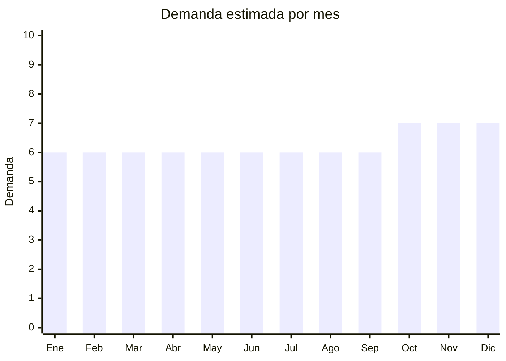

# Bolsas reutilizables y ecológicas

> **Capítulo NCM 63** — Los demás artículos textiles confeccionados | **Temporada:** Atemporal

## Qué es y por qué importarlo

Bolsas de compras reutilizables (tela, poliéster plegable), bolsas al vacío para almacenamiento de ropa, y bolsas ecológicas de algodón/yute. La reducción de bolsas plásticas por ley impulsa la demanda de bolsas reutilizables. Las bolsas al vacío para ropa/viaje son un producto complementario con buena demanda.

## Datos clave

| Dato | Valor |
|------|-------|
| **Posiciones NCM típicas** | 6305.33.00 (sacos/bolsas de tiras de polietileno), 6305.90.00 (de otras materias textiles) |
| **Derecho de importación** | 20% (DIE) + 3% tasa estadística |
| **Rango FOB típico** | USD 0.10 — USD 1.50 por unidad |
| **Precio de venta en Argentina** | ARS 1.500 — ARS 8.000 |
| **Margen bruto estimado** | 150% — 300% |
| **MOQ típico** | 200 — 2,000 unidades |
| **Demanda en MercadoLibre** | Alta (32,600+ resultados) |
| **Competencia en MercadoLibre** | Media-Alta |
| **Dificultad para importar** | Fácil |
| **Certificaciones necesarias** | Etiquetado básico |
| **Antidumping** | No |

## Variantes y subtipos más comunes

| Subtipo / Variante | FOB aprox. | Venta AR aprox. | Nota |
|--------------------|-----------|-----------------|------|
| Bolsa reutilizable plegable poliéster | USD 0.20 — 0.80 | ARS 1.500 — 4.000 | Compras |
| Bolsa algodón tote bag lisa | USD 0.30 — 1.00 | ARS 2.000 — 5.000 | Personalizable |
| Pack bolsas al vacío ropa x5-10 | USD 1.00 — 3.00 | ARS 4.000 — 10.000 | **Alto margen** |
| Bolsa yute/arpillera eco | USD 0.50 — 1.50 | ARS 2.000 — 6.000 | Premium eco |
| Bolsa organizadora viaje set x6 | USD 1.50 — 4.00 | ARS 5.000 — 12.000 | Viajeros |

## Regulaciones y requisitos

<Tabs>
  <Tab title="Certificaciones">
    Sin certificaciones especiales.
  </Tab>
  <Tab title="Etiquetado">
    Composición del material, país de origen, datos importador.
  </Tab>
  <Tab title="Restricciones">
    Sin restricciones. Se beneficia de legislación anti-bolsas plásticas.
  </Tab>
</Tabs>

## Logística

| Dato | Valor |
|------|-------|
| **Peso típico por unidad** | 0.03 — 0.20 kg |
| **Volumen típico** | Muy bajo (plegables) |
| **Fragilidad** | Nula |
| **Envío recomendado** | Marítimo LCL |
| **Tiempo total estimado** | 50 — 80 días (marítimo) |

## Estacionalidad



## Ventajas y riesgos

<CardGroup cols={2}>
  <Card title="Ventajas" icon="circle-check">
    - Tendencia eco permanente
    - Legislación anti-plástico impulsa demanda
    - Ultraliviano
    - Personalizable (logo, marca)
  </Card>
  <Card title="Riesgos" icon="triangle-exclamation">
    - Ticket bajo
    - Competencia alta
    - Producto commodity
  </Card>
</CardGroup>

## Palabras clave para buscar en Alibaba

```
reusable shopping bag wholesale, foldable bag polyester, tote bag cotton,
vacuum storage bag, jute bag wholesale, travel organizer bag set
```

## Fuentes

- [MercadoLibre Argentina — Bolsas reutilizables](https://listado.mercadolibre.com.ar/bolsa-reutilizable)
- [Alibaba — Reusable bag wholesale](https://www.alibaba.com/showroom/reusable-shopping-bag-wholesale.html)
