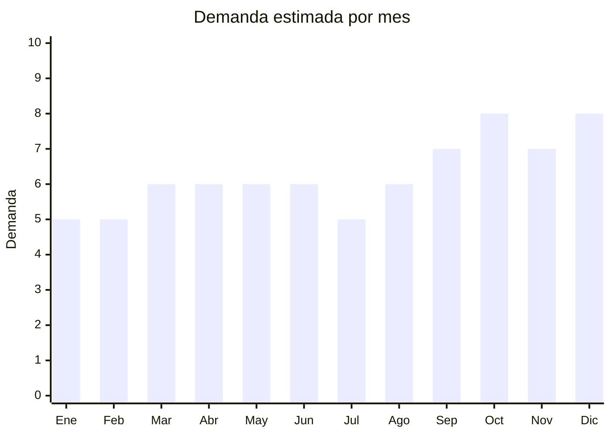

# Cortinas (blackout, microfibra, baño)

> **Capítulo NCM 63** — Los demás artículos textiles confeccionados | **Temporada:** Atemporal

## Qué es y por qué importarlo

Incluye cortinas blackout (oscurecimiento total), cortinas de microfibra/tela listas para colgar, cortinas de baño PEVA/vinilo antihongos y cortinas de tusor/voile. Se venden por pares (2 paños) o individuales. Demanda masiva: casi 200,000 resultados en MercadoLibre. China produce cortinas a costos muy competitivos. Sin antidumping en esta categoría.

## Datos clave

| Dato | Valor |
|------|-------|
| **Posiciones NCM típicas** | 6303.12.00 (visillos/cortinas de fibras sintéticas de punto), 6303.92.00 (no de punto) |
| **Derecho de importación** | 20% (DIE) + 3% tasa estadística |
| **Rango FOB típico** | USD 2.00 — USD 10.00 por unidad |
| **Precio de venta en Argentina** | ARS 8.000 — ARS 35.000 |
| **Margen bruto estimado** | 150% — 300% |
| **MOQ típico** | 50 — 300 unidades |
| **Demanda en MercadoLibre** | Muy Alta (197,000+ resultados) |
| **Competencia en MercadoLibre** | Alta |
| **Dificultad para importar** | Moderada |
| **Certificaciones necesarias** | Etiquetado textil |
| **Antidumping** | No |

## Variantes y subtipos más comunes

| Subtipo / Variante | FOB aprox. | Venta AR aprox. | Nota |
|--------------------|-----------|-----------------|------|
| Cortina blackout textil 210x140cm | USD 3.00 — 7.00 | ARS 10.000 — 22.000 | **Bestseller** |
| Juego cortinas microfibra x2 paños | USD 4.00 — 10.00 | ARS 12.000 — 30.000 | Living/dormitorio |
| Cortina de baño PEVA 180x180cm | USD 1.00 — 3.00 | ARS 4.000 — 12.000 | Antihongos |
| Cortina tusor/voile transparente | USD 2.00 — 5.00 | ARS 8.000 — 18.000 | Decorativa |
| Cortina blackout enrollable | USD 5.00 — 15.00 | ARS 15.000 — 40.000 | Premium |

## Regulaciones y requisitos

<Tabs>
  <Tab title="Certificaciones">
    Etiquetado textil obligatorio. Sin antidumping.
  </Tab>
  <Tab title="Etiquetado">
    Composición, medidas, país de origen, datos importador.
  </Tab>
  <Tab title="Restricciones">
    Sin restricciones especiales. Sin antidumping.
  </Tab>
</Tabs>

## Logística

| Dato | Valor |
|------|-------|
| **Peso típico por unidad** | 0.50 — 2.00 kg |
| **Volumen típico** | Medio |
| **Fragilidad** | Baja |
| **Envío recomendado** | Marítimo LCL |
| **Tiempo total estimado** | 50 — 80 días (marítimo) |

## Estacionalidad



| Aspecto | Detalle |
|---------|---------|
| **Meses pico** | Septiembre-Diciembre (renovación deco, mudanzas) |

## Ventajas y riesgos

<CardGroup cols={2}>
  <Card title="Ventajas" icon="circle-check">
    - Demanda masiva
    - **Sin antidumping**
    - Blackout tiene alto valor percibido
    - Producto de decoración esencial
  </Card>
  <Card title="Riesgos" icon="triangle-exclamation">
    - Competencia alta
    - Medidas deben adaptarse a Argentina
    - Tela blackout de baja calidad deja pasar luz
    - Pesado (flete significativo)
  </Card>
</CardGroup>

## Palabras clave para buscar en Alibaba

```
blackout curtain wholesale, window curtain fabric, shower curtain PEVA,
thermal curtain, voile sheer curtain, curtain panel ready made
```

## Fuentes

- [MercadoLibre Argentina — Cortinas](https://listado.mercadolibre.com.ar/cortina-blackout)
- [Alibaba — Curtain wholesale](https://www.alibaba.com/showroom/curtain-wholesale.html)
