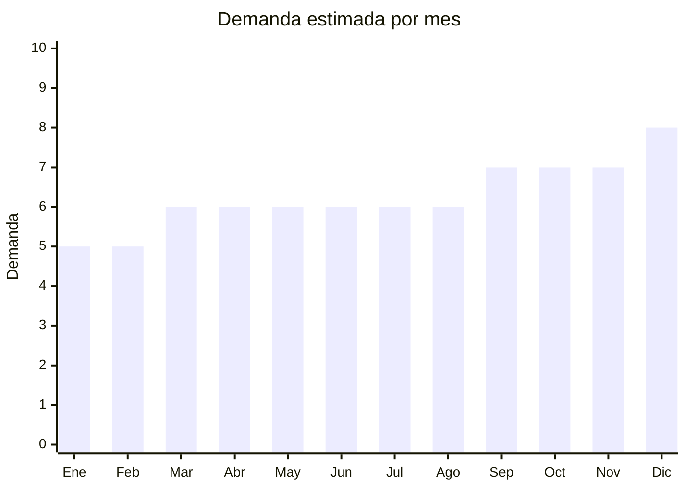

# Fundas de almohada y ropa de cama complementaria

> **Capítulo NCM 63** — Los demás artículos textiles confeccionados | **Temporada:** Atemporal

## Qué es y por qué importarlo

Producto complementario a los juegos de sábanas: fundas de almohada (packs x2-4), protectores de colchón impermeables, cubre sommier/box spring, y almohadas de fibra. Se venden como complemento o reposición. Alta rotación. Sin antidumping.

## Datos clave

| Dato | Valor |
|------|-------|
| **Posiciones NCM típicas** | 6302.31.00 (ropa de cama algodón), 6302.32.00 (fibras sintéticas) |
| **Derecho de importación** | 20% (DIE) + 3% tasa estadística |
| **Rango FOB típico** | USD 0.50 — USD 4.00 por unidad |
| **Precio de venta en Argentina** | ARS 3.000 — ARS 15.000 |
| **Margen bruto estimado** | 150% — 300% |
| **MOQ típico** | 200 — 1,000 unidades |
| **Demanda en MercadoLibre** | Muy Alta (116,000+ resultados) |
| **Competencia en MercadoLibre** | Alta |
| **Dificultad para importar** | Fácil |
| **Certificaciones necesarias** | Etiquetado textil |
| **Antidumping** | No |

## Variantes y subtipos más comunes

| Subtipo / Variante | FOB aprox. | Venta AR aprox. | Nota |
|--------------------|-----------|-----------------|------|
| Pack x2 fundas almohada 70x50cm | USD 0.50 — 1.50 | ARS 3.000 — 8.000 | **Alta rotación** |
| Protector colchón impermeable 2 plazas | USD 2.00 — 5.00 | ARS 8.000 — 18.000 | Funcional |
| Cubre sommier 2½ plazas | USD 1.50 — 4.00 | ARS 5.000 — 15.000 | Decorativo |
| Funda almohada satén (skincare) | USD 0.80 — 2.00 | ARS 4.000 — 10.000 | Tendencia |
| Pack x4 fundas almohada | USD 1.00 — 3.00 | ARS 5.000 — 12.000 | Set |

## Regulaciones y requisitos

<Tabs>
  <Tab title="Certificaciones">
    Etiquetado textil obligatorio. Sin antidumping.
  </Tab>
  <Tab title="Etiquetado">
    Composición, tamaño, país de origen, datos importador.
  </Tab>
  <Tab title="Restricciones">
    Sin restricciones.
  </Tab>
</Tabs>

## Logística

| Dato | Valor |
|------|-------|
| **Peso típico por pack** | 0.20 — 0.80 kg |
| **Volumen típico** | Bajo |
| **Fragilidad** | Nula |
| **Envío recomendado** | Marítimo LCL |
| **Tiempo total estimado** | 50 — 80 días (marítimo) |

## Estacionalidad



## Ventajas y riesgos

<CardGroup cols={2}>
  <Card title="Ventajas" icon="circle-check">
    - Sin antidumping
    - Alta rotación (reposición)
    - Complementa sábanas (cross-sell)
    - Liviano
  </Card>
  <Card title="Riesgos" icon="triangle-exclamation">
    - Ticket bajo
    - Competencia alta
    - Commodity (poca diferenciación)
  </Card>
</CardGroup>

## Palabras clave para buscar en Alibaba

```
pillowcase wholesale, waterproof mattress protector, bed skirt wholesale,
satin pillowcase, pillow cover pack, mattress pad wholesale
```

## Fuentes

- [MercadoLibre Argentina — Fundas almohada](https://listado.mercadolibre.com.ar/funda-almohada)
- [Alibaba — Pillowcase wholesale](https://www.alibaba.com/showroom/pillowcase-wholesale.html)
