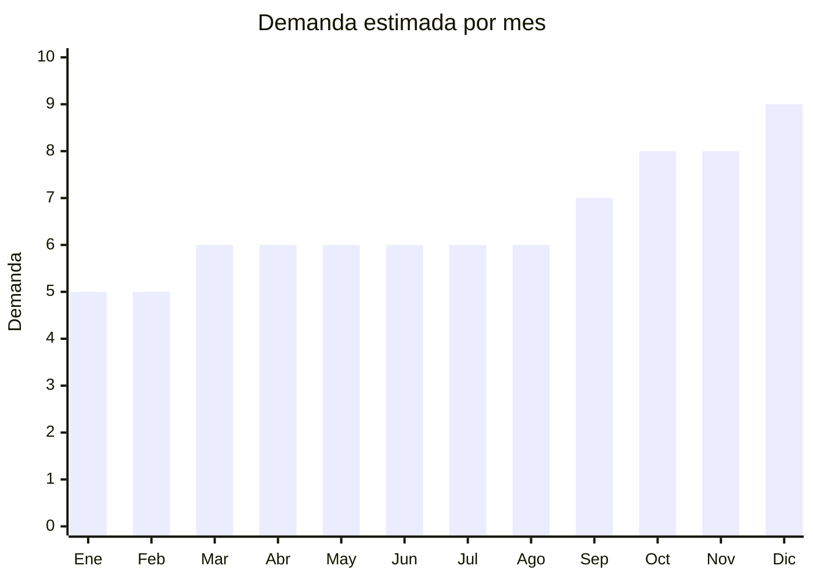

# Juegos de sábanas (microfibra, algodón)

> **Capítulo NCM 63** — Los demás artículos textiles confeccionados | **Temporada:** Atemporal

## Qué es y por qué importarlo

Juegos de sábanas que incluyen sábana bajera (con elástico), sábana encimera y fundas de almohada. Materiales: microfibra (más económica), algodón percal, algodón satén. Tamaños: 1½ plaza, 2 plazas, 2½ plazas (el más vendido) y king. Nantong (Jiangsu, China) es la capital mundial de blanquería con cientos de fábricas especializadas.

**No tiene antidumping vigente** en la mayoría de posiciones de blanquería, a diferencia de la ropa (Cap. 61-62).

## Datos clave

| Dato | Valor |
|------|-------|
| **Posiciones NCM típicas** | 6302.31.00 (ropa de cama algodón), 6302.32.00 (de fibras sintéticas) |
| **Derecho de importación** | 20% (DIE) + 3% tasa estadística |
| **Rango FOB típico** | USD 3.00 — USD 12.00 por juego |
| **Precio de venta en Argentina** | ARS 10.000 — ARS 35.000 |
| **Margen bruto estimado** | 150% — 300% |
| **MOQ típico** | 100 — 500 juegos |
| **Demanda en MercadoLibre** | Muy Alta (43,600+ resultados) |
| **Competencia en MercadoLibre** | Alta |
| **Dificultad para importar** | Moderada |
| **Certificaciones necesarias** | Etiquetado textil |
| **Antidumping** | No (en blanquería) |

## Variantes y subtipos más comunes

| Subtipo / Variante | FOB aprox. | Venta AR aprox. | Nota |
|--------------------|-----------|-----------------|------|
| Juego sábanas microfibra 2½ plazas | USD 3.00 — 6.00 | ARS 8.000 — 18.000 | **Más vendido** |
| Juego sábanas 240 hilos algodón | USD 5.00 — 10.00 | ARS 15.000 — 28.000 | Premium |
| Juego sábanas satén | USD 4.00 — 8.00 | ARS 12.000 — 25.000 | Elegante |
| Juego sábanas 1½ plaza | USD 2.00 — 5.00 | ARS 6.000 — 15.000 | Individual |
| Juego sábanas king size | USD 5.00 — 12.00 | ARS 15.000 — 35.000 | Premium |

## Regulaciones y requisitos

<Tabs>
  <Tab title="Certificaciones">
    Etiquetado textil obligatorio. Sin antidumping en blanquería.
  </Tab>
  <Tab title="Etiquetado">
    Composición de fibra (ej: "100% Microfibra Poliéster" o "100% Algodón 240 hilos"), tamaño, país de origen, datos importador.
  </Tab>
  <Tab title="Restricciones">
    Sin antidumping en blanquería. Mucho más viable que ropa (Cap. 61-62).
  </Tab>
</Tabs>

## Logística

| Dato | Valor |
|------|-------|
| **Peso típico por juego** | 0.80 — 2.00 kg |
| **Volumen típico** | Medio |
| **Fragilidad** | Baja |
| **Envío recomendado** | Marítimo LCL |
| **Tiempo total estimado** | 50 — 80 días (marítimo) |

## Estacionalidad



| Aspecto | Detalle |
|---------|---------|
| **Meses pico** | Octubre-Diciembre (regalos, mudanzas de fin de año, renovación) |

## Ventajas y riesgos

<CardGroup cols={2}>
  <Card title="Ventajas" icon="circle-check">
    - **Sin antidumping** (a diferencia de ropa)
    - Demanda masiva permanente
    - Nantong tiene fábricas especializadas
    - Producto de reposición constante
  </Card>
  <Card title="Riesgos" icon="triangle-exclamation">
    - Competencia alta (Jean Cartier, Cotton Touch)
    - Peso significativo (flete)
    - Microfibra de baja calidad genera reclamos
    - Tamaños deben adaptarse a Argentina
  </Card>
</CardGroup>

## Palabras clave para buscar en Alibaba

```
bed sheet set wholesale, microfiber bed sheet, cotton bedding set,
fitted sheet set, Nantong bedding factory, satin bed sheet set,
hotel bed linen wholesale, bed sheet 240 thread count
```

## Fuentes

- [MercadoLibre Argentina — Sábanas](https://listado.mercadolibre.com.ar/sabanas)
- [Alibaba — Bed sheet wholesale](https://www.alibaba.com/showroom/bed-sheet-set-wholesale.html)
