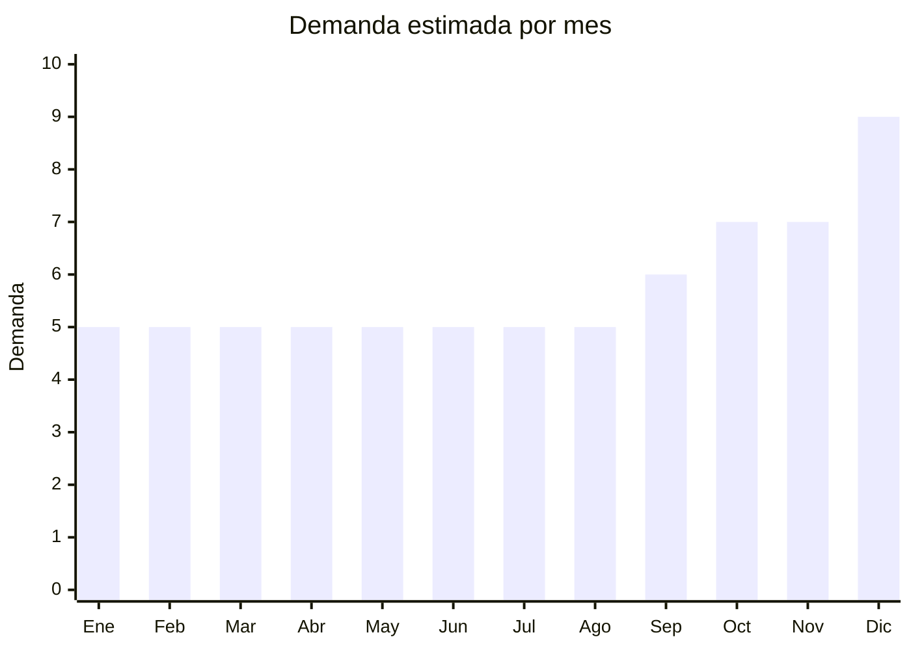

# Manteles y caminos de mesa

> **Capítulo NCM 63** — Los demás artículos textiles confeccionados | **Temporada:** Atemporal

## Qué es y por qué importarlo

Manteles de mesa en diversos materiales: tela (poliéster, algodón), PVC/hule (limpiar con trapo), individual tejido y caminos de mesa decorativos. Demanda permanente en hogares y gastronomía.

## Datos clave

| Dato | Valor |
|------|-------|
| **Posiciones NCM típicas** | 6302.51.00 (mantelería algodón), 6302.53.00 (de fibras sintéticas) |
| **Derecho de importación** | 20% (DIE) + 3% tasa estadística |
| **Rango FOB típico** | USD 1.00 — USD 6.00 por unidad |
| **Precio de venta en Argentina** | ARS 5.000 — ARS 20.000 |
| **Margen bruto estimado** | 150% — 250% |
| **MOQ típico** | 100 — 500 unidades |
| **Demanda en MercadoLibre** | Muy Alta (42,600+ resultados) |
| **Competencia en MercadoLibre** | Alta |
| **Dificultad para importar** | Fácil |
| **Certificaciones necesarias** | Etiquetado textil |
| **Antidumping** | No |

## Variantes y subtipos más comunes

| Subtipo / Variante | FOB aprox. | Venta AR aprox. | Nota |
|--------------------|-----------|-----------------|------|
| Mantel PVC/hule rectangular 140x180cm | USD 1.50 — 4.00 | ARS 5.000 — 12.000 | **Práctico** |
| Mantel tela poliéster 150x200cm | USD 2.00 — 5.00 | ARS 6.000 — 15.000 | Elegante |
| Camino de mesa decorativo 30x180cm | USD 1.00 — 3.00 | ARS 4.000 — 10.000 | Tendencia deco |
| Mantel antimanchas 140x210cm | USD 2.00 — 5.00 | ARS 8.000 — 18.000 | Funcional |
| Set individuales x4 + camino de mesa | USD 3.00 — 7.00 | ARS 8.000 — 20.000 | Set completo |

## Regulaciones y requisitos

<Tabs>
  <Tab title="Certificaciones">
    Etiquetado textil. Sin antidumping.
  </Tab>
  <Tab title="Etiquetado">
    Composición, medidas, país de origen, datos importador.
  </Tab>
  <Tab title="Restricciones">
    Sin restricciones.
  </Tab>
</Tabs>

## Logística

| Dato | Valor |
|------|-------|
| **Peso típico por unidad** | 0.30 — 1.00 kg |
| **Volumen típico** | Bajo-Medio |
| **Fragilidad** | Baja |
| **Envío recomendado** | Marítimo LCL |
| **Tiempo total estimado** | 50 — 80 días (marítimo) |

## Estacionalidad



| Aspecto | Detalle |
|---------|---------|
| **Meses pico** | Octubre-Diciembre (fiestas de fin de año, cenas familiares) |

## Ventajas y riesgos

<CardGroup cols={2}>
  <Card title="Ventajas" icon="circle-check">
    - Demanda masiva
    - Sin antidumping
    - Producto de renovación periódica
    - Complementa vajilla
  </Card>
  <Card title="Riesgos" icon="triangle-exclamation">
    - Competencia alta
    - Medidas deben adaptarse a mesas argentinas
    - Calidad de estampado variable
  </Card>
</CardGroup>

## Palabras clave para buscar en Alibaba

```
tablecloth wholesale, PVC table cover, table runner decorative,
waterproof tablecloth, polyester tablecloth, table mat set
```

## Fuentes

- [MercadoLibre Argentina — Manteles](https://listado.mercadolibre.com.ar/mantel)
- [Alibaba — Tablecloth wholesale](https://www.alibaba.com/showroom/tablecloth-wholesale.html)
