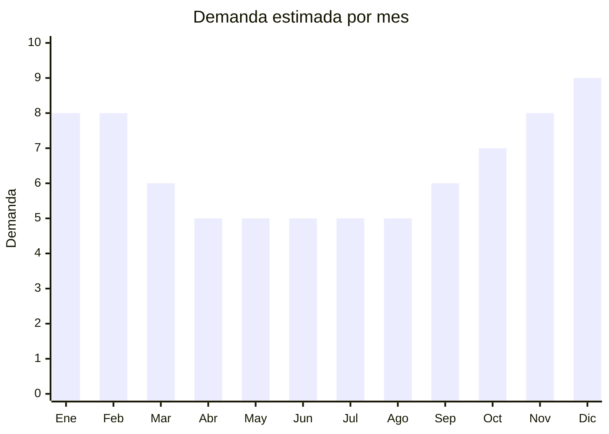

# Toallas y toallones de microfibra

> **Capítulo NCM 63** — Los demás artículos textiles confeccionados | **Temporada:** Atemporal (pico verano)

## Qué es y por qué importarlo

Toallas de microfibra de secado rápido en formatos: toallón grande (140x70cm), toalla deportiva compacta, toalla cooling/fría (se moja y enfría), y toalla de viaje ultracompacta. La microfibra seca 3-5x más rápido que el algodón y pesa mucho menos, ideal para fitness, playa, viaje y camping.

## Datos clave

| Dato | Valor |
|------|-------|
| **Posiciones NCM típicas** | 6302.60.00 (ropa de tocador de materia textil) |
| **Derecho de importación** | 20% (DIE) + 3% tasa estadística |
| **Rango FOB típico** | USD 1.00 — USD 4.00 por unidad |
| **Precio de venta en Argentina** | ARS 5.000 — ARS 18.000 |
| **Margen bruto estimado** | 200% — 350% |
| **MOQ típico** | 100 — 500 unidades |
| **Demanda en MercadoLibre** | Muy Alta (35,000+ resultados) |
| **Competencia en MercadoLibre** | Media-Alta |
| **Dificultad para importar** | Fácil |
| **Certificaciones necesarias** | Etiquetado textil |
| **Antidumping** | No |

## Variantes y subtipos más comunes

| Subtipo / Variante | FOB aprox. | Venta AR aprox. | Nota |
|--------------------|-----------|-----------------|------|
| Toallón microfibra 140x70cm | USD 1.50 — 3.00 | ARS 6.000 — 15.000 | **Más vendido** |
| Toalla deportiva compacta con funda | USD 1.00 — 2.50 | ARS 4.000 — 10.000 | Gym/running |
| Toalla cooling/fría | USD 0.50 — 1.50 | ARS 3.000 — 8.000 | Verano/deportes |
| Set toalla viaje x2 (grande+chica) | USD 2.00 — 5.00 | ARS 8.000 — 18.000 | Viajeros |
| Toalla microfibra estampada playa | USD 2.00 — 4.00 | ARS 6.000 — 15.000 | Verano |

## Regulaciones y requisitos

<Tabs>
  <Tab title="Certificaciones">
    Etiquetado textil obligatorio. Sin antidumping.
  </Tab>
  <Tab title="Etiquetado">
    Composición, tamaño, país de origen, datos importador.
  </Tab>
  <Tab title="Restricciones">
    Sin restricciones especiales.
  </Tab>
</Tabs>

## Logística

| Dato | Valor |
|------|-------|
| **Peso típico por unidad** | 0.15 — 0.40 kg |
| **Volumen típico** | Bajo (se comprimen mucho) |
| **Fragilidad** | Nula |
| **Envío recomendado** | Marítimo LCL |
| **Tiempo total estimado** | 50 — 80 días (marítimo) |

## Estacionalidad



| Aspecto | Detalle |
|---------|---------|
| **Meses pico** | Noviembre-Febrero (verano, playa, viajes) |

## Ventajas y riesgos

<CardGroup cols={2}>
  <Card title="Ventajas" icon="circle-check">
    - Liviano y compacto
    - Buen margen
    - Tendencia fitness/viaje
    - Sin antidumping
  </Card>
  <Card title="Riesgos" icon="triangle-exclamation">
    - Competencia media-alta
    - Calidad variable de absorción
    - Producto estacional (pico verano)
  </Card>
</CardGroup>

## Palabras clave para buscar en Alibaba

```
microfiber towel wholesale, quick dry towel, sports towel microfiber,
beach towel microfiber, cooling towel, travel towel compact
```

## Fuentes

- [MercadoLibre Argentina — Toallas microfibra](https://listado.mercadolibre.com.ar/toalla-microfibra)
- [Alibaba — Microfiber towel wholesale](https://www.alibaba.com/showroom/microfiber-towel-wholesale.html)
