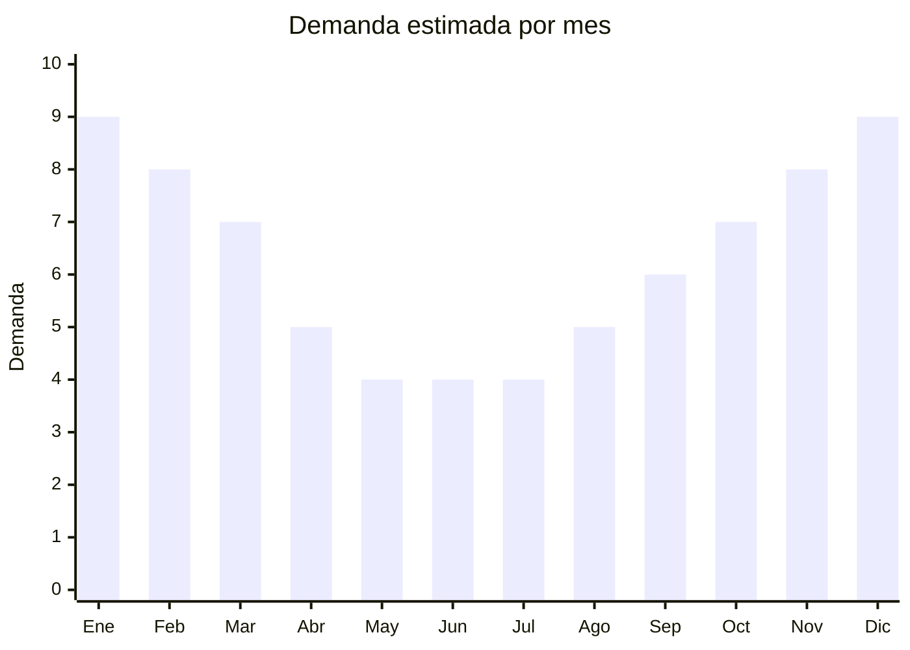

# Ojotas y chinelas (EVA, goma)

> **Capítulo NCM 64** — Calzado, polainas y artículos análogos | **Temporada:** Atemporal (pico verano)

<Warning>
**ANTIDUMPING VARIABLE:** El calzado de origen chino puede estar sujeto a antidumping según la posición NCM. Las ojotas y chinelas de EVA/goma tienen **menor riesgo** que el calzado deportivo, pero verificar siempre en la [CNCE](https://www.argentina.gob.ar/cnce/investigaciones/medidasvigentes) el NCM exacto. Además, el calzado requiere **etiquetado obligatorio** (Res. 508/2007).
</Warning>

## Qué es y por qué importarlo

Ojotas, chinelas y zuecos de EVA y goma para uso doméstico, playa, baño y casual. Incluye ojotas clásicas (tipo Havaianas), gomones/zuecos (estilo Crocs), chinelas de baño antideslizantes y sandalias EVA. Material EVA es ultraliviano, económico y cómodo. Los "gomones" estilo Crocs son tendencia fuerte en Argentina. El material EVA tiene menor riesgo de antidumping que el calzado textil o de cuero.

## Datos clave

| Dato | Valor |
|------|-------|
| **Posiciones NCM típicas** | 6402.99.00 (calzado con suela/parte superior de caucho/plástico), 6402.20.00 (con tiras) |
| **Derecho de importación** | 20% (DIE) + 3% tasa estadística + **posible antidumping** |
| **Rango FOB típico** | USD 0.80 — USD 3.00 por par |
| **Precio de venta en Argentina** | ARS 5.000 — ARS 18.000 |
| **Margen bruto estimado** | 150% — 300% (si no hay antidumping significativo) |
| **MOQ típico** | 100 — 500 pares por modelo/talle |
| **Demanda en MercadoLibre** | Muy Alta (30,534+ resultados) |
| **Competencia en MercadoLibre** | Alta |
| **Dificultad para importar** | Moderada (antidumping variable + etiquetado) |
| **Certificaciones necesarias** | Etiquetado de calzado (Res. 508/2007) |
| **Antidumping** | **Verificar NCM — menor riesgo que deportivo** |

## Variantes y subtipos más comunes

| Subtipo / Variante | FOB aprox. | Venta AR aprox. | Nota |
|--------------------|-----------|-----------------|------|
| Ojotas EVA clásicas | USD 0.80 — 1.50 | ARS 3.000 — 8.000 | Básico |
| Gomón/zueco estilo Crocs | USD 1.50 — 3.00 | ARS 8.000 — 18.000 | **Tendencia fuerte** |
| Chinelas de baño antideslizantes | USD 0.50 — 1.50 | ARS 2.000 — 6.000 | Hogar |
| Ojotas con plataforma mujer | USD 1.00 — 2.50 | ARS 5.000 — 12.000 | Moda |
| Ojotas deportivas slide | USD 1.00 — 2.50 | ARS 5.000 — 12.000 | Sport casual |

## Regulaciones y requisitos

<Tabs>
  <Tab title="Certificaciones">
    | Requisito | Obligatorio | Detalle |
    |-----------|-------------|---------|
    | Etiquetado calzado Res. 508/2007 | **Sí** | Material del corte, suela, forro; talle sistema argentino; país de origen; datos importador |
    | Antidumping CNCE | **Verificar** | Ojotas EVA/goma suelen tener menor riesgo, pero verificar NCM exacto |
  </Tab>
  <Tab title="Etiquetado">
    **Obligatorio:** Material del corte (ej: "EVA"), material de la suela (ej: "Goma"), material del forro (si tiene), talle en sistema argentino, país de origen, razón social e identificación fiscal del importador.
  </Tab>
  <Tab title="Restricciones">
    - Antidumping variable según NCM — verificar antes de importar
    - Sistema de talles debe ser argentino
    - Etiquetado obligatorio — incumplimiento = retención en aduana
  </Tab>
</Tabs>

## Logística

| Dato | Valor |
|------|-------|
| **Peso típico por par** | 0.15 — 0.40 kg |
| **Volumen típico** | Bajo (EVA liviano) |
| **Fragilidad** | Nula |
| **Envío recomendado** | Marítimo LCL |
| **Tiempo total estimado** | 50 — 80 días (marítimo) |

## Estacionalidad



| Aspecto | Detalle |
|---------|---------|
| **Meses pico** | Noviembre-Marzo (primavera/verano + playa) |
| **Meses valle** | Mayo-Agosto — uso doméstico mantiene demanda base |

## Ventajas y riesgos

<CardGroup cols={2}>
  <Card title="Ventajas" icon="circle-check">
    - Demanda masiva (30,000+ resultados ML)
    - Material EVA ultraliviano (flete eficiente)
    - Menor riesgo antidumping que deportivo
    - Gomones estilo Crocs en tendencia
    - Producto de reposición frecuente
  </Card>
  <Card title="Riesgos" icon="triangle-exclamation">
    - Antidumping variable — verificar siempre
    - Competencia alta (Jaguar, marcas locales)
    - Talles deben adaptarse a Argentina
    - Calidad del EVA variable
    - Etiquetado obligatorio
  </Card>
</CardGroup>

## Palabras clave para buscar en Alibaba

```
EVA slippers wholesale, rubber slides, clog shoes wholesale,
garden clogs EVA, bathroom slippers non-slip, platform slides women,
sport slides wholesale, beach sandals EVA
```

## Fuentes

- [MercadoLibre Argentina — Ojotas](https://listado.mercadolibre.com.ar/ojotas)
- [CNCE — Medidas antidumping vigentes](https://www.argentina.gob.ar/cnce/investigaciones/medidasvigentes)
