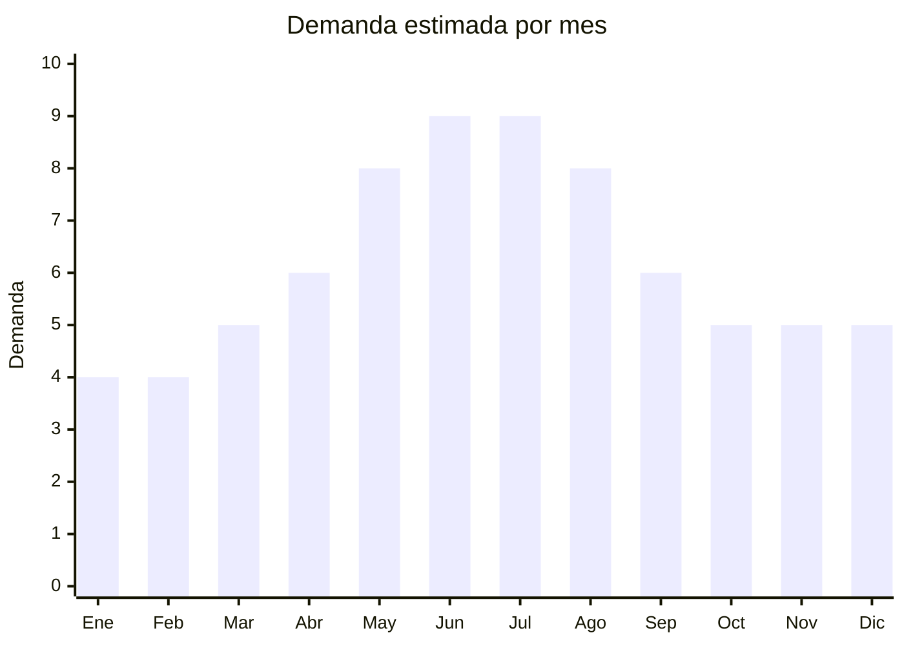

# Pantuflas (algodón, peluche, espumón)

> **Capítulo NCM 64** — Calzado, polainas y artículos análogos | **Temporada:** Atemporal (pico invierno)

<Warning>
**ANTIDUMPING VARIABLE:** Verificar en la [CNCE](https://www.argentina.gob.ar/cnce/investigaciones/medidasvigentes) el NCM exacto. Las pantuflas de interior suelen tener menor riesgo de antidumping que calzado deportivo, pero depende del material y clasificación. Requiere **etiquetado obligatorio** (Res. 508/2007).
</Warning>

## Qué es y por qué importarlo

Pantuflas para uso doméstico en múltiples materiales: algodón, peluche (felpa), espumón (memory foam), y combinaciones. Formatos: punta abierta, cerrada, tipo botín. Las pantuflas con personajes (anime, series, películas) son tendencia fuerte. China produce la gran mayoría de las pantuflas del mercado mundial con una relación calidad/precio imbatible.

## Datos clave

| Dato | Valor |
|------|-------|
| **Posiciones NCM típicas** | 6405.20.00 (calzado con parte superior de materia textil), 6404.19.00 (calzado con suela de caucho/plástico y parte superior textil) |
| **Derecho de importación** | 20% (DIE) + 3% tasa estadística + **posible antidumping** |
| **Rango FOB típico** | USD 1.00 — USD 4.00 por par |
| **Precio de venta en Argentina** | ARS 5.000 — ARS 15.000 |
| **Margen bruto estimado** | 150% — 300% |
| **MOQ típico** | 100 — 500 pares por modelo/talle |
| **Demanda en MercadoLibre** | Muy Alta (51,446+ resultados) |
| **Competencia en MercadoLibre** | Media-Alta |
| **Dificultad para importar** | Moderada |
| **Certificaciones necesarias** | Etiquetado de calzado (Res. 508/2007) |
| **Antidumping** | **Verificar NCM** |

## Variantes y subtipos más comunes

| Subtipo / Variante | FOB aprox. | Venta AR aprox. | Nota |
|--------------------|-----------|-----------------|------|
| Pantuflas algodón punta abierta | USD 1.00 — 2.00 | ARS 4.000 — 8.000 | **Más vendido** |
| Pantuflas peluche cerradas | USD 1.50 — 3.00 | ARS 6.000 — 12.000 | Invierno |
| Pantuflas con personajes (anime) | USD 2.00 — 4.00 | ARS 8.000 — 15.000 | **Tendencia** |
| Pantuflas tipo botín | USD 2.00 — 3.50 | ARS 7.000 — 13.000 | Invierno premium |
| Pantuflas memory foam | USD 1.50 — 3.00 | ARS 6.000 — 12.000 | Confort premium |

## Regulaciones y requisitos

<Tabs>
  <Tab title="Certificaciones">
    Etiquetado de calzado obligatorio. Verificar antidumping por NCM.
  </Tab>
  <Tab title="Etiquetado">
    Material del corte (ej: "Felpa 100% Poliéster"), material de la suela (ej: "EVA antideslizante"), talle sistema argentino, país de origen, datos importador.
  </Tab>
  <Tab title="Restricciones">
    - Antidumping variable según clasificación NCM
    - Sistema de talles argentino obligatorio
    - Pantuflas infantiles pueden tener requisitos adicionales
  </Tab>
</Tabs>

## Logística

| Dato | Valor |
|------|-------|
| **Peso típico por par** | 0.20 — 0.50 kg |
| **Volumen típico** | Bajo-Medio |
| **Fragilidad** | Baja |
| **Envío recomendado** | Marítimo LCL |
| **Tiempo total estimado** | 50 — 80 días (marítimo) |

## Estacionalidad



| Aspecto | Detalle |
|---------|---------|
| **Meses pico** | Mayo-Agosto (invierno) + Junio (Día del Padre — regalo popular) |
| **Meses valle** | Enero-Febrero — demanda base se mantiene |

## Ventajas y riesgos

<CardGroup cols={2}>
  <Card title="Ventajas" icon="circle-check">
    - Demanda masiva (51,000+ resultados ML)
    - Producto de reposición frecuente
    - Pantuflas personajes = alto valor percibido
    - Livianas (flete eficiente)
    - Sin regulaciones complejas
  </Card>
  <Card title="Riesgos" icon="triangle-exclamation">
    - Antidumping variable
    - Competencia alta
    - Talles argentinos obligatorios
    - Calidad de materiales variable
    - Estacionalidad marcada (invierno)
  </Card>
</CardGroup>

## Palabras clave para buscar en Alibaba

```
plush slippers wholesale, indoor slippers cotton, memory foam slippers,
character slippers anime, warm slippers winter, home slippers women,
fluffy slippers wholesale, EVA sole slippers
```

## Fuentes

- [MercadoLibre Argentina — Pantuflas](https://listado.mercadolibre.com.ar/pantuflas)
- [CNCE — Medidas antidumping vigentes](https://www.argentina.gob.ar/cnce/investigaciones/medidasvigentes)
