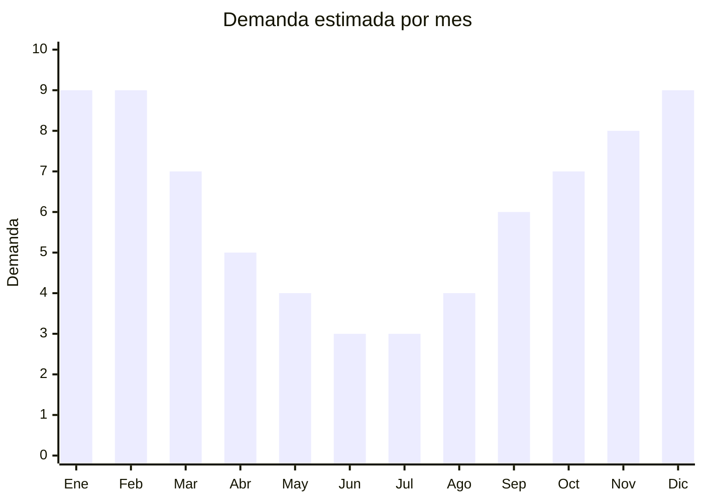

# Sandalias y calzado casual

> **Capítulo NCM 64** — Calzado, polainas y artículos análogos | **Temporada:** Atemporal (pico verano)

<Warning>
**ANTIDUMPING VARIABLE:** Las sandalias de plástico/EVA/PVC suelen tener menor riesgo de antidumping que calzado deportivo, pero depende del NCM exacto. Verificar siempre en la [CNCE](https://www.argentina.gob.ar/cnce/investigaciones/medidasvigentes). Requiere **etiquetado obligatorio** (Res. 508/2007).
</Warning>

## Qué es y por qué importarlo

Sandalias para hombre y mujer en materiales diversos: EVA, PVC, goma, tela con suela de goma. Incluye sandalias planas, con plataforma, deportivas, franciscanas, birkenstock-style, y chinelas con tiras. Es uno de los segmentos más grandes de calzado en Argentina con más de 104,000 resultados en MercadoLibre. Las sandalias de EVA y PVC son más viables por material económico y menor riesgo de antidumping.

## Datos clave

| Dato | Valor |
|------|-------|
| **Posiciones NCM típicas** | 6402.99.00 (suela/parte superior caucho/plástico), 6402.20.00 (con tiras), 6404.19.00 (parte superior textil) |
| **Derecho de importación** | 20% (DIE) + 3% tasa estadística + **posible antidumping** |
| **Rango FOB típico** | USD 1.00 — USD 5.00 por par |
| **Precio de venta en Argentina** | ARS 5.000 — ARS 20.000 |
| **Margen bruto estimado** | 150% — 250% (si antidumping es bajo) |
| **MOQ típico** | 100 — 500 pares por modelo/talle |
| **Demanda en MercadoLibre** | Muy Alta (104,788+ resultados) |
| **Competencia en MercadoLibre** | Alta |
| **Dificultad para importar** | Moderada |
| **Certificaciones necesarias** | Etiquetado de calzado (Res. 508/2007) |
| **Antidumping** | **Verificar NCM específico** |

## Variantes y subtipos más comunes

| Subtipo / Variante | FOB aprox. | Venta AR aprox. | Nota |
|--------------------|-----------|-----------------|------|
| Sandalias EVA planas unisex | USD 1.00 — 2.00 | ARS 4.000 — 10.000 | Básico |
| Sandalias birkenstock-style | USD 2.00 — 4.00 | ARS 8.000 — 18.000 | **Tendencia** |
| Sandalias plataforma mujer | USD 2.00 — 5.00 | ARS 8.000 — 20.000 | Moda |
| Sandalias deportivas hombre | USD 2.00 — 4.00 | ARS 7.000 — 15.000 | Sport casual |
| Sandalias franciscanas | USD 1.50 — 3.00 | ARS 5.000 — 12.000 | Clásico |

## Regulaciones y requisitos

<Tabs>
  <Tab title="Certificaciones">
    Etiquetado de calzado obligatorio. Verificar antidumping por NCM.
  </Tab>
  <Tab title="Etiquetado">
    Material del corte, material de la suela, material del forro (si tiene), talle en sistema argentino, país de origen, datos del importador.
  </Tab>
  <Tab title="Restricciones">
    - Antidumping variable según NCM
    - Etiquetado obligatorio
    - Sistema de talles argentino
  </Tab>
</Tabs>

## Logística

| Dato | Valor |
|------|-------|
| **Peso típico por par** | 0.20 — 0.50 kg |
| **Volumen típico** | Bajo-Medio |
| **Fragilidad** | Baja |
| **Envío recomendado** | Marítimo LCL |
| **Tiempo total estimado** | 50 — 80 días (marítimo) |

## Estacionalidad



| Aspecto | Detalle |
|---------|---------|
| **Meses pico** | Noviembre-Marzo (primavera/verano) |
| **Meses valle** | Junio-Agosto — demanda muy reducida |

## Ventajas y riesgos

<CardGroup cols={2}>
  <Card title="Ventajas" icon="circle-check">
    - Demanda masiva (104,000+ resultados ML)
    - Material EVA/PVC = menor antidumping
    - Livianas (flete eficiente)
    - Múltiples nichos (moda, sport, básico)
    - Personalización con marca propia
  </Card>
  <Card title="Riesgos" icon="triangle-exclamation">
    - Antidumping variable — verificar
    - Estacionalidad marcada (verano)
    - Competencia muy alta
    - Talles argentinos obligatorios
    - Calidad de materiales variable
  </Card>
</CardGroup>

## Palabras clave para buscar en Alibaba

```
sandals wholesale, EVA sandals women, platform sandals wholesale,
birkenstock style sandals, sport sandals men, PVC sandals bulk,
beach sandals wholesale, slide sandals women
```

## Fuentes

- [MercadoLibre Argentina — Sandalias](https://listado.mercadolibre.com.ar/sandalias)
- [CNCE — Medidas antidumping vigentes](https://www.argentina.gob.ar/cnce/investigaciones/medidasvigentes)
