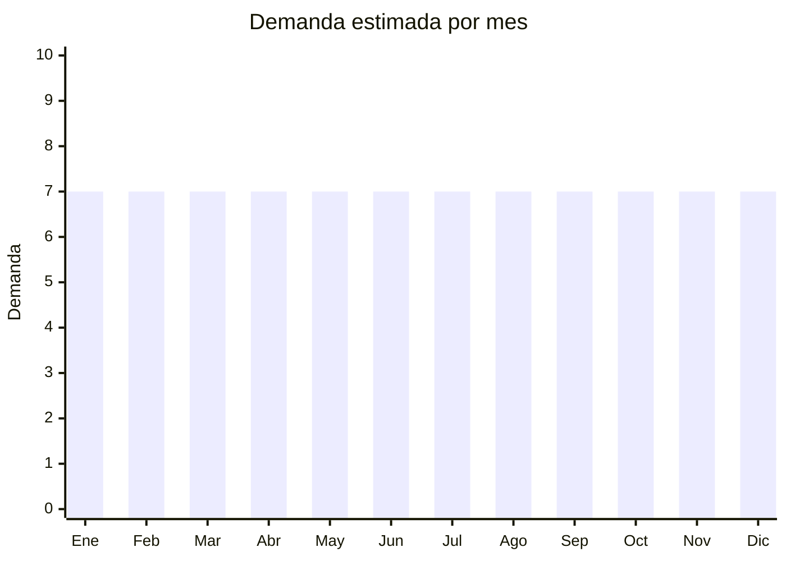

# Zapatillas deportivas y casual

> **Capítulo NCM 64** — Calzado, polainas y artículos análogos | **Temporada:** Atemporal

<Warning>
**⚠️ RIESGO ALTO — ANTIDUMPING SIGNIFICATIVO:** Argentina mantiene derechos antidumping **muy elevados** sobre calzado deportivo de origen chino. Los derechos pueden **duplicar o triplicar** el costo de importación, destruyendo completamente el margen. El Decreto 236/2025 redujo aranceles generales de 35% a 20%, pero los antidumping son adicionales y siguen vigentes. Verificar SIEMPRE en la [CNCE](https://www.argentina.gob.ar/cnce/investigaciones/medidasvigentes). Este producto es de **ALTO RIESGO** para importadores sin experiencia.
</Warning>

## Qué es y por qué importarlo

Zapatillas de running, training, casual urbano y con tecnologías como amortiguación, mesh transpirable, suela de goma EVA. Incluye zapatillas deportivas funcionales, urbanas casual y zapatillas con luz LED (infantiles). China (Fujian — Putian, Jinjiang) es el centro mundial de producción de calzado deportivo. **Sin embargo, el antidumping sobre este producto es uno de los más altos en importación de China → Argentina.**

## Datos clave

| Dato | Valor |
|------|-------|
| **Posiciones NCM típicas** | 6404.11.00 (calzado deportivo con suela caucho y parte superior textil), 6402.91.00 (calzado que cubra el tobillo) |
| **Derecho de importación** | 20% (DIE) + 3% tasa estadística + **ANTIDUMPING ALTO** |
| **Rango FOB típico** | USD 3.00 — USD 15.00 por par |
| **Precio de venta en Argentina** | ARS 15.000 — ARS 50.000 |
| **Margen bruto estimado** | **Variable — puede ser negativo con antidumping** |
| **MOQ típico** | 100 — 500 pares por modelo/talle |
| **Demanda en MercadoLibre** | Muy Alta (29,803+ resultados solo "running") |
| **Competencia en MercadoLibre** | Muy Alta |
| **Dificultad para importar** | **Difícil** (antidumping + etiquetado + talles) |
| **Certificaciones necesarias** | Etiquetado calzado (Res. 508/2007) |
| **Antidumping** | **⚠️ ALTO — verificar siempre** |

## Variantes y subtipos más comunes

| Subtipo / Variante | FOB aprox. | Venta AR aprox. | Nota |
|--------------------|-----------|-----------------|------|
| Zapatillas running/training | USD 5.00 — 15.00 | ARS 20.000 — 50.000 | **⚠️ Antidumping alto** |
| Zapatillas urbanas casual | USD 3.00 — 10.00 | ARS 15.000 — 35.000 | **⚠️ Verificar AD** |
| Zapatillas con luz LED infantiles | USD 3.00 — 8.00 | ARS 10.000 — 25.000 | Nicho infantil |
| Zapatillas pádel/tenis | USD 5.00 — 12.00 | ARS 20.000 — 45.000 | **⚠️ Antidumping alto** |

## Regulaciones y requisitos

<Tabs>
  <Tab title="Certificaciones">
    | Requisito | Obligatorio | Detalle |
    |-----------|-------------|---------|
    | Etiquetado calzado Res. 508/2007 | **Sí** | Material del corte, suela, forro, talle AR, país de origen, datos importador |
    | Antidumping CNCE | **⚠️ CRÍTICO** | Derechos antidumping muy significativos sobre calzado deportivo chino |
  </Tab>
  <Tab title="Etiquetado">
    Material del corte (ej: "Mesh sintético"), material de la suela (ej: "EVA + Rubber"), material del forro, talle en sistema argentino, país de origen, datos importador.
  </Tab>
  <Tab title="Restricciones">
    - **Antidumping elevado** es la restricción principal
    - Etiquetado obligatorio estricto
    - Sistema de talles argentino
    - Zapatillas con LED: verificar si requieren ENACOM (Bluetooth)
  </Tab>
</Tabs>

## Logística

| Dato | Valor |
|------|-------|
| **Peso típico por par** | 0.50 — 1.00 kg |
| **Volumen típico** | Medio (cajas individuales) |
| **Fragilidad** | Baja |
| **Envío recomendado** | Marítimo LCL |
| **Tiempo total estimado** | 50 — 80 días (marítimo) |

## Estacionalidad



| Aspecto | Detalle |
|---------|---------|
| **Meses pico** | Demanda estable todo el año. Leve pico en fechas de regalo (Navidad, Día del Padre) |
| **Meses valle** | No hay estacionalidad marcada |

## Ventajas y riesgos

<CardGroup cols={2}>
  <Card title="Ventajas" icon="circle-check">
    - Demanda masiva permanente
    - Alto ticket de venta
    - Marca propia posible
    - Tendencia fitness/athleisure
  </Card>
  <Card title="Riesgos" icon="triangle-exclamation">
    - **Antidumping puede destruir el margen**
    - Competencia altísima (Nike, Adidas + locales)
    - Sistema de talles complejo
    - Calidad variable
    - Etiquetado obligatorio estricto
    - Devoluciones por talle
  </Card>
</CardGroup>

<Warning>
**Recomendación:** Este producto es **solo para importadores experimentados** que puedan verificar antidumping exacto, negociar costos y absorber regulaciones. Para principiantes, las **ojotas EVA** y **pantuflas** del mismo capítulo son alternativas mucho más viables.
</Warning>

## Palabras clave para buscar en Alibaba

```
running shoes wholesale, sport shoes factory Putian, casual sneakers wholesale,
training shoes men, mesh running shoes, LED shoes children,
athletic shoes bulk, Jinjiang shoes factory
```

## Fuentes

- [MercadoLibre Argentina — Zapatillas running](https://listado.mercadolibre.com.ar/zapatillas-running)
- [CNCE — Medidas antidumping vigentes](https://www.argentina.gob.ar/cnce/investigaciones/medidasvigentes)
