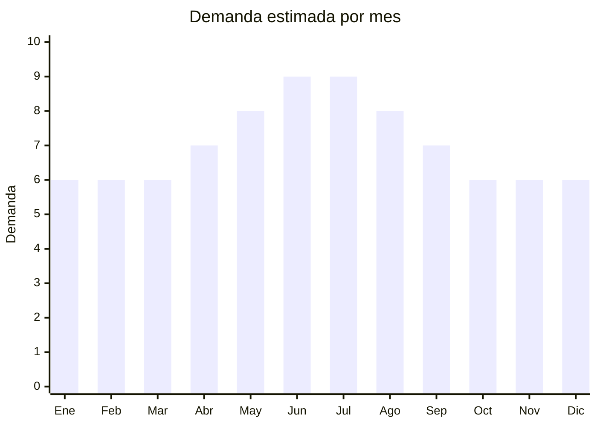

# Cuellos térmicos / buff multifunción

> **Capítulo NCM 65** — Sombreros, demás tocados y sus partes | **Temporada:** Atemporal

## Qué es y por qué importarlo

Los cuellos térmicos multifunción (tipo "buff") son bandanas tubulares que se usan como cuello, tapaboca, vincha, gorro o muñequera. Uso principal: moto, running, ciclismo, ski, pesca, y protección contra frío/sol/polvo. Se venden por unidad o en packs. El costo FOB es extremadamente bajo y se venden con márgenes excelentes. Demanda todo el año: en invierno para frío (moto, ski) y en verano para sol (running, pesca).

**Sin antidumping. Sin certificaciones especiales.**

## Datos clave

| Dato | Valor |
|------|-------|
| **Posiciones NCM típicas** | 6505.00.29 (tocados de otras materias textiles), 6117.80.00 (complementos de vestir de punto) |
| **Derecho de importación** | 20% (DIE) + 3% tasa estadística |
| **Rango FOB típico** | USD 0.20 — USD 1.50 por unidad |
| **Precio de venta en Argentina** | ARS 2.000 — ARS 8.000 |
| **Margen bruto estimado** | 300% — 600% |
| **MOQ típico** | 100 — 1,000 unidades |
| **Demanda en MercadoLibre** | Alta (10,945+ resultados) |
| **Competencia en MercadoLibre** | Media |
| **Dificultad para importar** | Muy fácil |
| **Certificaciones necesarias** | Etiquetado básico |
| **Antidumping** | **No** |

## Variantes y subtipos más comunes

| Subtipo / Variante | FOB aprox. | Venta AR aprox. | Nota |
|--------------------|-----------|-----------------|------|
| Cuello multifunción básico | USD 0.20 — 0.50 | ARS 2.000 — 4.000 | **Más vendido** |
| Cuello térmico polar (fleece) | USD 0.50 — 1.50 | ARS 3.000 — 8.000 | Invierno premium |
| Pack x3 cuellos variados | USD 0.60 — 1.50 | ARS 5.000 — 10.000 | Formato popular |
| Cuello con filtro UV | USD 0.30 — 0.80 | ARS 2.500 — 5.000 | Running/pesca |
| Cuello con diseños temáticos | USD 0.30 — 0.80 | ARS 2.500 — 6.000 | Moto/outdoor |

## Regulaciones y requisitos

<Tabs>
  <Tab title="Certificaciones">
    Sin certificaciones especiales.
  </Tab>
  <Tab title="Etiquetado">
    Composición del material (ej: "100% Poliéster"), país de origen, datos importador.
  </Tab>
  <Tab title="Restricciones">
    Sin restricciones. Producto de importación libre.
  </Tab>
</Tabs>

## Logística

| Dato | Valor |
|------|-------|
| **Peso típico por unidad** | 0.03 — 0.08 kg |
| **Volumen típico** | Muy bajo (se enrollan/comprimen) |
| **Fragilidad** | Nula |
| **Envío recomendado** | Aéreo/Courier (ultraliviano) |
| **Tiempo total estimado** | 15 — 25 días (aéreo) / 50 — 80 días (marítimo) |

<Tip>
Por su peso mínimo, los cuellos térmicos son **ideales para envío aéreo** incluso en lotes grandes. Un paquete de 500 unidades pesa apenas 15-25 kg. Esto permite reposición rápida y test de mercado con bajo riesgo.
</Tip>

## Estacionalidad



| Aspecto | Detalle |
|---------|---------|
| **Meses pico** | Mayo-Agosto (invierno — moto, ski, frío) |
| **Meses valle** | Verano — uso para protección solar mantiene demanda base |

## Ventajas y riesgos

<CardGroup cols={2}>
  <Card title="Ventajas" icon="circle-check">
    - FOB extremadamente bajo
    - Margen excepcional (300-600%)
    - Ultraliviano (ideal envío aéreo)
    - **Sin antidumping ni certificaciones**
    - Uso multifunción = demanda diversa
    - Ideal para test de mercado
  </Card>
  <Card title="Riesgos" icon="triangle-exclamation">
    - Ticket promedio bajo
    - Competencia de precio
    - Calidad de impresión variable
    - Mercado fragmentado
  </Card>
</CardGroup>

## Palabras clave para buscar en Alibaba

```
neck gaiter wholesale, bandana tube scarf, multifunctional headwear,
cycling neck cover, motorcycle face mask tube, UV protection neck gaiter,
fleece neck warmer, outdoor face cover
```

## Fuentes

- [MercadoLibre Argentina — Cuello térmico](https://listado.mercadolibre.com.ar/cuello-termico)
- [Alibaba — Neck gaiter wholesale](https://www.alibaba.com/showroom/neck-gaiter-wholesale.html)
