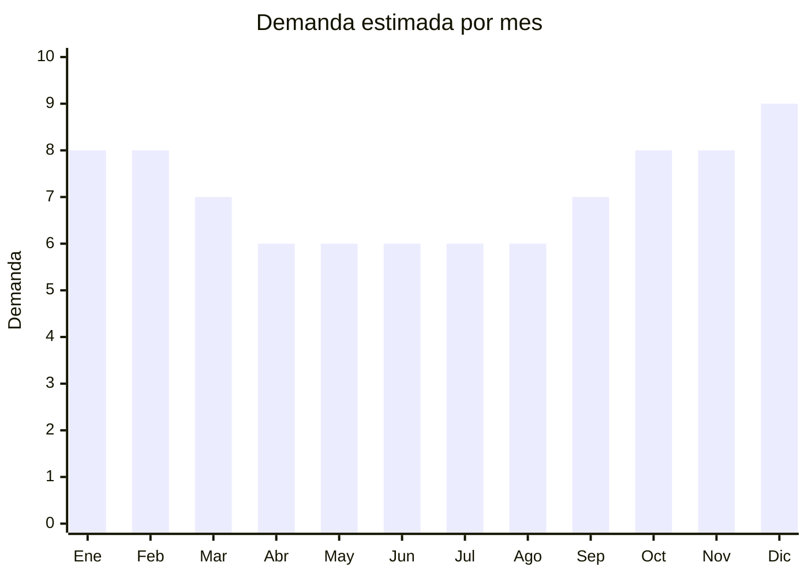

# Gorras (trucker, visera, deportivas)

> **Capítulo NCM 65** — Sombreros, demás tocados y sus partes | **Temporada:** Atemporal

## Qué es y por qué importarlo

Las gorras son el producto ESTRELLA del capítulo 65. Incluye gorras trucker (malla trasera), visera plana estilo NY/snapback, deportivas de gabardina, dad caps (gorra desestructurada), y gorras personalizables con bordado. La demanda es masiva todo el año con más de 329,000 resultados en MercadoLibre. China (Yiwu, Shenzhen, Dongguan) produce la mayoría de gorras del mundo con personalización (bordado, sublimación) desde MOQ bajos.

**Sin antidumping vigente** sobre sombreros y gorras. Menor regulación que ropa y calzado.

## Datos clave

| Dato | Valor |
|------|-------|
| **Posiciones NCM típicas** | 6505.00.22 (gorras con visera de algodón), 6505.00.29 (de otras materias textiles) |
| **Derecho de importación** | 20% (DIE) + 3% tasa estadística |
| **Rango FOB típico** | USD 0.50 — USD 3.00 por unidad |
| **Precio de venta en Argentina** | ARS 5.000 — ARS 18.000 |
| **Margen bruto estimado** | 200% — 400% |
| **MOQ típico** | 50 — 500 unidades por diseño |
| **Demanda en MercadoLibre** | Muy Alta (329,398+ resultados) |
| **Competencia en MercadoLibre** | Alta |
| **Dificultad para importar** | Fácil |
| **Certificaciones necesarias** | Etiquetado básico |
| **Antidumping** | **No** |

## Variantes y subtipos más comunes

| Subtipo / Variante | FOB aprox. | Venta AR aprox. | Nota |
|--------------------|-----------|-----------------|------|
| Gorra trucker (malla trasera) | USD 0.80 — 2.00 | ARS 5.000 — 12.000 | **Más vendido** |
| Gorra visera plana snapback (NY) | USD 1.00 — 3.00 | ARS 6.000 — 18.000 | Streetwear |
| Gorra dad cap (desestructurada) | USD 0.50 — 1.50 | ARS 4.000 — 10.000 | Casual |
| Gorra deportiva gabardina lisa | USD 0.50 — 1.50 | ARS 3.000 — 8.000 | Básica |
| Gorra con bordado personalizado | USD 1.50 — 3.00 | ARS 8.000 — 18.000 | **Marca propia** |

## Regulaciones y requisitos

<Tabs>
  <Tab title="Certificaciones">
    Sin certificaciones especiales. Producto de mínima regulación.
  </Tab>
  <Tab title="Etiquetado">
    Composición del material (ej: "100% Algodón" o "100% Poliéster"), país de origen, datos del importador.
  </Tab>
  <Tab title="Restricciones">
    - Sin antidumping
    - Sin certificaciones
    - **Atención propiedad intelectual:** Gorras con logos de marcas (NY Yankees, Nike, etc.) pueden generar problemas por falsificación. Preferir diseños propios o genéricos.
  </Tab>
</Tabs>

## Logística

| Dato | Valor |
|------|-------|
| **Peso típico por unidad** | 0.08 — 0.15 kg |
| **Volumen típico** | Bajo (se apilan/aplanan) |
| **Fragilidad** | Baja (visera rígida cuidar) |
| **Envío recomendado** | Marítimo LCL / Aéreo si lote chico |
| **Tiempo total estimado** | 50 — 80 días (marítimo) / 15-25 días (aéreo) |

## Estacionalidad



| Aspecto | Detalle |
|---------|---------|
| **Meses pico** | Octubre-Febrero (primavera/verano + sol) + Diciembre (regalos) |
| **Meses valle** | Abril-Agosto — demanda base estable |

## Ventajas y riesgos

<CardGroup cols={2}>
  <Card title="Ventajas" icon="circle-check">
    - Demanda masiva (329,000+ resultados ML)
    - **Sin antidumping**
    - FOB muy bajo (USD 0.50-3.00)
    - Personalizable con marca propia
    - Liviano (flete eficiente)
    - Mínima regulación
  </Card>
  <Card title="Riesgos" icon="triangle-exclamation">
    - Competencia alta
    - Riesgo de propiedad intelectual con logos
    - Calidad de bordado variable
    - Viseras pueden deformarse en transporte
    - Mercado fragmentado
  </Card>
</CardGroup>

## Palabras clave para buscar en Alibaba

```
trucker cap wholesale, snapback cap factory, baseball cap custom logo,
dad cap wholesale, embroidered cap bulk, sports cap wholesale,
mesh back cap, flat brim cap
```

## Fuentes

- [MercadoLibre Argentina — Gorras](https://listado.mercadolibre.com.ar/gorras)
- [Alibaba — Caps wholesale](https://www.alibaba.com/showroom/baseball-cap-wholesale.html)
