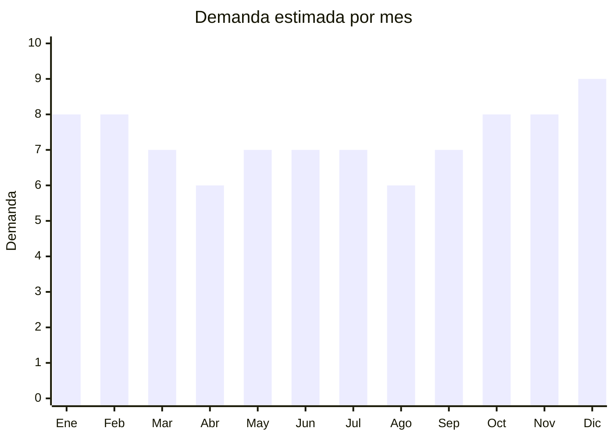

# Gorros (bucket, lana, natación)

> **Capítulo NCM 65** — Sombreros, demás tocados y sus partes | **Temporada:** Atemporal

## Qué es y por qué importarlo

Categoría amplia que incluye gorros australianos/bucket hat/pescador (tendencia fuerte en moda), gorros de lana/punto para invierno, y gorros de natación de silicona (demanda deportiva todo el año). Los bucket hats/gorros pescador son el formato estrella con más de 455,000 resultados combinados en MercadoLibre. China produce la mayoría de gorros del mundo con precios FOB extremadamente competitivos.

**Sin antidumping vigente.** Mínima regulación.

## Datos clave

| Dato | Valor |
|------|-------|
| **Posiciones NCM típicas** | 6505.00.22 (de algodón), 6505.00.29 (de otras fibras textiles), 6506.10.00 (cascos protectores — gorros natación = 6506.99) |
| **Derecho de importación** | 20% (DIE) + 3% tasa estadística |
| **Rango FOB típico** | USD 0.50 — USD 3.00 por unidad |
| **Precio de venta en Argentina** | ARS 3.000 — ARS 12.000 |
| **Margen bruto estimado** | 200% — 400% |
| **MOQ típico** | 50 — 500 unidades |
| **Demanda en MercadoLibre** | Muy Alta (455,834+ resultados combinados) |
| **Competencia en MercadoLibre** | Media-Alta |
| **Dificultad para importar** | Fácil |
| **Certificaciones necesarias** | Etiquetado básico |
| **Antidumping** | **No** |

## Variantes y subtipos más comunes

| Subtipo / Variante | FOB aprox. | Venta AR aprox. | Nota |
|--------------------|-----------|-----------------|------|
| Gorro bucket/pescador/australiano | USD 0.80 — 2.00 | ARS 4.000 — 12.000 | **Nº1 bestseller** |
| Gorro de lana/punto | USD 0.50 — 2.00 | ARS 3.000 — 8.000 | Invierno |
| Gorro de natación silicona | USD 0.30 — 1.50 | ARS 2.000 — 6.000 | Deportivo |
| Combo x2 gorros bucket | USD 1.50 — 3.00 | ARS 6.000 — 12.000 | Pack popular |
| Gorro bucket reversible | USD 1.00 — 2.50 | ARS 5.000 — 12.000 | 2 diseños en 1 |

## Regulaciones y requisitos

<Tabs>
  <Tab title="Certificaciones">
    Sin certificaciones especiales. Producto de mínima regulación.
  </Tab>
  <Tab title="Etiquetado">
    Composición del material, país de origen, datos del importador.
  </Tab>
  <Tab title="Restricciones">
    Sin restricciones significativas. Producto de importación libre.
  </Tab>
</Tabs>

## Logística

| Dato | Valor |
|------|-------|
| **Peso típico por unidad** | 0.05 — 0.15 kg |
| **Volumen típico** | Muy bajo (se aplanan) |
| **Fragilidad** | Nula |
| **Envío recomendado** | Marítimo LCL / Aéreo si lote chico |
| **Tiempo total estimado** | 50 — 80 días (marítimo) / 15-25 días (aéreo) |

## Estacionalidad



| Aspecto | Detalle |
|---------|---------|
| **Meses pico** | Verano (bucket para sol), Invierno (gorros lana), Diciembre (regalos) |
| **Meses valle** | Demanda estable — tipos diferentes para cada estación |

## Ventajas y riesgos

<CardGroup cols={2}>
  <Card title="Ventajas" icon="circle-check">
    - Demanda masiva (455,000+ resultados)
    - **Sin antidumping**
    - FOB muy bajo
    - Ultraliviano (flete mínimo)
    - Mínima regulación
    - Bucket hat = tendencia consolidada
  </Card>
  <Card title="Riesgos" icon="triangle-exclamation">
    - Competencia alta
    - Ticket promedio bajo
    - Calidad variable (costuras, telas)
    - Dependencia de tendencias de moda
  </Card>
</CardGroup>

## Palabras clave para buscar en Alibaba

```
bucket hat wholesale, fisherman hat wholesale, beanie winter hat,
knit cap wholesale, swimming cap silicone, reversible bucket hat,
cotton bucket hat, wool beanie cap
```

## Fuentes

- [MercadoLibre Argentina — Gorros](https://listado.mercadolibre.com.ar/gorros)
- [Alibaba — Bucket hat wholesale](https://www.alibaba.com/showroom/bucket-hat-wholesale.html)
