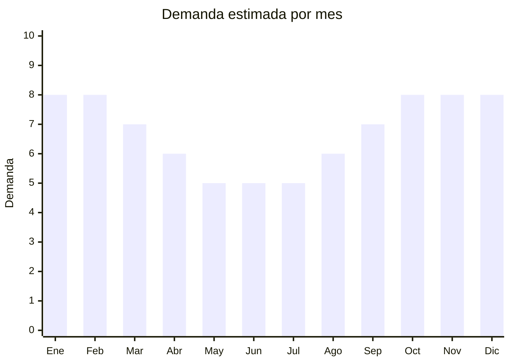

# Viseras deportivas (running, tenis, golf)

> **Capítulo NCM 65** — Sombreros, demás tocados y sus partes | **Temporada:** Atemporal

## Qué es y por qué importarlo

Viseras deportivas sin copa para running, tenis, golf, playa y actividades al aire libre. Son más livianas que las gorras y permiten mejor ventilación. Aonijie es una marca china que se posicionó como referencia en Argentina para viseras de running. El producto es ultraliviano, tiene bajo costo FOB y demanda constante entre deportistas. Ideal como complemento de la línea de gorras.

**Sin antidumping. Sin certificaciones especiales.**

## Datos clave

| Dato | Valor |
|------|-------|
| **Posiciones NCM típicas** | 6505.00.22 (de algodón), 6505.00.29 (de otras fibras textiles) |
| **Derecho de importación** | 20% (DIE) + 3% tasa estadística |
| **Rango FOB típico** | USD 0.50 — USD 2.50 por unidad |
| **Precio de venta en Argentina** | ARS 4.000 — ARS 12.000 |
| **Margen bruto estimado** | 200% — 400% |
| **MOQ típico** | 50 — 300 unidades |
| **Demanda en MercadoLibre** | Media-Alta (11,472+ resultados) |
| **Competencia en MercadoLibre** | Media |
| **Dificultad para importar** | Muy fácil |
| **Certificaciones necesarias** | Etiquetado básico |
| **Antidumping** | **No** |

## Variantes y subtipos más comunes

| Subtipo / Variante | FOB aprox. | Venta AR aprox. | Nota |
|--------------------|-----------|-----------------|------|
| Visera running ultraliviana | USD 0.50 — 1.50 | ARS 4.000 — 10.000 | **Más vendido** |
| Visera tenis/golf | USD 0.80 — 2.00 | ARS 5.000 — 12.000 | Clásica |
| Visera enrollable de playa | USD 0.50 — 1.50 | ARS 3.000 — 8.000 | Verano |
| Visera con protección UV | USD 1.00 — 2.50 | ARS 5.000 — 12.000 | Premium |

## Regulaciones y requisitos

<Tabs>
  <Tab title="Certificaciones">
    Sin certificaciones especiales.
  </Tab>
  <Tab title="Etiquetado">
    Composición del material, país de origen, datos importador.
  </Tab>
  <Tab title="Restricciones">
    Sin restricciones. Producto de mínima regulación.
  </Tab>
</Tabs>

## Logística

| Dato | Valor |
|------|-------|
| **Peso típico por unidad** | 0.03 — 0.08 kg |
| **Volumen típico** | Muy bajo |
| **Fragilidad** | Baja |
| **Envío recomendado** | Aéreo/Courier (ultraliviano) |
| **Tiempo total estimado** | 15 — 25 días (aéreo) / 50 — 80 días (marítimo) |

## Estacionalidad



| Aspecto | Detalle |
|---------|---------|
| **Meses pico** | Septiembre-Marzo (primavera/verano + actividad outdoor) |
| **Meses valle** | Mayo-Agosto — deportistas mantienen demanda base |

## Ventajas y riesgos

<CardGroup cols={2}>
  <Card title="Ventajas" icon="circle-check">
    - **Sin antidumping ni certificaciones**
    - Ultraliviano (ideal envío aéreo)
    - FOB muy bajo
    - Complemento de línea gorras
    - Nicho deportivo con demanda estable
  </Card>
  <Card title="Riesgos" icon="triangle-exclamation">
    - Nicho más pequeño que gorras
    - Ticket promedio bajo
    - Competencia de marcas deportivas
    - Estacionalidad moderada
  </Card>
</CardGroup>

## Palabras clave para buscar en Alibaba

```
sport visor cap wholesale, sun visor running, tennis visor wholesale,
golf visor cap, UV protection visor, lightweight sport visor
```

## Fuentes

- [MercadoLibre Argentina — Visera deportiva](https://listado.mercadolibre.com.ar/visera-deportiva)
- [Alibaba — Sport visor wholesale](https://www.alibaba.com/showroom/sport-visor-cap.html)
