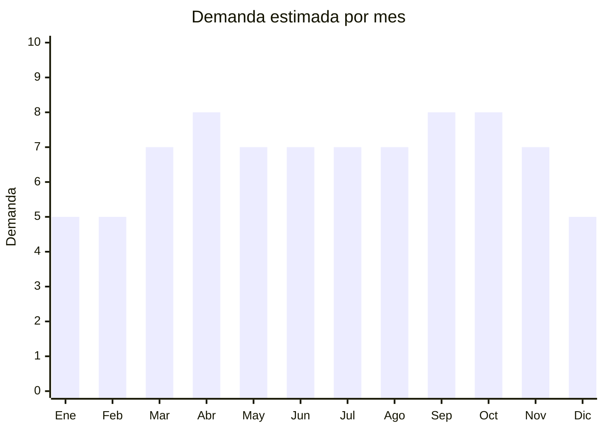

# Paraguas automáticos (cortos y largos)

> **Capítulo NCM 66** — Paraguas, sombrillas, quitasoles, bastones | **Temporada:** Atemporal

## Qué es y por qué importarlo

Paraguas con sistema de apertura/cierre automático en formatos corto (plegable) y largo. Los modelos reforzados antiviento (con doble varilla o 8-12 varillas) son los más demandados. China (Xiamen, Shaoxing) produce más del 80% de los paraguas del mundo. El paraguas automático reforzado antiviento es el bestseller absoluto en MercadoLibre con demanda permanente en toda Argentina (AMBA, litoral, sur, Patagonia).

**Sin antidumping. Sin certificaciones especiales. Mínima regulación.**

## Datos clave

| Dato | Valor |
|------|-------|
| **Posiciones NCM típicas** | 6601.10.00 (paraguas de jardín/terraza), 6601.91.00 (telescópicos — plegables), 6601.99.00 (los demás) |
| **Derecho de importación** | 20% (DIE) + 3% tasa estadística |
| **Rango FOB típico** | USD 1.00 — USD 5.00 por unidad |
| **Precio de venta en Argentina** | ARS 5.000 — ARS 18.000 |
| **Margen bruto estimado** | 150% — 300% |
| **MOQ típico** | 100 — 500 unidades |
| **Demanda en MercadoLibre** | Alta (27,691+ resultados) |
| **Competencia en MercadoLibre** | Media-Alta |
| **Dificultad para importar** | Fácil |
| **Certificaciones necesarias** | Ninguna |
| **Antidumping** | **No** |

## Variantes y subtipos más comunes

| Subtipo / Variante | FOB aprox. | Venta AR aprox. | Nota |
|--------------------|-----------|-----------------|------|
| Paraguas automático plegable reforzado | USD 2.00 — 4.00 | ARS 8.000 — 15.000 | **Más vendido** |
| Paraguas largo automático antiviento | USD 2.00 — 5.00 | ARS 8.000 — 18.000 | 12 varillas |
| Paraguas automático con filtro UV | USD 2.50 — 5.00 | ARS 9.000 — 18.000 | Doble uso lluvia/sol |
| Paraguas anti-fluido compacto | USD 1.50 — 3.00 | ARS 5.000 — 12.000 | Tela hidrofóbica |
| Paraguas 8 varillas básico | USD 1.00 — 2.00 | ARS 4.000 — 8.000 | Económico |

## Regulaciones y requisitos

<Tabs>
  <Tab title="Certificaciones">
    Sin certificaciones especiales.
  </Tab>
  <Tab title="Etiquetado">
    País de origen, datos importador. Estándar mínimo.
  </Tab>
  <Tab title="Restricciones">
    Sin restricciones. Categoría de **mínima regulación**.
  </Tab>
</Tabs>

## Logística

| Dato | Valor |
|------|-------|
| **Peso típico por unidad** | 0.30 — 0.60 kg |
| **Volumen típico** | Medio (paraguas largos ocupan espacio) |
| **Fragilidad** | Media (varillas pueden doblarse) |
| **Envío recomendado** | Marítimo LCL |
| **Tiempo total estimado** | 50 — 80 días (marítimo) |

<Warning>
Los paraguas son **relativamente frágiles** en transporte. Solicitar packaging individual reforzado (cada paraguas en funda + caja con protección). Las varillas pueden doblarse si el embalaje no es adecuado.
</Warning>

## Estacionalidad



| Aspecto | Detalle |
|---------|---------|
| **Meses pico** | Marzo-Abril (otoño, temporada de lluvias) + Septiembre-Octubre (primavera lluviosa) |
| **Meses valle** | Enero-Febrero, Diciembre — menor demanda pero siempre presente |

## Ventajas y riesgos

<CardGroup cols={2}>
  <Card title="Ventajas" icon="circle-check">
    - **Sin antidumping ni certificaciones**
    - Demanda permanente (llueve todo el año)
    - China domina la producción mundial
    - Producto de reposición (se rompen, se pierden)
    - Marca propia viable
  </Card>
  <Card title="Riesgos" icon="triangle-exclamation">
    - Fragilidad en transporte
    - Competencia media-alta
    - Calidad de varillas variable
    - Volumen significativo (paraguas largos)
    - Reclamos por fallas mecánicas (apertura)
  </Card>
</CardGroup>

## Palabras clave para buscar en Alibaba

```
automatic umbrella wholesale, windproof umbrella, folding umbrella bulk,
anti-UV umbrella, double layer umbrella, 12 ribs umbrella,
compact umbrella wholesale, Xiamen umbrella factory
```

## Fuentes

- [MercadoLibre Argentina — Paraguas](https://listado.mercadolibre.com.ar/paraguas)
- [Alibaba — Umbrella wholesale](https://www.alibaba.com/showroom/umbrella-wholesale.html)
