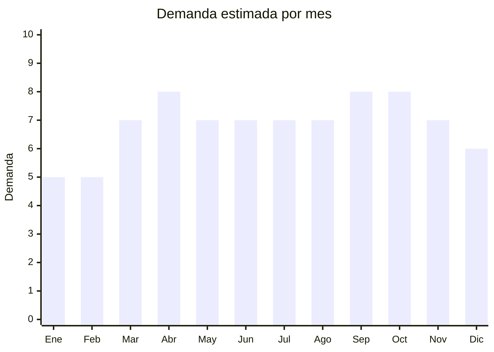

# Paraguas mini plegables (de cartera/bolsillo)

> **Capítulo NCM 66** — Paraguas, sombrillas, quitasoles, bastones | **Temporada:** Atemporal

## Qué es y por qué importarlo

Paraguas ultra compactos que caben en una cartera, bolsillo o mochila. El formato "cápsula" con estuche rígido es tendencia fuerte. Miden 15-20 cm plegados. Son ideales como producto de impulso en venta online y como regalo. La comodidad del formato compacto justifica un precio premium respecto al paraguas estándar. Complemento perfecto de la línea de paraguas automáticos.

**Sin antidumping. Sin certificaciones.**

## Datos clave

| Dato | Valor |
|------|-------|
| **Posiciones NCM típicas** | 6601.91.00 (paraguas telescópicos — plegables) |
| **Derecho de importación** | 20% (DIE) + 3% tasa estadística |
| **Rango FOB típico** | USD 1.00 — USD 3.00 por unidad |
| **Precio de venta en Argentina** | ARS 5.000 — ARS 12.000 |
| **Margen bruto estimado** | 200% — 350% |
| **MOQ típico** | 100 — 500 unidades |
| **Demanda en MercadoLibre** | Media-Alta |
| **Competencia en MercadoLibre** | Media |
| **Dificultad para importar** | Fácil |
| **Certificaciones necesarias** | Ninguna |
| **Antidumping** | **No** |

## Variantes y subtipos más comunes

| Subtipo / Variante | FOB aprox. | Venta AR aprox. | Nota |
|--------------------|-----------|-----------------|------|
| Paraguas mini cápsula con estuche | USD 1.50 — 3.00 | ARS 6.000 — 12.000 | **Más vendido** |
| Paraguas mini 5 pliegues pocket | USD 1.00 — 2.00 | ARS 4.000 — 8.000 | Ultra compacto |
| Paraguas mini anti-UV | USD 1.50 — 3.00 | ARS 5.000 — 10.000 | Doble uso |
| Paraguas mini con funda absorbente | USD 1.50 — 2.50 | ARS 5.000 — 10.000 | Práctico |

## Regulaciones y requisitos

<Tabs>
  <Tab title="Certificaciones">
    Sin certificaciones especiales.
  </Tab>
  <Tab title="Etiquetado">
    País de origen, datos importador.
  </Tab>
  <Tab title="Restricciones">
    Sin restricciones.
  </Tab>
</Tabs>

## Logística

| Dato | Valor |
|------|-------|
| **Peso típico por unidad** | 0.15 — 0.30 kg |
| **Volumen típico** | Bajo (compactos) |
| **Fragilidad** | Media |
| **Envío recomendado** | Marítimo LCL / Aéreo si lote chico |
| **Tiempo total estimado** | 50 — 80 días (marítimo) |

## Estacionalidad



| Aspecto | Detalle |
|---------|---------|
| **Meses pico** | Marzo-Abril + Septiembre-Octubre (temporadas de lluvia) |
| **Meses valle** | Enero-Febrero — demanda base se mantiene |

## Ventajas y riesgos

<CardGroup cols={2}>
  <Card title="Ventajas" icon="circle-check">
    - **Sin antidumping ni certificaciones**
    - Formato cápsula = alto valor percibido
    - Compacto (flete eficiente)
    - Producto de impulso/regalo
    - Complementa línea de paraguas
  </Card>
  <Card title="Riesgos" icon="triangle-exclamation">
    - Fragilidad (varillas finas)
    - Resistencia al viento limitada
    - Reclamos por fallas mecánicas
    - Competencia creciente
  </Card>
</CardGroup>

## Palabras clave para buscar en Alibaba

```
mini umbrella capsule, pocket umbrella wholesale, 5 fold umbrella,
ultra compact umbrella, small folding umbrella, UV mini umbrella,
travel umbrella wholesale, capsule umbrella case
```

## Fuentes

- [MercadoLibre Argentina — Paraguas mini](https://listado.mercadolibre.com.ar/paraguas-mini)
- [Alibaba — Mini umbrella wholesale](https://www.alibaba.com/showroom/mini-umbrella-wholesale.html)
