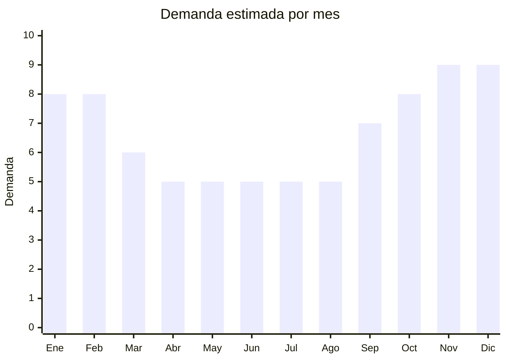

# Sombrillas y parasoles (UV, golf)

> **Capítulo NCM 66** — Paraguas, sombrillas, quitasoles, bastones | **Temporada:** Atemporal

## Qué es y por qué importarlo

Sombrillas y parasoles con protección UV para uso personal y deportivo. Incluye parasoles de golf (diámetro grande, recubrimiento plateado anti-UV), sombrillas UV de mano y paraguas de doble uso lluvia/sol. El formato pack x2 es popular. La demanda es doble: en verano para protección solar y en temporada de lluvias como paraguas. Los parasoles de golf con recubrimiento plateado son un nicho premium.

**Sin antidumping. Sin certificaciones.**

## Datos clave

| Dato | Valor |
|------|-------|
| **Posiciones NCM típicas** | 6601.10.00 (sombrillas/quitasoles), 6601.99.00 (los demás paraguas) |
| **Derecho de importación** | 20% (DIE) + 3% tasa estadística |
| **Rango FOB típico** | USD 1.50 — USD 5.00 por unidad |
| **Precio de venta en Argentina** | ARS 6.000 — ARS 18.000 |
| **Margen bruto estimado** | 150% — 300% |
| **MOQ típico** | 50 — 300 unidades |
| **Demanda en MercadoLibre** | Media (9,614+ resultados) |
| **Competencia en MercadoLibre** | Baja-Media |
| **Dificultad para importar** | Fácil |
| **Certificaciones necesarias** | Ninguna |
| **Antidumping** | **No** |

## Variantes y subtipos más comunes

| Subtipo / Variante | FOB aprox. | Venta AR aprox. | Nota |
|--------------------|-----------|-----------------|------|
| Parasol golf plateado UV | USD 2.50 — 5.00 | ARS 8.000 — 18.000 | **Premium** |
| Sombrilla UV compacta | USD 1.50 — 3.00 | ARS 5.000 — 12.000 | Más vendido |
| Pack x2 parasol lluvia/sol | USD 3.00 — 6.00 | ARS 10.000 — 18.000 | Formato popular |
| Sombrilla de playa portátil | USD 3.00 — 8.00 | ARS 10.000 — 25.000 | Verano |

## Regulaciones y requisitos

<Tabs>
  <Tab title="Certificaciones">
    Sin certificaciones especiales. Si se promociona como "UV protection", el recubrimiento debe ser verificable.
  </Tab>
  <Tab title="Etiquetado">
    País de origen, datos importador. Factor de protección UV si se declara.
  </Tab>
  <Tab title="Restricciones">
    Sin restricciones.
  </Tab>
</Tabs>

## Logística

| Dato | Valor |
|------|-------|
| **Peso típico por unidad** | 0.30 — 0.80 kg |
| **Volumen típico** | Medio-Alto (parasoles golf son grandes) |
| **Fragilidad** | Media |
| **Envío recomendado** | Marítimo LCL |
| **Tiempo total estimado** | 50 — 80 días (marítimo) |

## Estacionalidad



| Aspecto | Detalle |
|---------|---------|
| **Meses pico** | Noviembre-Febrero (verano — protección solar) |
| **Meses valle** | Abril-Agosto — demanda base por uso lluvia |

## Ventajas y riesgos

<CardGroup cols={2}>
  <Card title="Ventajas" icon="circle-check">
    - **Sin antidumping ni certificaciones**
    - Doble uso (lluvia + sol) amplifica demanda
    - Competencia baja-media
    - Parasoles golf = nicho premium
    - Producto de reposición
  </Card>
  <Card title="Riesgos" icon="triangle-exclamation">
    - Volumen significativo (parasoles grandes)
    - Fragilidad en transporte
    - Mercado más pequeño que paraguas
    - Estacionalidad moderada
  </Card>
</CardGroup>

## Palabras clave para buscar en Alibaba

```
UV umbrella wholesale, golf umbrella silver coating, sun umbrella wholesale,
parasol UV protection, double layer sun umbrella, beach umbrella portable,
rain sun umbrella dual, anti-UV parasol
```

## Fuentes

- [MercadoLibre Argentina — Sombrillas](https://listado.mercadolibre.com.ar/sombrilla)
- [Alibaba — Sun umbrella wholesale](https://www.alibaba.com/showroom/sun-umbrella-wholesale.html)
