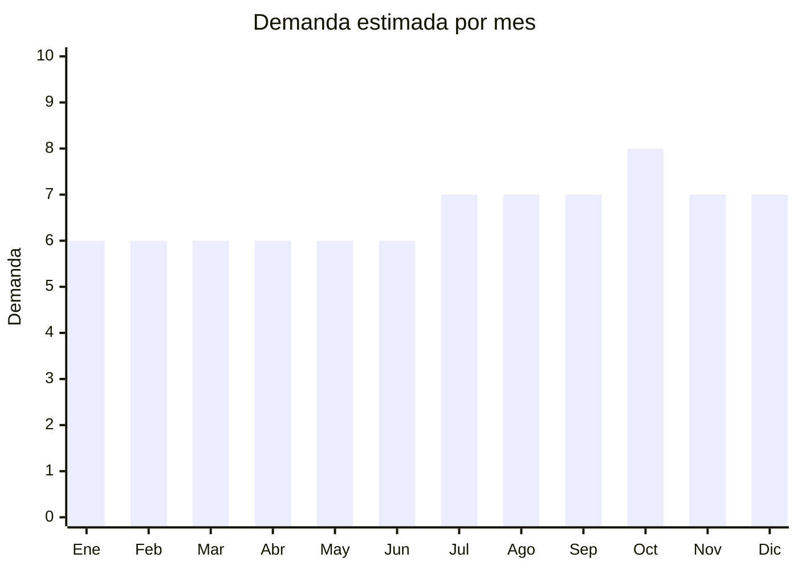

# Cabello sintético y extensiones

> **Capítulo NCM 67** — Plumas y plumón preparados; flores artificiales; manufacturas de cabello | **Temporada:** Atemporal

## Qué es y por qué importarlo

Extensiones de cabello sintético, pelucas (fashion y cosplay), trenzas sintéticas (crochet braids, box braids), colitas postizas y accesorios de cabello artificial. China, especialmente Xuchang (Henan), es la capital mundial de producción de cabello sintético. El producto es liviano, no requiere certificaciones especiales, y tiene demanda estable impulsada por tendencias de moda, cosplay, y extensiones capilares. Las pelucas de cosplay y las trenzas sintéticas son nichos con márgenes premium.

**Sin antidumping. Sin certificaciones especiales.**

## Datos clave

| Dato | Valor |
|------|-------|
| **Posiciones NCM típicas** | 6704.20.00 (cabello sintético), 6704.11.00 (pelucas completas de materia sintética) |
| **Derecho de importación** | 20% (DIE) + 3% tasa estadística |
| **Rango FOB típico** | USD 1.00 — USD 8.00 por unidad |
| **Precio de venta en Argentina** | ARS 5.000 — ARS 25.000 |
| **Margen bruto estimado** | 200% — 400% |
| **MOQ típico** | 50 — 200 unidades por modelo |
| **Demanda en MercadoLibre** | Media-Alta |
| **Competencia en MercadoLibre** | Baja-Media |
| **Dificultad para importar** | Fácil |
| **Certificaciones necesarias** | Ninguna |
| **Antidumping** | **No** |

## Variantes y subtipos más comunes

| Subtipo / Variante | FOB aprox. | Venta AR aprox. | Nota |
|--------------------|-----------|-----------------|------|
| Extensiones clip-in sintéticas | USD 1.50 — 4.00 | ARS 5.000 — 12.000 | Más vendido |
| Pelucas cosplay (colores fantasía) | USD 3.00 — 8.00 | ARS 8.000 — 25.000 | **Nicho premium** |
| Trenzas sintéticas crochet braids | USD 1.00 — 3.00 | ARS 3.000 — 8.000 | Tendencia |
| Colita postiza sintética | USD 1.00 — 3.00 | ARS 4.000 — 10.000 | Popular |
| Peluca natural look | USD 3.00 — 10.00 | ARS 10.000 — 30.000 | Fashion |

## Regulaciones y requisitos

<Tabs>
  <Tab title="Certificaciones">
    Sin certificaciones especiales para cabello sintético.
  </Tab>
  <Tab title="Etiquetado">
    Material (ej: "100% Fibra Sintética — Alta Temperatura"), país de origen, datos importador.
  </Tab>
  <Tab title="Restricciones">
    - Productos con cabello **humano** pueden tener requisitos sanitarios adicionales
    - Cabello **sintético** no tiene restricciones
    - Atención con productos que imiten marcas de pelucas con licencia
  </Tab>
</Tabs>

## Logística

| Dato | Valor |
|------|-------|
| **Peso típico por unidad** | 0.10 — 0.30 kg |
| **Volumen típico** | Bajo (se comprimen) |
| **Fragilidad** | Baja |
| **Envío recomendado** | Marítimo LCL / Aéreo si lote chico |
| **Tiempo total estimado** | 50 — 80 días (marítimo) / 15-25 días (aéreo) |

## Estacionalidad



| Aspecto | Detalle |
|---------|---------|
| **Meses pico** | Julio (Comic-Con/eventos cosplay), Octubre (Halloween), Diciembre (fiestas) |
| **Meses valle** | Demanda base estable — extensiones y trenzas todo el año |

## Ventajas y riesgos

<CardGroup cols={2}>
  <Card title="Ventajas" icon="circle-check">
    - **Sin antidumping ni certificaciones**
    - Xuchang = capital mundial (precios imbatibles)
    - Margen excelente (200-400%)
    - Liviano (flete eficiente)
    - Nichos premium (cosplay, trenzas)
    - Competencia baja en Argentina
  </Card>
  <Card title="Riesgos" icon="triangle-exclamation">
    - Nicho relativamente especializado
    - Calidad de fibra variable (resistencia al calor)
    - Devoluciones por color (diferencia pantalla vs real)
    - Tendencias de estilo cambian
  </Card>
</CardGroup>

## Palabras clave para buscar en Alibaba

```
synthetic hair extensions wholesale, cosplay wig wholesale Xuchang,
crochet braids synthetic, clip in hair extensions, ponytail extension synthetic,
lace front wig synthetic, braiding hair wholesale, heat resistant fiber wig
```

## Fuentes

- [MercadoLibre Argentina — Extensiones cabello](https://listado.mercadolibre.com.ar/extensiones-cabello)
- [Alibaba — Synthetic hair wholesale](https://www.alibaba.com/showroom/synthetic-hair-wholesale.html)
