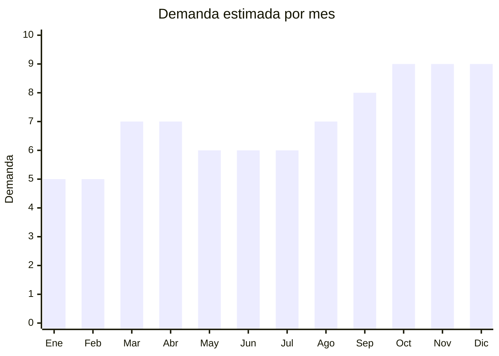

# Enredaderas y guirnaldas de flores artificiales

> **Capítulo NCM 67** — Plumas y plumón preparados; flores artificiales; manufacturas de cabello | **Temporada:** Atemporal

## Qué es y por qué importarlo

Enredaderas y guirnaldas de flores artificiales colgantes para decoración de eventos (bodas, cumpleaños de 15, bautismos), jardines verticales, locales comerciales, restaurantes, y decoración del hogar. Los formatos estrella son: pack x12 enredaderas de glicina (wisteria), guirnaldas de cerezo, hiedra artificial y cortinas de flores. Es un producto de tendencia muy fuerte en Argentina, impulsado por bodas y decoración de eventos.

**Sin antidumping. Sin certificaciones.**

## Datos clave

| Dato | Valor |
|------|-------|
| **Posiciones NCM típicas** | 6702.10.00 (flores artificiales de plástico), 6702.90.00 (de otras materias) |
| **Derecho de importación** | 20% (DIE) + 3% tasa estadística |
| **Rango FOB típico** | USD 0.30 — USD 1.50 por tira/enredadera |
| **Precio de venta en Argentina** | ARS 2.000 — ARS 12.000 por pack |
| **Margen bruto estimado** | 200% — 500% |
| **MOQ típico** | 100 — 500 packs |
| **Demanda en MercadoLibre** | Alta |
| **Competencia en MercadoLibre** | Baja-Media |
| **Dificultad para importar** | Fácil |
| **Certificaciones necesarias** | Ninguna |
| **Antidumping** | **No** |

## Variantes y subtipos más comunes

| Subtipo / Variante | FOB aprox. | Venta AR aprox. | Nota |
|--------------------|-----------|-----------------|------|
| Pack x12 enredaderas glicina (wisteria) | USD 3.00 — 8.00/pack | ARS 8.000 — 20.000 | **Bestseller absoluto** |
| Guirnalda de cerezo 2m | USD 0.50 — 1.50/u | ARS 2.500 — 6.000 | Eventos |
| Hiedra artificial x12 tiras | USD 2.00 — 5.00/pack | ARS 5.000 — 12.000 | Jardín vertical |
| Cortina de flores colgantes | USD 1.00 — 3.00/u | ARS 3.000 — 8.000 | Decoración |
| Enredadera con luces LED | USD 1.50 — 4.00/u | ARS 5.000 — 12.000 | Premium |

## Regulaciones y requisitos

<Tabs>
  <Tab title="Certificaciones">
    Sin certificaciones especiales.
  </Tab>
  <Tab title="Etiquetado">
    País de origen, datos importador.
  </Tab>
  <Tab title="Restricciones">
    Sin restricciones. Producto de importación libre. Las enredaderas con luces LED integradas podrían requerir verificación de seguridad eléctrica si tienen transformador.
  </Tab>
</Tabs>

## Logística

| Dato | Valor |
|------|-------|
| **Peso típico por pack x12** | 0.50 — 1.50 kg |
| **Volumen típico** | Medio (comprimibles) |
| **Fragilidad** | Baja |
| **Envío recomendado** | Marítimo LCL |
| **Tiempo total estimado** | 50 — 80 días (marítimo) |

## Estacionalidad



| Aspecto | Detalle |
|---------|---------|
| **Meses pico** | Septiembre-Diciembre (temporada de eventos, bodas, 15 años, Navidad) |
| **Meses valle** | Enero-Febrero — temporada baja de eventos |

## Ventajas y riesgos

<CardGroup cols={2}>
  <Card title="Ventajas" icon="circle-check">
    - Margen excepcional (200-500%)
    - **Sin antidumping ni certificaciones**
    - Tendencia decorativa fuerte
    - Pack x12 = alto ticket
    - Demanda de eventos (bodas, 15 años)
    - Competencia baja
  </Card>
  <Card title="Riesgos" icon="triangle-exclamation">
    - Voluminoso para su peso
    - Calidad de apariencia variable
    - Dependencia de tendencias decorativas
    - Producto estacional (pico en eventos)
  </Card>
</CardGroup>

## Palabras clave para buscar en Alibaba

```
wisteria flower garland wholesale, artificial vine wholesale,
hanging flower garland, ivy artificial vine, cherry blossom garland,
flower curtain wedding, artificial creeper plant, wisteria vine 12 pack
```

## Fuentes

- [MercadoLibre Argentina — Enredaderas artificiales](https://listado.mercadolibre.com.ar/enredadera-artificial)
- [Alibaba — Artificial vine wholesale](https://www.alibaba.com/showroom/artificial-vine-wholesale.html)
