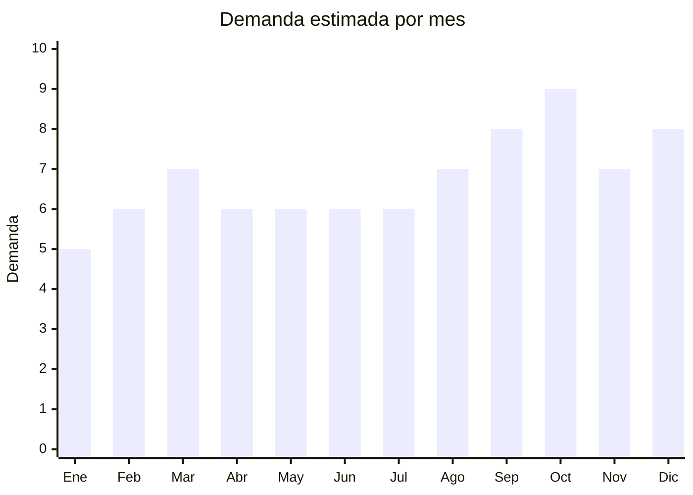

# Flores artificiales decorativas

> **Capítulo NCM 67** — Plumas y plumón preparados; flores artificiales; manufacturas de cabello | **Temporada:** Atemporal

## Qué es y por qué importarlo

Flores artificiales de tela, seda sintética y plástico para decoración del hogar, eventos, locales comerciales y regalos. Incluye rosas individuales, ramos armados, girasoles, orquídeas, tulipanes, lavandas y otras variedades decorativas. China produce la inmensa mayoría de flores artificiales del mundo con calidad cada vez más realista. Es un producto de demanda permanente que no se marchita, ideal para decoración estable.

**Sin antidumping. Sin certificaciones. Mínima regulación.** Producto liviano y no frágil.

## Datos clave

| Dato | Valor |
|------|-------|
| **Posiciones NCM típicas** | 6702.10.00 (flores artificiales de plástico), 6702.90.00 (de otras materias — tela, seda) |
| **Derecho de importación** | 20% (DIE) + 3% tasa estadística |
| **Rango FOB típico** | USD 0.20 — USD 2.00 por ramo/pieza |
| **Precio de venta en Argentina** | ARS 2.000 — ARS 10.000 |
| **Margen bruto estimado** | 200% — 500% |
| **MOQ típico** | 100 — 500 unidades |
| **Demanda en MercadoLibre** | Alta |
| **Competencia en MercadoLibre** | Media |
| **Dificultad para importar** | Fácil |
| **Certificaciones necesarias** | Ninguna |
| **Antidumping** | **No** |

## Variantes y subtipos más comunes

| Subtipo / Variante | FOB aprox. | Venta AR aprox. | Nota |
|--------------------|-----------|-----------------|------|
| Ramo rosas artificiales x6-12 | USD 0.50 — 1.50 | ARS 3.000 — 8.000 | **Más vendido** |
| Ramo girasoles artificiales | USD 0.50 — 1.50 | ARS 3.000 — 8.000 | Tendencia deco |
| Orquídea artificial en maceta | USD 1.00 — 3.00 | ARS 5.000 — 15.000 | Premium |
| Ramo lavanda artificial | USD 0.30 — 1.00 | ARS 2.000 — 6.000 | Estilo provenzal |
| Tulipanes artificiales x5 | USD 0.40 — 1.00 | ARS 2.500 — 7.000 | Decorativo |

## Regulaciones y requisitos

<Tabs>
  <Tab title="Certificaciones">
    Sin certificaciones especiales. Producto de importación libre.
  </Tab>
  <Tab title="Etiquetado">
    País de origen, datos importador. Estándar mínimo.
  </Tab>
  <Tab title="Restricciones">
    Sin restricciones. Las flores artificiales de tela/plástico no tienen requisitos fitosanitarios (a diferencia de flores naturales).
  </Tab>
</Tabs>

## Logística

| Dato | Valor |
|------|-------|
| **Peso típico por ramo** | 0.05 — 0.30 kg |
| **Volumen típico** | Medio (voluminosos pero livianos) |
| **Fragilidad** | Baja |
| **Envío recomendado** | Marítimo LCL |
| **Tiempo total estimado** | 50 — 80 días (marítimo) |

<Note>
Las flores artificiales son **livianas pero voluminosas** — ocupan espacio por su forma. Solicitar packaging comprimido al proveedor para optimizar CBM. Algunas flores se pueden enviar desmontadas y armar en destino.
</Note>

## Estacionalidad



| Aspecto | Detalle |
|---------|---------|
| **Meses pico** | Septiembre-Octubre (primavera, Día de la Madre), Diciembre (Navidad, decoración) |
| **Meses valle** | Enero-Febrero — demanda base constante |

## Ventajas y riesgos

<CardGroup cols={2}>
  <Card title="Ventajas" icon="circle-check">
    - **Sin antidumping ni certificaciones**
    - Margen excepcional (200-500%)
    - Liviano
    - Demanda permanente (decoración)
    - Producto no perecedero
    - Variedad infinita de diseños
  </Card>
  <Card title="Riesgos" icon="triangle-exclamation">
    - Voluminoso (relación CBM/valor)
    - Calidad de aspecto "realista" variable
    - Competencia creciente
    - Percepción de "producto barato"
  </Card>
</CardGroup>

## Palabras clave para buscar en Alibaba

```
artificial flowers wholesale, silk roses bulk, fake flowers decoration,
artificial sunflower, orchid artificial, lavender bunch artificial,
artificial flower bouquet, silk flower wholesale
```

## Fuentes

- [MercadoLibre Argentina — Flores artificiales](https://listado.mercadolibre.com.ar/flores-artificiales)
- [Alibaba — Artificial flowers wholesale](https://www.alibaba.com/showroom/artificial-flowers-wholesale.html)
