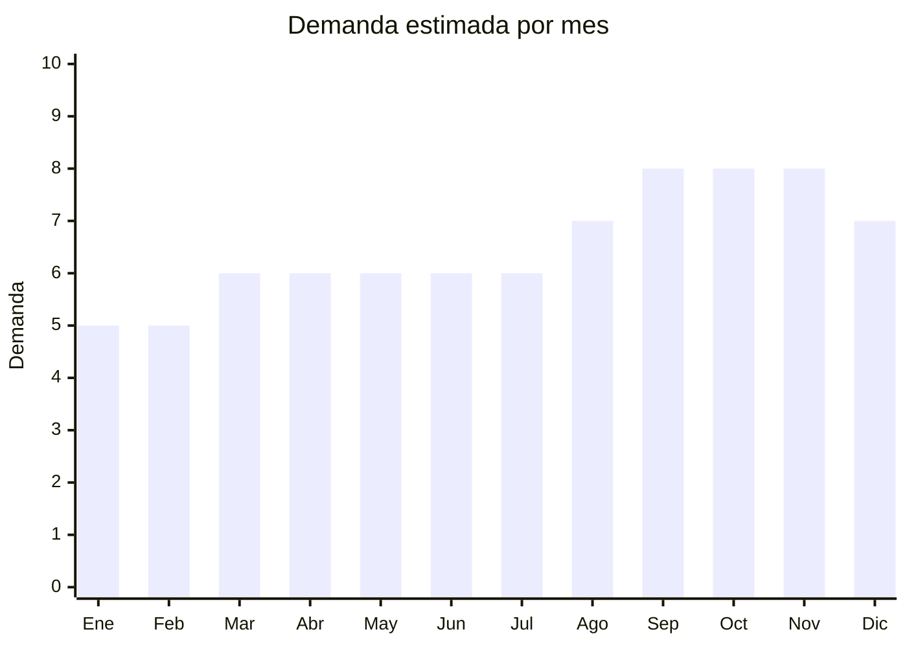

# Plumas decorativas y hierba de pampa artificial

> **Capítulo NCM 67** — Plumas y plumón preparados; flores artificiales; manufacturas de cabello | **Temporada:** Atemporal

## Qué es y por qué importarlo

Esta categoría incluye plumas decorativas para manualidades y cotillón (marabú, faisán, avestruz), y hierba de pampa artificial (pampas grass) que es tendencia decorativa muy fuerte. Las plumas de marabú se usan en cotillón, manualidades escolares y decoración de eventos. Las plumas de faisán y avestruz son para decoración premium. La hierba de pampa artificial es el producto estrella actual, impulsada por la tendencia de decoración boho/natural.

**Sin antidumping. Sin certificaciones.**

## Datos clave

| Dato | Valor |
|------|-------|
| **Posiciones NCM típicas** | 6701.00.00 (plumas preparadas), 6702.90.00 (flores/follaje artificiales) |
| **Derecho de importación** | 20% (DIE) + 3% tasa estadística |
| **Rango FOB típico** | USD 0.10 — USD 3.00 por pack |
| **Precio de venta en Argentina** | ARS 2.000 — ARS 10.000 |
| **Margen bruto estimado** | 200% — 500% |
| **MOQ típico** | 100 — 500 packs |
| **Demanda en MercadoLibre** | Media-Alta (9,337+ resultados) |
| **Competencia en MercadoLibre** | Baja-Media |
| **Dificultad para importar** | Fácil |
| **Certificaciones necesarias** | Ninguna |
| **Antidumping** | **No** |

## Variantes y subtipos más comunes

| Subtipo / Variante | FOB aprox. | Venta AR aprox. | Nota |
|--------------------|-----------|-----------------|------|
| Hierba de pampa artificial x6 tallos | USD 1.00 — 3.00 | ARS 5.000 — 12.000 | **Tendencia fuerte** |
| Pack x50 plumas marabú mini | USD 0.20 — 0.80 | ARS 1.500 — 4.000 | Manualidades/cotillón |
| Plumas de faisán artificial x10 | USD 0.50 — 1.50 | ARS 2.500 — 6.000 | Decoración |
| Pampas secas naturales x100 | USD 2.00 — 5.00 | ARS 6.000 — 15.000 | Natural premium |
| Plumas avestruz x5-10 | USD 1.00 — 3.00 | ARS 3.000 — 8.000 | Eventos/deco |

## Regulaciones y requisitos

<Tabs>
  <Tab title="Certificaciones">
    Sin certificaciones especiales.
  </Tab>
  <Tab title="Etiquetado">
    País de origen, datos importador. Si son plumas naturales procesadas, estándar mínimo.
  </Tab>
  <Tab title="Restricciones">
    - Las plumas **naturales** podrían requerir certificado fitosanitario/sanitario según origen
    - Las plumas **artificiales/sintéticas** no tienen restricciones
    - Las pampas grass naturales/secas verificar requisitos SENASA
  </Tab>
</Tabs>

## Logística

| Dato | Valor |
|------|-------|
| **Peso típico por pack** | 0.05 — 0.30 kg |
| **Volumen típico** | Medio (voluminoso para su peso — pampas grass) |
| **Fragilidad** | Media (plumas y pampas se pueden dañar) |
| **Envío recomendado** | Marítimo LCL (con packaging protector) |
| **Tiempo total estimado** | 50 — 80 días (marítimo) |

## Estacionalidad



| Aspecto | Detalle |
|---------|---------|
| **Meses pico** | Septiembre-Noviembre (primavera, eventos, renovación decoración) |
| **Meses valle** | Enero-Febrero — demanda base constante por manualidades |

## Ventajas y riesgos

<CardGroup cols={2}>
  <Card title="Ventajas" icon="circle-check">
    - Margen excepcional (200-500%)
    - **Sin antidumping ni certificaciones**
    - Hierba pampa artificial = tendencia boho
    - Competencia baja
    - Producto liviano
  </Card>
  <Card title="Riesgos" icon="triangle-exclamation">
    - Voluminoso para su peso (pampas)
    - Fragilidad en transporte
    - Nicho relativamente pequeño
    - Pampas naturales pueden tener restricciones SENASA
    - Dependencia de tendencia decorativa
  </Card>
</CardGroup>

## Palabras clave para buscar en Alibaba

```
pampas grass artificial wholesale, decorative feathers wholesale,
marabou feathers bulk, pheasant feathers decoration, ostrich feather wholesale,
artificial pampas grass tall, dried flowers pampas, feather craft supply
```

## Fuentes

- [MercadoLibre Argentina — Plumas decorativas](https://listado.mercadolibre.com.ar/plumas-decorativas)
- [Alibaba — Pampas grass wholesale](https://www.alibaba.com/showroom/pampas-grass-wholesale.html)
