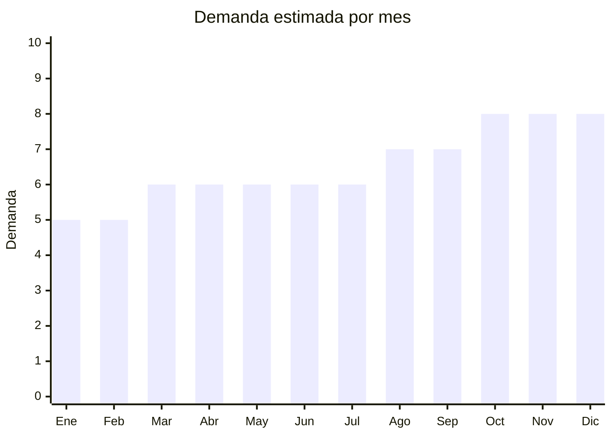

# Accesorios de baño en cerámica

> **Capítulo NCM 69** — Productos cerámicos | **Temporada:** Atemporal

## Qué es y por qué importarlo

Sets de accesorios de baño en cerámica que incluyen dispensador de jabón líquido, portacepillos de dientes, jabonera y vaso. Se venden como sets de 3-5 piezas coordinadas. Producto atemporal que se renueva con las tendencias decorativas (nórdico, minimalista, terrazzo, marmolado). **No afectado por antidumping de vajilla** ya que no es producto alimentario.

## Datos clave

| Dato | Valor |
|------|-------|
| **Posiciones NCM típicas** | 6911.90.00 (artículos de porcelana uso doméstico), 6914.90.00 (las demás manufacturas cerámica) |
| **Derecho de importación** | 20% (DIE) + 3% tasa estadística |
| **Rango FOB típico** | USD 2.00 — USD 8.00 por set |
| **Precio de venta en Argentina** | ARS 8.000 — ARS 25.000 |
| **Margen bruto estimado** | 200% — 350% |
| **MOQ típico** | 100 — 300 sets |
| **Demanda en MercadoLibre** | Media-Alta |
| **Competencia en MercadoLibre** | Media |
| **Dificultad para importar** | Moderada (fragilidad) |
| **Certificaciones necesarias** | Ninguna |
| **Antidumping** | **No** (no es vajilla alimentaria) |

## Variantes y subtipos más comunes

| Subtipo / Variante | FOB aprox. | Venta AR aprox. | Nota |
|--------------------|-----------|-----------------|------|
| Set baño cerámica 4 piezas básico | USD 2.00 — 4.00 | ARS 8.000 — 15.000 | **Más vendido** |
| Set baño diseño marmolado | USD 3.00 — 6.00 | ARS 10.000 — 20.000 | Tendencia |
| Set baño terrazzo | USD 3.00 — 6.00 | ARS 10.000 — 20.000 | Tendencia |
| Set baño nórdico minimalista | USD 2.50 — 5.00 | ARS 8.000 — 18.000 | Estilo clean |
| Dispensador jabón individual cerámico | USD 1.00 — 3.00 | ARS 4.000 — 10.000 | Pieza suelta |

## Regulaciones y requisitos

<Tabs>
  <Tab title="Certificaciones">
    Sin certificaciones especiales. No afectado por antidumping de vajilla.
  </Tab>
  <Tab title="Etiquetado">
    Material, país de origen, datos importador.
  </Tab>
  <Tab title="Restricciones">
    Sin restricciones especiales. Producto decorativo/funcional para baño.
  </Tab>
</Tabs>

## Logística

| Dato | Valor |
|------|-------|
| **Peso típico por set** | 1.00 — 3.00 kg |
| **Volumen típico** | Medio |
| **Fragilidad** | **Alta** |
| **Envío recomendado** | Marítimo LCL (packaging reforzado) |
| **Tiempo total estimado** | 50 — 80 días (marítimo) |

## Estacionalidad



| Aspecto | Detalle |
|---------|---------|
| **Meses pico** | Octubre-Diciembre (renovación hogar, mudanzas, regalos) |
| **Meses valle** | Enero-Febrero — demanda base constante |

## Ventajas y riesgos

<CardGroup cols={2}>
  <Card title="Ventajas" icon="circle-check">
    - **Sin antidumping**
    - Venta como set = ticket más alto
    - Tendencias decorativas renuevan demanda
    - Sin certificaciones
    - Personalizable con diseños
  </Card>
  <Card title="Riesgos" icon="triangle-exclamation">
    - Fragilidad alta en transporte
    - Peso considerable
    - Competencia con plástico y resina
    - Rotura parcial del set inutiliza el pack
  </Card>
</CardGroup>

## Palabras clave para buscar en Alibaba

```
bathroom accessories set ceramic, soap dispenser ceramic,
toothbrush holder ceramic, bathroom set marble design,
ceramic bath set wholesale, terrazzo bathroom accessories
```

## Fuentes

- [MercadoLibre Argentina — Set baño cerámica](https://listado.mercadolibre.com.ar/set-bano-ceramica)
- [Alibaba — Ceramic bathroom set](https://www.alibaba.com/showroom/ceramic-bathroom-set.html)
