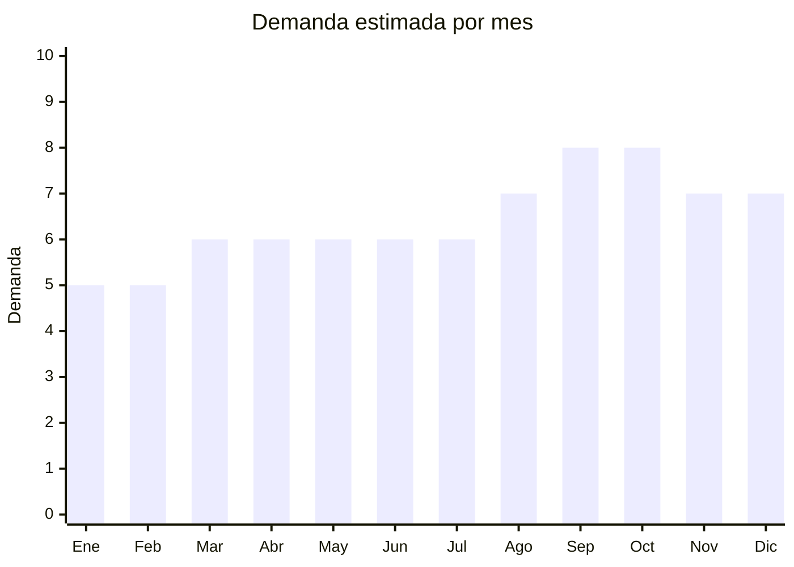

# Macetas decorativas de cerámica

> **Capítulo NCM 69** — Productos cerámicos | **Temporada:** Atemporal

## Qué es y por qué importarlo

Macetas decorativas de cerámica para plantas de interior y exterior. Incluye macetas con diseños modernos (geométricos, nórdicos, minimalistas), macetas con plato, macetas colgantes, macetas con autorriego y macetas para suculentas/cactus. La tendencia de urban gardening y decoración con plantas impulsa una demanda creciente. **NO afectadas por antidumping de vajilla** (clasificación NCM diferente), lo que las hace más viables que platos y tazas.

## Datos clave

| Dato | Valor |
|------|-------|
| **Posiciones NCM típicas** | 6913.90.00 (artículos de cerámica para decoración), 6914.90.00 (las demás manufacturas de cerámica) |
| **Derecho de importación** | 20% (DIE) + 3% tasa estadística |
| **Rango FOB típico** | USD 0.50 — USD 5.00 por unidad |
| **Precio de venta en Argentina** | ARS 3.000 — ARS 15.000 |
| **Margen bruto estimado** | 200% — 400% |
| **MOQ típico** | 100 — 500 unidades |
| **Demanda en MercadoLibre** | Media-Alta |
| **Competencia en MercadoLibre** | Media |
| **Dificultad para importar** | Moderada (fragilidad) |
| **Certificaciones necesarias** | Ninguna |
| **Antidumping** | **No** (no es vajilla) |

## Variantes y subtipos más comunes

| Subtipo / Variante | FOB aprox. | Venta AR aprox. | Nota |
|--------------------|-----------|-----------------|------|
| Maceta cerámica con plato 15-20cm | USD 0.80 — 2.00 | ARS 3.000 — 8.000 | **Más vendido** |
| Set macetas para suculentas x3 | USD 1.50 — 4.00 | ARS 5.000 — 12.000 | Tendencia |
| Maceta con diseño nórdico/geométrico | USD 1.00 — 3.00 | ARS 4.000 — 12.000 | Premium deco |
| Maceta colgante cerámica | USD 1.00 — 3.00 | ARS 4.000 — 10.000 | Decoración |
| Maceta grande 25-30cm | USD 2.00 — 5.00 | ARS 6.000 — 15.000 | Statement piece |

## Regulaciones y requisitos

<Tabs>
  <Tab title="Certificaciones">
    Sin certificaciones especiales. **No afectada por antidumping de vajilla.**
  </Tab>
  <Tab title="Etiquetado">
    País de origen, datos importador.
  </Tab>
  <Tab title="Restricciones">
    Sin restricciones especiales. La maceta es artículo decorativo, no vajilla.
  </Tab>
</Tabs>

## Logística

| Dato | Valor |
|------|-------|
| **Peso típico por unidad** | 0.30 — 2.00 kg |
| **Volumen típico** | Medio-Alto |
| **Fragilidad** | **Alta** |
| **Envío recomendado** | Marítimo LCL (packaging reforzado) |
| **Tiempo total estimado** | 50 — 80 días (marítimo) |

<Warning>
Las macetas de cerámica son **frágiles**. Solicitar packaging individual con protección (burbuja + caja). Calcular 5-10% de rotura. Las macetas grandes son pesadas y voluminosas — evaluar relación flete/valor.
</Warning>

## Estacionalidad



| Aspecto | Detalle |
|---------|---------|
| **Meses pico** | Septiembre-Octubre (primavera — época de plantar) |
| **Meses valle** | Enero-Febrero — demanda base por decoración |

## Ventajas y riesgos

<CardGroup cols={2}>
  <Card title="Ventajas" icon="circle-check">
    - **Sin antidumping** (no es vajilla)
    - Tendencia urban gardening creciente
    - Personalizable con diseños
    - Margen excelente (200-400%)
    - Sin certificaciones
  </Card>
  <Card title="Riesgos" icon="triangle-exclamation">
    - Fragilidad alta
    - Pesadas y voluminosas
    - Flete puede ser alto
    - Competencia local (macetas cemento/plástico)
  </Card>
</CardGroup>

## Palabras clave para buscar en Alibaba

```
ceramic planter wholesale, decorative plant pot, succulent pot set,
nordic style planter, hanging planter ceramic, flower pot ceramic,
indoor plant pot wholesale, geometric planter
```

## Fuentes

- [MercadoLibre Argentina — Macetas cerámica](https://listado.mercadolibre.com.ar/maceta-ceramica)
- [Alibaba — Ceramic planter wholesale](https://www.alibaba.com/showroom/ceramic-planter-wholesale.html)
