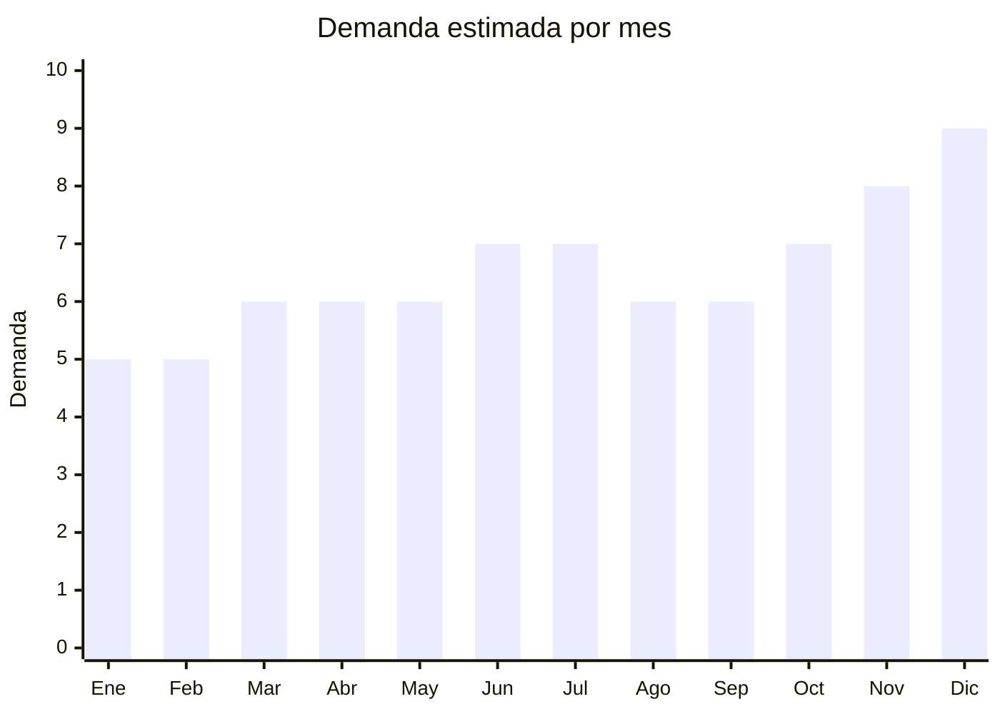

# Tazas de cerámica y porcelana

> **Capítulo NCM 69** — Productos cerámicos | **Temporada:** Atemporal

<Warning>
**ANTIDUMPING POSIBLE:** Argentina mantiene derechos antidumping sobre vajilla de porcelana/cerámica china (NCM 6911/6912). Las tazas pueden estar incluidas dependiendo de la clasificación exacta. Verificar en la [CNCE](https://www.argentina.gob.ar/cnce/investigaciones/medidasvigentes) el NCM específico antes de importar.
</Warning>

## Qué es y por qué importarlo

Tazas de cerámica y porcelana para café, té e infusiones. Incluye tazas lisas personalizables, con diseños impresos, tazas mágicas (cambian color con calor), tazas de porcelana premium y mugs de gran capacidad. China (Dehua, Fujian y Jingdezhen, Jiangxi) es el mayor productor mundial de cerámica con precios FOB desde USD 0.30 por unidad. Las tazas personalizables con logo/diseño propio son ideales para marca propia.

## Datos clave

| Dato | Valor |
|------|-------|
| **Posiciones NCM típicas** | 6911.10.10 (porcelana tazas), 6912.00.00 (cerámica no porcelana) |
| **Derecho de importación** | 20% (DIE) + 3% tasa estadística + **posible antidumping** |
| **Rango FOB típico** | USD 0.30 — USD 2.00 por unidad |
| **Precio de venta en Argentina** | ARS 3.000 — ARS 12.000 |
| **Margen bruto estimado** | 200% — 400% |
| **MOQ típico** | 100 — 500 unidades por diseño |
| **Demanda en MercadoLibre** | Alta |
| **Competencia en MercadoLibre** | Media-Alta |
| **Dificultad para importar** | Moderada (antidumping + fragilidad) |
| **Certificaciones necesarias** | Contacto alimentos (si aplica) |
| **Antidumping** | **Verificar NCM exacto** |

## Variantes y subtipos más comunes

| Subtipo / Variante | FOB aprox. | Venta AR aprox. | Nota |
|--------------------|-----------|-----------------|------|
| Taza cerámica lisa 350ml | USD 0.30 — 0.80 | ARS 2.000 — 5.000 | Básica |
| Taza con diseño impreso | USD 0.50 — 1.50 | ARS 3.000 — 8.000 | **Más vendido** |
| Taza mágica (cambia color) | USD 1.00 — 2.00 | ARS 5.000 — 12.000 | Regalo popular |
| Mug grande 450-500ml | USD 0.50 — 1.50 | ARS 3.000 — 8.000 | Tendencia |
| Set tazas x6 con soporte | USD 3.00 — 6.00 | ARS 10.000 — 20.000 | Set hogar |

## Regulaciones y requisitos

<Tabs>
  <Tab title="Certificaciones">
    Verificar antidumping por NCM. Si se comercializa para contacto con alimentos, debe cumplir con migración de materiales (plomo, cadmio).
  </Tab>
  <Tab title="Etiquetado">
    País de origen, datos importador. Si apto alimentos, indicar material.
  </Tab>
  <Tab title="Restricciones">
    - Antidumping sobre vajilla de porcelana/cerámica china
    - Tazas decorativas (no para alimentos) podrían tener menor riesgo
    - Fragilidad requiere packaging especial
  </Tab>
</Tabs>

## Logística

| Dato | Valor |
|------|-------|
| **Peso típico por unidad** | 0.25 — 0.40 kg |
| **Volumen típico** | Medio |
| **Fragilidad** | **Alta** |
| **Envío recomendado** | Marítimo LCL (packaging reforzado) |
| **Tiempo total estimado** | 50 — 80 días (marítimo) |

<Warning>
La cerámica es **extremadamente frágil** en transporte marítimo. Solicitar packaging individual (cada taza envuelta en burbuja + caja individual) y palletizado. Calcular un **5-10% de rotura** en el costo. Verificar seguro de transporte.
</Warning>

## Estacionalidad



| Aspecto | Detalle |
|---------|---------|
| **Meses pico** | Junio (Día del Padre), Octubre (Día de la Madre), Diciembre (Navidad) — regalo clásico |
| **Meses valle** | Enero-Febrero — demanda base constante |

## Ventajas y riesgos

<CardGroup cols={2}>
  <Card title="Ventajas" icon="circle-check">
    - FOB muy bajo (desde USD 0.30)
    - Personalizable con marca propia
    - China = mayor productor mundial
    - Demanda permanente
    - Alto valor percibido
  </Card>
  <Card title="Riesgos" icon="triangle-exclamation">
    - **Fragilidad alta** (rotura en transporte)
    - Antidumping posible
    - Competencia alta (Oxford, Tsuji)
    - Peso significativo para su tamaño
    - Packaging especial encarece
  </Card>
</CardGroup>

## Palabras clave para buscar en Alibaba

```
ceramic mug wholesale, porcelain cup factory, custom printed mug,
color changing mug, coffee mug wholesale Dehua, sublimation mug blank,
ceramic cup set, large mug 450ml
```

## Fuentes

- [MercadoLibre Argentina — Tazas cerámica](https://listado.mercadolibre.com.ar/taza-ceramica)
- [CNCE — Medidas antidumping vigentes](https://www.argentina.gob.ar/cnce/investigaciones/medidasvigentes)
