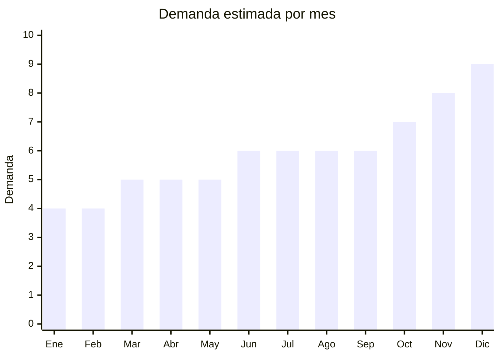

# Sets de vajilla (platos, bowls, fuentes)

> **Capítulo NCM 69** — Productos cerámicos | **Temporada:** Atemporal

<Warning>
**⚠️ ANTIDUMPING VIGENTE:** Argentina mantiene derechos antidumping sobre vajilla de porcelana y cerámica originaria de China (NCM 6911.10.10, 6911.10.90, 6911.90.00 y 6912.00.00). Esto incrementa significativamente el costo landed. Verificar SIEMPRE en la [CNCE](https://www.argentina.gob.ar/cnce/investigaciones/medidasvigentes).
</Warning>

## Qué es y por qué importarlo

Sets de vajilla de cerámica/porcelana que incluyen platos planos, platos hondos, bowls, fuentes y tazas. Formatos típicos: sets de 12, 16, 20 o 24 piezas. Producto de reposición constante para hogares y gastronomía. China (Dehua, Jingdezhen, Chaozhou) domina la producción mundial. **Sin embargo, el antidumping sobre vajilla china es la barrera principal** — puede reducir significativamente el margen.

## Datos clave

| Dato | Valor |
|------|-------|
| **Posiciones NCM típicas** | 6911.10.10 (vajilla de porcelana), 6911.10.90 (otras), 6912.00.00 (cerámica no porcelana) |
| **Derecho de importación** | 20% (DIE) + 3% tasa estadística + **antidumping vigente** |
| **Rango FOB típico** | USD 5.00 — USD 25.00 por set |
| **Precio de venta en Argentina** | ARS 15.000 — ARS 60.000 |
| **Margen bruto estimado** | 80% — 200% (variable por antidumping) |
| **MOQ típico** | 100 — 500 sets |
| **Demanda en MercadoLibre** | Alta (3,000+ resultados) |
| **Competencia en MercadoLibre** | Alta |
| **Dificultad para importar** | **Difícil** (antidumping + fragilidad + peso) |
| **Certificaciones necesarias** | Contacto alimentos, antidumping |
| **Antidumping** | **⚠️ SÍ — vigente** |

## Variantes y subtipos más comunes

| Subtipo / Variante | FOB aprox. | Venta AR aprox. | Nota |
|--------------------|-----------|-----------------|------|
| Set vajilla porcelana 12 piezas | USD 5.00 — 12.00 | ARS 15.000 — 30.000 | Básico |
| Set vajilla 20 piezas completo | USD 10.00 — 20.00 | ARS 25.000 — 50.000 | Más completo |
| Platos individuales x6 | USD 3.00 — 8.00 | ARS 8.000 — 20.000 | Reposición |
| Bowls cerámica x6 | USD 2.00 — 6.00 | ARS 6.000 — 15.000 | Tendencia |
| Set vajilla stoneware rústico | USD 8.00 — 25.00 | ARS 25.000 — 60.000 | Premium |

## Regulaciones y requisitos

<Tabs>
  <Tab title="Certificaciones">
    | Requisito | Obligatorio | Detalle |
    |-----------|-------------|---------|
    | Antidumping CNCE | **⚠️ SÍ** | Derechos antidumping sobre vajilla cerámica/porcelana de China |
    | Contacto alimentos | **Sí** | Migración de plomo y cadmio bajo norma |
  </Tab>
  <Tab title="Etiquetado">
    Material (porcelana, cerámica, stoneware), país de origen, datos importador. Indicar apto contacto alimentos.
  </Tab>
  <Tab title="Restricciones">
    - **Antidumping vigente** — costo adicional significativo
    - Certificación contacto alimentos obligatoria
    - Fragilidad extrema en transporte
    - Peso elevado (flete caro)
  </Tab>
</Tabs>

## Logística

| Dato | Valor |
|------|-------|
| **Peso típico por set 12 piezas** | 3.00 — 6.00 kg |
| **Volumen típico** | Alto |
| **Fragilidad** | **Muy Alta** |
| **Envío recomendado** | Marítimo LCL/FCL (packaging premium) |
| **Tiempo total estimado** | 50 — 80 días (marítimo) |

## Estacionalidad



| Aspecto | Detalle |
|---------|---------|
| **Meses pico** | Octubre-Diciembre (mudanzas, regalos, renovación) |
| **Meses valle** | Enero-Marzo — demanda base de reposición |

## Ventajas y riesgos

<CardGroup cols={2}>
  <Card title="Ventajas" icon="circle-check">
    - Alto ticket de venta
    - Producto de reposición permanente
    - China domina producción mundial
    - Variedad infinita de diseños
  </Card>
  <Card title="Riesgos" icon="triangle-exclamation">
    - **Antidumping vigente** reduce margen
    - **Fragilidad extrema** (rotura 5-15%)
    - Pesado (flete alto)
    - Competencia fuerte (Oxford, Verbano, Luminarc)
    - Packaging caro
  </Card>
</CardGroup>

## Palabras clave para buscar en Alibaba

```
dinnerware set porcelain wholesale, ceramic plate set, stoneware dinnerware,
porcelain dinner set 12 piece, bowl set ceramic, Chaozhou porcelain factory,
tableware set wholesale, Jingdezhen porcelain
```

## Fuentes

- [MercadoLibre Argentina — Set vajilla](https://listado.mercadolibre.com.ar/set-vajilla)
- [CNCE — Medidas antidumping vigentes](https://www.argentina.gob.ar/cnce/investigaciones/medidasvigentes)
