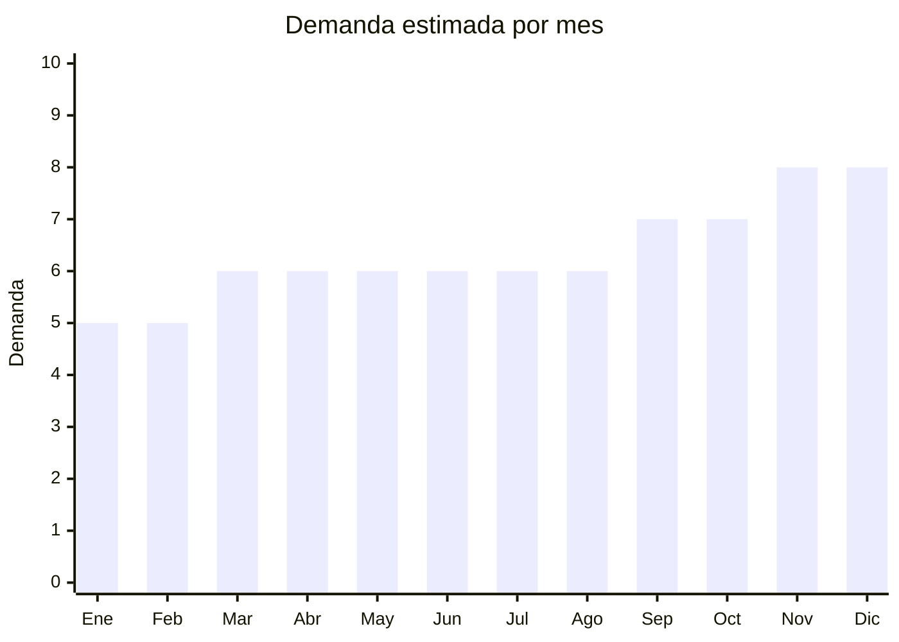

# Botellas y frascos de vidrio (decorativos y funcionales)

> **Capítulo NCM 70** — Vidrio y sus manufacturas | **Temporada:** Atemporal

## Qué es y por qué importarlo

Botellas de vidrio con tapa hermética para agua (reemplazo de plástico), frascos de vidrio para especias y conservas, botellas decorativas, frascos con tapa de bambú y frascos tipo mason jar. La tendencia eco-friendly impulsa el reemplazo de botellas plásticas por vidrio. Los frascos herméticos para especias y almacenamiento son producto de demanda permanente. Foshan (China) es hub productor de botellas de vidrio.

**Sin antidumping. Sin certificaciones especiales.**

## Datos clave

| Dato | Valor |
|------|-------|
| **Posiciones NCM típicas** | 7010.90.00 (botellas, frascos y recipientes de vidrio), 7013.49.00 (artículos de vidrio para mesa/cocina) |
| **Derecho de importación** | 18-20% (DIE) + 3% tasa estadística |
| **Rango FOB típico** | USD 0.30 — USD 3.00 por unidad |
| **Precio de venta en Argentina** | ARS 2.000 — ARS 10.000 |
| **Margen bruto estimado** | 200% — 350% |
| **MOQ típico** | 200 — 1,000 unidades |
| **Demanda en MercadoLibre** | Media-Alta |
| **Competencia en MercadoLibre** | Media |
| **Dificultad para importar** | Moderada (fragilidad + peso) |
| **Certificaciones necesarias** | Contacto alimentos (si aplica) |
| **Antidumping** | **No** |

## Variantes y subtipos más comunes

| Subtipo / Variante | FOB aprox. | Venta AR aprox. | Nota |
|--------------------|-----------|-----------------|------|
| Botella vidrio con tapa hermética 500ml | USD 0.50 — 1.50 | ARS 2.500 — 6.000 | Eco-friendly |
| Set frascos especias x6-12 | USD 2.00 — 5.00/set | ARS 6.000 — 15.000 | **Más vendido** |
| Frasco mason jar 500ml | USD 0.40 — 1.00 | ARS 2.000 — 5.000 | Decoración/almacenamiento |
| Botella vidrio tapa bambú 750ml | USD 0.80 — 2.00 | ARS 3.000 — 8.000 | Premium eco |
| Frascos herméticos almacenamiento x4 | USD 2.00 — 5.00/set | ARS 6.000 — 15.000 | Cocina |

## Regulaciones y requisitos

<Tabs>
  <Tab title="Certificaciones">
    Contacto alimentos si se comercializan para uso alimentario.
  </Tab>
  <Tab title="Etiquetado">
    Material, capacidad, país de origen, datos importador.
  </Tab>
  <Tab title="Restricciones">
    Sin restricciones especiales. Fragilidad requiere packaging adecuado.
  </Tab>
</Tabs>

## Logística

| Dato | Valor |
|------|-------|
| **Peso típico por unidad** | 0.20 — 0.80 kg |
| **Volumen típico** | Medio |
| **Fragilidad** | **Alta** |
| **Envío recomendado** | Marítimo LCL |
| **Tiempo total estimado** | 50 — 80 días (marítimo) |

## Estacionalidad



| Aspecto | Detalle |
|---------|---------|
| **Meses pico** | Octubre-Diciembre (renovación hogar, regalos) |
| **Meses valle** | Enero-Febrero — demanda base constante |

## Ventajas y riesgos

<CardGroup cols={2}>
  <Card title="Ventajas" icon="circle-check">
    - **Sin antidumping**
    - Tendencia eco-friendly creciente
    - Sets de especias = alto ticket
    - Demanda permanente
    - Variedad de formatos
  </Card>
  <Card title="Riesgos" icon="triangle-exclamation">
    - Fragilidad alta
    - Peso considerable
    - Competencia con producción local
    - Flete puede ser alto por peso/volumen
  </Card>
</CardGroup>

## Palabras clave para buscar en Alibaba

```
glass bottle wholesale, spice jar set glass, mason jar wholesale,
glass water bottle bamboo lid, airtight glass jar, storage jar glass,
glass container set, borosilicate glass bottle
```

## Fuentes

- [MercadoLibre Argentina — Frascos vidrio](https://listado.mercadolibre.com.ar/frascos-vidrio)
- [Alibaba — Glass jar wholesale](https://www.alibaba.com/showroom/glass-jar-wholesale.html)
