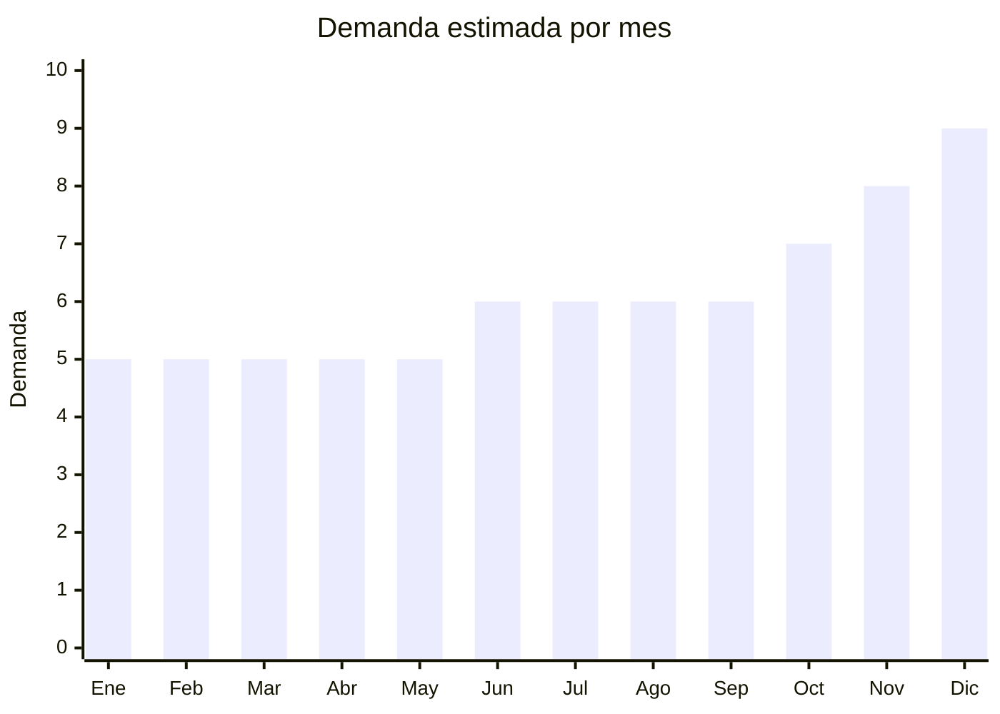

# Vasos y copas de vidrio

> **Capítulo NCM 70** — Vidrio y sus manufacturas | **Temporada:** Atemporal

## Qué es y por qué importarlo

Vasos de vidrio (agua, jugo, cerveza), copas de vino, copas de champagne, vasos de whisky y cristalería decorativa. Producto de consumo permanente para hogares y gastronomía/bares. China ofrece precios FOB muy competitivos con variedad de estilos. Compite con marcas establecidas (Rigolleau, Durax, Luminarc) pero hay espacio en nichos de diseño y formato.

**Sin antidumping. Sin certificaciones especiales (excepto contacto alimentos).**

## Datos clave

| Dato | Valor |
|------|-------|
| **Posiciones NCM típicas** | 7013.28.00 (vasos de vidrio), 7013.37.00 (copas de cristal) |
| **Derecho de importación** | 18-20% (DIE) + 3% tasa estadística |
| **Rango FOB típico** | USD 0.28 — USD 2.07 por unidad |
| **Precio de venta en Argentina** | ARS 1.500 — ARS 8.000 por unidad/pack |
| **Margen bruto estimado** | 150% — 300% |
| **MOQ típico** | 200 — 1,000 unidades |
| **Demanda en MercadoLibre** | Alta |
| **Competencia en MercadoLibre** | Alta |
| **Dificultad para importar** | Moderada (fragilidad + peso) |
| **Certificaciones necesarias** | Contacto alimentos |
| **Antidumping** | **No** |

## Variantes y subtipos más comunes

| Subtipo / Variante | FOB aprox. | Venta AR aprox. | Nota |
|--------------------|-----------|-----------------|------|
| Vasos de vidrio x6 básicos | USD 1.50 — 4.00/set | ARS 5.000 — 12.000 | Hogar |
| Copas de vino x6 | USD 2.00 — 6.00/set | ARS 8.000 — 20.000 | Premium |
| Vasos cerveza/pinta x6 | USD 1.50 — 4.00/set | ARS 5.000 — 15.000 | Gastronomía |
| Vasos whisky x4 | USD 2.00 — 5.00/set | ARS 6.000 — 18.000 | Regalo |
| Copas champagne x6 | USD 2.00 — 5.00/set | ARS 8.000 — 18.000 | Eventos |

## Regulaciones y requisitos

<Tabs>
  <Tab title="Certificaciones">
    Contacto alimentos: vidrio debe cumplir con migración de plomo y cadmio.
  </Tab>
  <Tab title="Etiquetado">
    Material, capacidad, país de origen, datos importador.
  </Tab>
  <Tab title="Restricciones">
    Sin antidumping. Fragilidad extrema requiere packaging especial.
  </Tab>
</Tabs>

## Logística

| Dato | Valor |
|------|-------|
| **Peso típico por set x6** | 1.50 — 4.00 kg |
| **Volumen típico** | Medio-Alto |
| **Fragilidad** | **Muy Alta** |
| **Envío recomendado** | Marítimo LCL (packaging premium) |
| **Tiempo total estimado** | 50 — 80 días (marítimo) |

## Estacionalidad



| Aspecto | Detalle |
|---------|---------|
| **Meses pico** | Noviembre-Diciembre (regalos, fiestas, renovación) |
| **Meses valle** | Enero-Mayo — demanda base de reposición |

## Ventajas y riesgos

<CardGroup cols={2}>
  <Card title="Ventajas" icon="circle-check">
    - **Sin antidumping**
    - Demanda permanente (reposición)
    - FOB competitivo
    - Variedad de diseños
    - Alto valor percibido en cristalería
  </Card>
  <Card title="Riesgos" icon="triangle-exclamation">
    - **Fragilidad extrema**
    - Peso alto (flete caro)
    - Competencia fuerte (Rigolleau, Durax)
    - Packaging costoso
    - Rotura 5-15% en transporte
  </Card>
</CardGroup>

## Palabras clave para buscar en Alibaba

```
glass cup wholesale, wine glass set, beer glass wholesale,
whisky glass set, champagne flute wholesale, drinking glass bulk,
stemless wine glass, glass tumbler set
```

## Fuentes

- [MercadoLibre Argentina — Vasos vidrio](https://listado.mercadolibre.com.ar/vasos-vidrio)
- [Alibaba — Glass cup wholesale](https://www.alibaba.com/showroom/glass-cup-wholesale.html)
