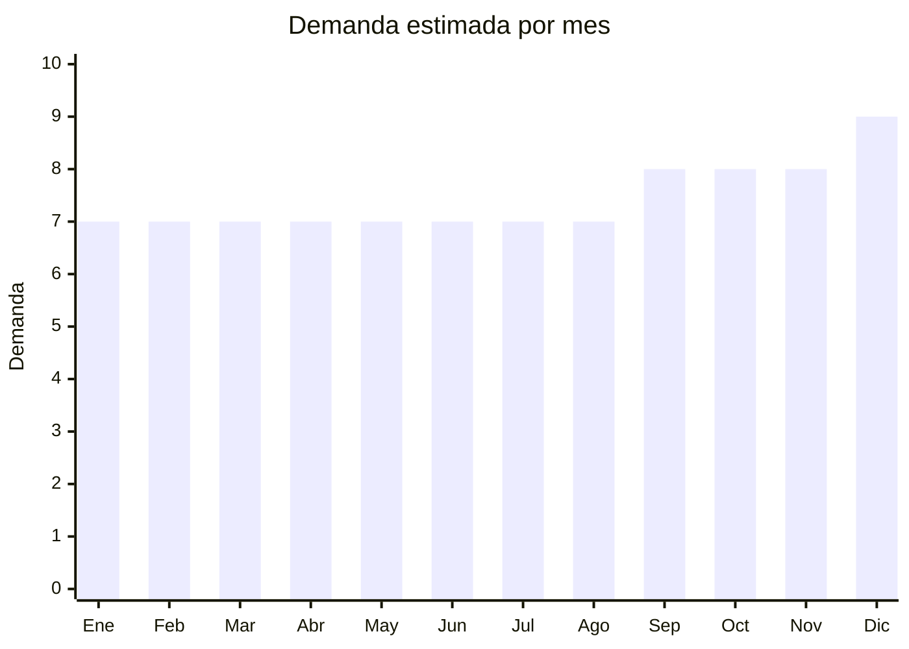

# Vidrio templado / protector de pantalla para celulares

> **Capítulo NCM 70** — Vidrio y sus manufacturas | **Temporada:** Atemporal

## Qué es y por qué importarlo

Protectores de pantalla de vidrio templado para smartphones. Es el producto ESTRELLA del capítulo 70 y uno de los de mayor margen en importación de China. El FOB es extremadamente bajo (desde USD 0.19 por unidad) y el margen supera el 300%. La demanda es permanente porque cada nuevo celular necesita protector, y estos se rompen y reemplazan con frecuencia. China (Shenzhen, Dongguan) es el centro mundial de producción. Modelos compatibles con iPhone, Samsung, Xiaomi, Motorola son los más vendidos.

**Sin antidumping. Sin certificaciones especiales.**

## Datos clave

| Dato | Valor |
|------|-------|
| **Posiciones NCM típicas** | 7007.19.00 (vidrio templado), 7020.00.00 (manufacturas de vidrio) |
| **Derecho de importación** | 14-18% (DIE) + 3% tasa estadística |
| **Rango FOB típico** | USD 0.19 — USD 0.88 por unidad |
| **Precio de venta en Argentina** | ARS 2.000 — ARS 8.000 |
| **Margen bruto estimado** | 300% — 600% |
| **MOQ típico** | 100 — 1,000 unidades por modelo |
| **Demanda en MercadoLibre** | Muy Alta (24,500+ resultados) |
| **Competencia en MercadoLibre** | Alta |
| **Dificultad para importar** | Fácil |
| **Certificaciones necesarias** | Ninguna |
| **Antidumping** | **No** |

## Variantes y subtipos más comunes

| Subtipo / Variante | FOB aprox. | Venta AR aprox. | Nota |
|--------------------|-----------|-----------------|------|
| Vidrio templado 9H estándar | USD 0.19 — 0.30 | ARS 1.500 — 3.000 | **Alto volumen** |
| Vidrio privacidad (privacy) | USD 0.30 — 0.60 | ARS 3.000 — 6.000 | Premium |
| Vidrio curvo full cover | USD 0.30 — 0.60 | ARS 2.500 — 5.000 | Bordes curvos |
| Vidrio mate anti-fingerprint | USD 0.25 — 0.50 | ARS 2.500 — 5.000 | Gamers |
| Pack x3 vidrios templados | USD 0.50 — 1.50 | ARS 4.000 — 8.000 | **Formato popular** |

## Regulaciones y requisitos

<Tabs>
  <Tab title="Certificaciones">
    Sin certificaciones especiales.
  </Tab>
  <Tab title="Etiquetado">
    Modelo compatible, país de origen, datos importador.
  </Tab>
  <Tab title="Restricciones">
    Sin restricciones. Producto de importación libre. Atención con modelos de celulares — la rotación de modelos es rápida y los vidrios de modelos viejos pierden demanda.
  </Tab>
</Tabs>

## Logística

| Dato | Valor |
|------|-------|
| **Peso típico por unidad** | 0.03 — 0.05 kg |
| **Volumen típico** | Muy bajo |
| **Fragilidad** | Media (packaging adecuado elimina riesgo) |
| **Envío recomendado** | Aéreo/Courier (ultraliviano) |
| **Tiempo total estimado** | 15 — 25 días (aéreo) / 50 — 80 días (marítimo) |

<Tip>
Los vidrios templados son **ideales para envío aéreo** por su peso mínimo y alto valor relativo. Un paquete de 500 unidades pesa apenas 15-25 kg. Esto permite reposición rápida y reacción inmediata a nuevos modelos de celulares.
</Tip>

## Estacionalidad



| Aspecto | Detalle |
|---------|---------|
| **Meses pico** | Septiembre-Diciembre (lanzamientos de iPhone/Samsung + compras navideñas) |
| **Meses valle** | Demanda muy estable todo el año |

## Ventajas y riesgos

<CardGroup cols={2}>
  <Card title="Ventajas" icon="circle-check">
    - **Margen excepcional** (300-600%)
    - FOB extremadamente bajo
    - Ultraliviano (ideal envío aéreo)
    - **Sin antidumping ni certificaciones**
    - Demanda permanente con recompra
    - Alta rotación
  </Card>
  <Card title="Riesgos" icon="triangle-exclamation">
    - Competencia altísima
    - Rotación de modelos de celulares (stock obsoleto)
    - Calidad variable (9H real vs declarado)
    - Precio unitario bajo (necesita volumen)
    - Muchos vendedores en ML
  </Card>
</CardGroup>

## Palabras clave para buscar en Alibaba

```
tempered glass screen protector wholesale, 9H glass protector,
privacy screen protector, full cover tempered glass, matte screen protector,
iPhone tempered glass bulk, Samsung screen protector wholesale
```

## Fuentes

- [MercadoLibre Argentina — Vidrio templado celular](https://listado.mercadolibre.com.ar/vidrio-templado-celular)
- [Alibaba — Tempered glass wholesale](https://www.alibaba.com/showroom/tempered-glass-screen-protector-wholesale.html)
