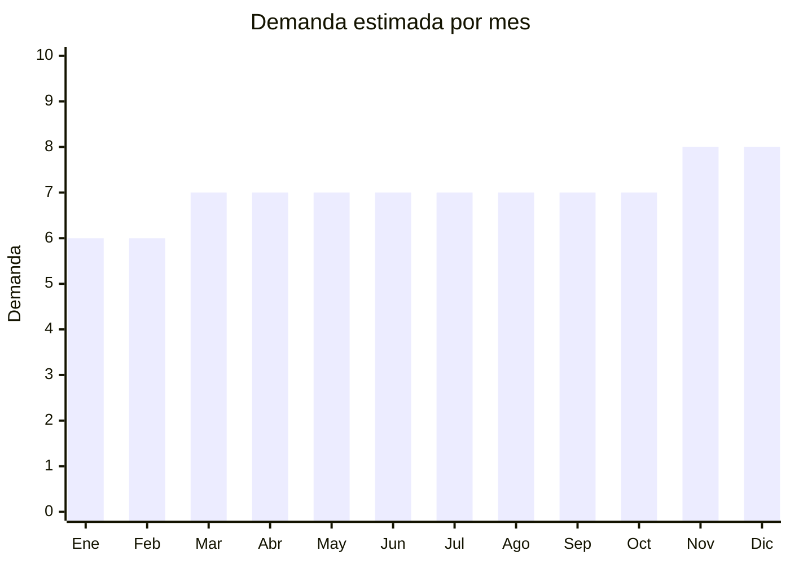

# Accesorios para cabello (hebillas, broches, vinchas)

> **Capítulo NCM 71** — Perlas, piedras preciosas, metales preciosos, bisutería | **Temporada:** Atemporal

## Qué es y por qué importarlo

Accesorios para cabello: hebillas, broches, vinchas, colitas, pinzas cangrejo (claw clips), horquillas, diademas y peinetas. Yiwu (Zhejiang, China) es la capital mundial de estos accesorios. El costo por unidad es extremadamente bajo y se venden por packs múltiples. Las pinzas cangrejo (claw clips) son tendencia fuerte actualmente. Producto de compra recurrente con alta rotación y demanda femenina constante.

**Sin antidumping. Sin certificaciones.**

## Datos clave

| Dato | Valor |
|------|-------|
| **Posiciones NCM típicas** | 7117.90.00 (bisutería), 9615.11.00 (peines y peinetas), 9615.19.00 (horquillas) |
| **Derecho de importación** | 18-20% (DIE) + 3% tasa estadística |
| **Rango FOB típico** | USD 0.05 — USD 1.00 por unidad |
| **Precio de venta en Argentina** | ARS 1.000 — ARS 5.000 (por pack) |
| **Margen bruto estimado** | 300% — 600% |
| **MOQ típico** | 200 — 1,000 unidades |
| **Demanda en MercadoLibre** | Alta |
| **Competencia en MercadoLibre** | Media |
| **Dificultad para importar** | Muy fácil |
| **Certificaciones necesarias** | Ninguna |
| **Antidumping** | **No** |

## Variantes y subtipos más comunes

| Subtipo / Variante | FOB aprox. | Venta AR aprox. | Nota |
|--------------------|-----------|-----------------|------|
| Pinzas cangrejo (claw clips) x3-6 | USD 0.30 — 1.00/pack | ARS 2.000 — 5.000 | **Tendencia fuerte** |
| Hebillas perla/doradas x6-10 | USD 0.20 — 0.80/pack | ARS 1.500 — 4.000 | Elegantes |
| Vinchas acolchadas x3 | USD 0.30 — 1.00/pack | ARS 2.000 — 5.000 | Moda |
| Colitas elásticas x20-50 | USD 0.10 — 0.30/pack | ARS 800 — 2.000 | Básico alto volumen |
| Pack mixto accesorios cabello | USD 0.50 — 2.00/pack | ARS 3.000 — 8.000 | Set variado |

## Regulaciones y requisitos

<Tabs>
  <Tab title="Certificaciones">
    Sin certificaciones especiales.
  </Tab>
  <Tab title="Etiquetado">
    Material, país de origen, datos importador.
  </Tab>
  <Tab title="Restricciones">
    Sin restricciones. Producto de importación libre.
  </Tab>
</Tabs>

## Logística

| Dato | Valor |
|------|-------|
| **Peso típico por pack** | 0.02 — 0.10 kg |
| **Volumen típico** | Muy bajo |
| **Fragilidad** | Baja |
| **Envío recomendado** | Aéreo/Courier (ultraliviano) |
| **Tiempo total estimado** | 15 — 25 días (aéreo) |

## Estacionalidad



| Aspecto | Detalle |
|---------|---------|
| **Meses pico** | Noviembre-Diciembre (regalos), Marzo (vuelta a clases/Día de la Mujer) |
| **Meses valle** | Demanda muy estable todo el año |

## Ventajas y riesgos

<CardGroup cols={2}>
  <Card title="Ventajas" icon="circle-check">
    - **Margen excepcional** (300-600%)
    - Ultraliviano (envío aéreo ideal)
    - Yiwu = precios imbatibles
    - Compra recurrente
    - **Sin regulaciones**
    - Claw clips = tendencia fuerte
  </Card>
  <Card title="Riesgos" icon="triangle-exclamation">
    - Ticket unitario muy bajo
    - Competencia de precio
    - Calidad variable
    - Tendencias de moda cambian
  </Card>
</CardGroup>

## Palabras clave para buscar en Alibaba

```
hair accessories wholesale Yiwu, claw clip wholesale, hair clip pack,
pearl hair pin, headband wholesale, elastic hair tie bulk,
fashion hair clip set, velvet scrunchie wholesale
```

## Fuentes

- [MercadoLibre Argentina — Accesorios cabello](https://listado.mercadolibre.com.ar/accesorios-cabello)
- [Alibaba — Hair accessories Yiwu](https://www.alibaba.com/showroom/hair-accessories-wholesale.html)
