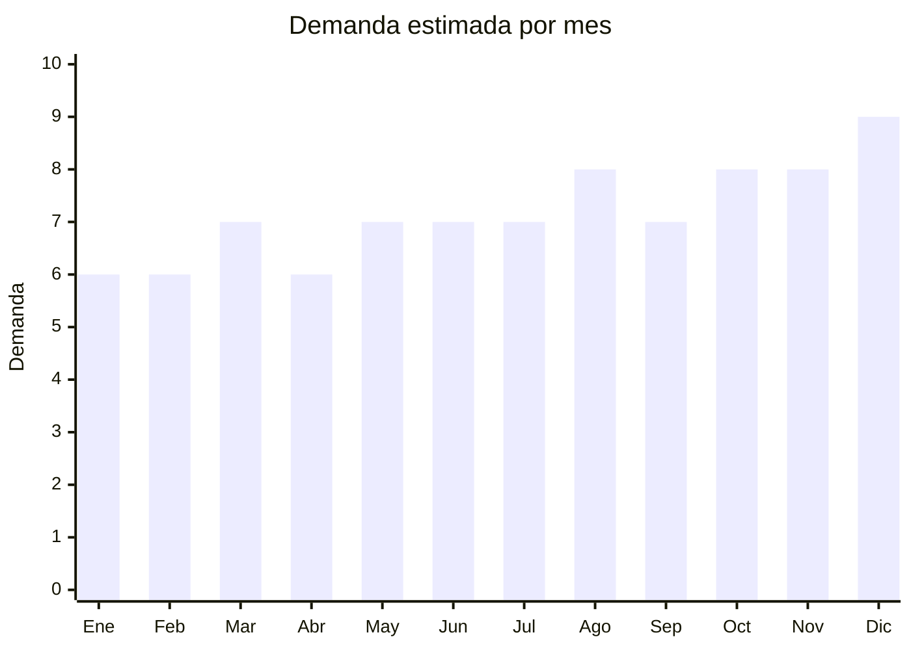

# Bijouterie de acero inoxidable

> **Capítulo NCM 71** — Perlas, piedras preciosas, metales preciosos, bisutería | **Temporada:** Atemporal

## Qué es y por qué importarlo

Bijouterie de acero inoxidable (acero quirúrgico 316L) con baño de oro 18k, plata o rosé gold. Incluye pulseras, collares, anillos, aros, cadenas y dijes. El acero quirúrgico con baño de oro es la tendencia dominante en Argentina — combina apariencia premium con precio accesible y durabilidad (no se oxida ni genera alergias). China (Yiwu, Guangzhou) produce la mayoría de la bijouterie mundial con precios FOB extremadamente bajos.

**Sin antidumping. Sin certificaciones especiales.**

## Datos clave

| Dato | Valor |
|------|-------|
| **Posiciones NCM típicas** | 7117.19.00 (bisutería de metales comunes), 7117.90.00 (las demás) |
| **Derecho de importación** | 20% (DIE) + 3% tasa estadística |
| **Rango FOB típico** | USD 0.30 — USD 3.00 por pieza |
| **Precio de venta en Argentina** | ARS 3.000 — ARS 15.000 |
| **Margen bruto estimado** | 300% — 600% |
| **MOQ típico** | 50 — 200 piezas por modelo |
| **Demanda en MercadoLibre** | Muy Alta (7,500+ resultados solo pulseras acero) |
| **Competencia en MercadoLibre** | Media-Alta |
| **Dificultad para importar** | Fácil |
| **Certificaciones necesarias** | Ninguna |
| **Antidumping** | **No** |

## Variantes y subtipos más comunes

| Subtipo / Variante | FOB aprox. | Venta AR aprox. | Nota |
|--------------------|-----------|-----------------|------|
| Pulsera acero baño oro 18k | USD 0.50 — 2.00 | ARS 4.000 — 12.000 | **Más vendido** |
| Collar/cadena acero baño oro | USD 0.80 — 3.00 | ARS 5.000 — 15.000 | Tendencia |
| Anillo acero quirúrgico | USD 0.30 — 1.50 | ARS 2.000 — 8.000 | Alta rotación |
| Aros acero baño oro | USD 0.50 — 2.00 | ARS 3.000 — 10.000 | Variedad |
| Set pulsera + collar + aros | USD 1.50 — 5.00 | ARS 8.000 — 25.000 | Set regalo |

## Regulaciones y requisitos

<Tabs>
  <Tab title="Certificaciones">
    Sin certificaciones especiales para bisutería.
  </Tab>
  <Tab title="Etiquetado">
    Material (ej: "Acero Inoxidable 316L — Baño Oro 18k"), país de origen, datos importador. **No publicitar como "oro" si es baño** — indicar siempre "baño de oro" o "gold plated".
  </Tab>
  <Tab title="Restricciones">
    - No comercializar como oro/plata genuino si es baño
    - Verificar contenido de níquel (normativa europea aplica como referencia)
    - Atención con imitaciones de marcas registradas (Pandora, Tiffany, etc.)
  </Tab>
</Tabs>

## Logística

| Dato | Valor |
|------|-------|
| **Peso típico por pieza** | 0.01 — 0.05 kg |
| **Volumen típico** | Muy bajo |
| **Fragilidad** | Baja |
| **Envío recomendado** | Aéreo/Courier (ultraliviano, alto valor) |
| **Tiempo total estimado** | 15 — 25 días (aéreo) |

<Tip>
La bijouterie es **ideal para envío aéreo** por su relación peso/valor excepcional. Un paquete de 500 piezas pesa apenas 5-15 kg y tiene un valor de venta de varios miles de dólares. Esto permite reposición rápida y test de mercado con inversión mínima.
</Tip>

## Estacionalidad



| Aspecto | Detalle |
|---------|---------|
| **Meses pico** | Marzo (Día de la Mujer), Mayo (Día de la Madre), Julio (Día del Amigo), Diciembre (Navidad) |
| **Meses valle** | Enero-Febrero — demanda base estable |

## Ventajas y riesgos

<CardGroup cols={2}>
  <Card title="Ventajas" icon="circle-check">
    - **Margen excepcional** (300-600%)
    - Ultraliviano (envío aéreo ideal)
    - **Sin antidumping ni certificaciones**
    - Acero quirúrgico + baño oro = tendencia dominante
    - Marca propia viable
    - Recompra frecuente
  </Card>
  <Card title="Riesgos" icon="triangle-exclamation">
    - Competencia alta
    - Calidad del baño variable (desgaste)
    - Riesgo de propiedad intelectual (imitaciones)
    - Ticket unitario bajo
    - Tendencias cambian rápido
  </Card>
</CardGroup>

## Palabras clave para buscar en Alibaba

```
stainless steel jewelry wholesale, 18k gold plated bracelet,
316L stainless steel necklace, surgical steel ring wholesale,
gold plated earrings bulk, Yiwu jewelry factory, fashion jewelry set,
waterproof jewelry stainless steel
```

## Fuentes

- [MercadoLibre Argentina — Bijouterie acero](https://listado.mercadolibre.com.ar/bijouterie-acero)
- [Alibaba — Stainless steel jewelry wholesale](https://www.alibaba.com/showroom/stainless-steel-jewelry-wholesale.html)
