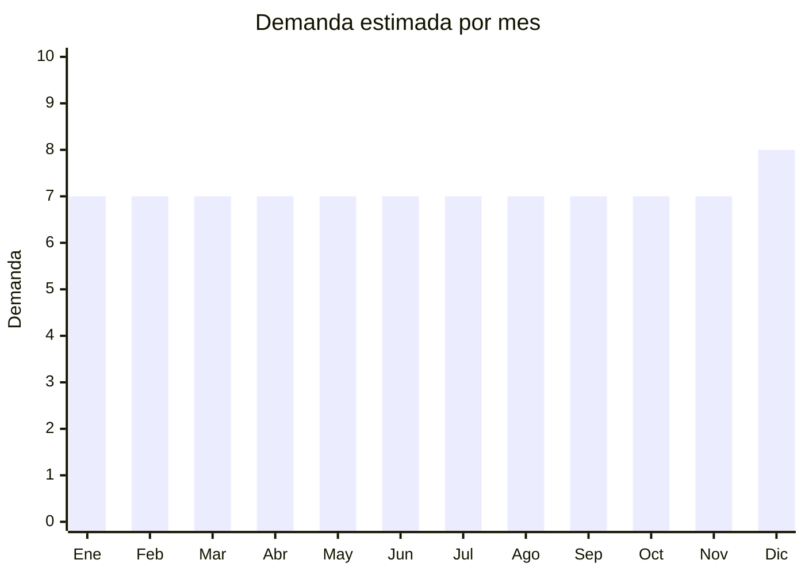

# Piercing y aros de fantasía

> **Capítulo NCM 71** — Perlas, piedras preciosas, metales preciosos, bisutería | **Temporada:** Atemporal

## Qué es y por qué importarlo

Piercings y aros de fantasía en acero quirúrgico (316L), titanio y acero con baño de oro. Incluye aros de nariz, septum, labret, helix, tragus, industrial, ombligo y aros de oreja estilo huggie/cuff. Se venden por packs de 3-12 unidades. El acero quirúrgico y el titanio son los materiales más buscados por ser hipoalergénicos. Demanda juvenil permanente con tendencia creciente por la cultura del piercing.

**Sin antidumping. Sin certificaciones especiales.**

## Datos clave

| Dato | Valor |
|------|-------|
| **Posiciones NCM típicas** | 7117.19.00 (bisutería de metales comunes), 7117.90.00 (las demás) |
| **Derecho de importación** | 20% (DIE) + 3% tasa estadística |
| **Rango FOB típico** | USD 0.10 — USD 2.00 por pieza |
| **Precio de venta en Argentina** | ARS 1.500 — ARS 8.000 (por pack) |
| **Margen bruto estimado** | 300% — 600% |
| **MOQ típico** | 100 — 500 piezas |
| **Demanda en MercadoLibre** | Media-Alta |
| **Competencia en MercadoLibre** | Media |
| **Dificultad para importar** | Muy fácil |
| **Certificaciones necesarias** | Ninguna |
| **Antidumping** | **No** |

## Variantes y subtipos más comunes

| Subtipo / Variante | FOB aprox. | Venta AR aprox. | Nota |
|--------------------|-----------|-----------------|------|
| Pack x6-12 aros acero quirúrgico | USD 0.50 — 2.00/pack | ARS 3.000 — 8.000 | **Más vendido** |
| Piercing septum acero/titanio | USD 0.20 — 1.00/u | ARS 1.500 — 4.000 | Tendencia |
| Aros huggie x3-6 acero baño oro | USD 0.50 — 2.00/pack | ARS 3.000 — 8.000 | Elegante |
| Piercing ombligo x5 | USD 0.50 — 1.50/pack | ARS 2.000 — 5.000 | Clásico |
| Pack surtido piercings x20 | USD 1.00 — 3.00/pack | ARS 4.000 — 10.000 | Variedad |

## Regulaciones y requisitos

<Tabs>
  <Tab title="Certificaciones">
    Sin certificaciones obligatorias. Se recomienda que el material sea hipoalergénico (acero 316L o titanio).
  </Tab>
  <Tab title="Etiquetado">
    Material (ej: "Acero Quirúrgico 316L"), medida (gauge/grosor), país de origen, datos importador.
  </Tab>
  <Tab title="Restricciones">
    - Indicar siempre el material real
    - Verificar contenido de níquel (referencia norma EU)
    - No publicitar como "titanio" si es acero con baño
  </Tab>
</Tabs>

## Logística

| Dato | Valor |
|------|-------|
| **Peso típico por pack** | 0.01 — 0.05 kg |
| **Volumen típico** | Muy bajo |
| **Fragilidad** | Nula |
| **Envío recomendado** | Aéreo/Courier (ultraliviano) |
| **Tiempo total estimado** | 15 — 25 días (aéreo) |

## Estacionalidad



| Aspecto | Detalle |
|---------|---------|
| **Meses pico** | Demanda estable todo el año. Leve pico en Diciembre (regalos) |
| **Meses valle** | No hay estacionalidad marcada |

## Ventajas y riesgos

<CardGroup cols={2}>
  <Card title="Ventajas" icon="circle-check">
    - **Margen excepcional** (300-600%)
    - Ultraliviano
    - **Sin regulaciones**
    - Demanda juvenil permanente
    - Packs = alto ticket acumulado
    - Nicho con comunidad fiel
  </Card>
  <Card title="Riesgos" icon="triangle-exclamation">
    - Ticket unitario muy bajo
    - Calidad de material variable
    - Riesgo alergias si material es malo
    - Mercado fragmentado
  </Card>
</CardGroup>

## Palabras clave para buscar en Alibaba

```
piercing jewelry wholesale, surgical steel piercing, septum ring wholesale,
titanium piercing, belly button ring pack, huggie earrings stainless steel,
helix earring set, body piercing wholesale
```

## Fuentes

- [MercadoLibre Argentina — Piercings](https://listado.mercadolibre.com.ar/piercing)
- [Alibaba — Piercing jewelry wholesale](https://www.alibaba.com/showroom/piercing-jewelry-wholesale.html)
