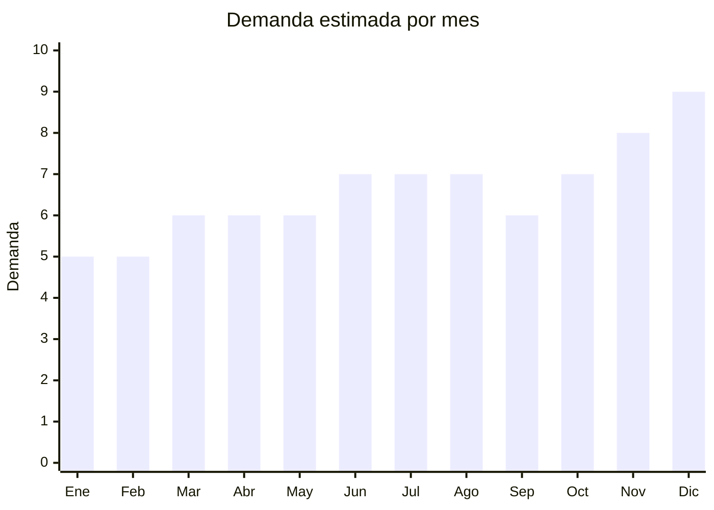

# Relojes de moda / fashion watches

> **Capítulo NCM 71** — Perlas, piedras preciosas, metales preciosos, bisutería | **Temporada:** Atemporal

## Qué es y por qué importarlo

Relojes analógicos de moda (fashion watches) para hombre y mujer. NO son smartwatches (esos van en Cap. 85). Incluye relojes con correa de cuero sintético, acero, silicona y malla milanesa. Estilos: minimalista, vintage, deportivo casual, elegante. China (Shenzhen, Guangzhou) es el mayor productor mundial de relojes de moda con capacidad de personalización (logo propio) desde MOQ bajos. El reloj de moda tiene alto valor percibido respecto a su costo FOB.

**Sin antidumping. Sin certificaciones especiales.**

## Datos clave

| Dato | Valor |
|------|-------|
| **Posiciones NCM típicas** | 7117.90.00 (bisutería — si es fashion/moda), 9102.11.00 (relojes pulsera — si tiene maquinaria) |
| **Derecho de importación** | 18-20% (DIE) + 3% tasa estadística |
| **Rango FOB típico** | USD 2.00 — USD 10.00 por unidad |
| **Precio de venta en Argentina** | ARS 8.000 — ARS 30.000 |
| **Margen bruto estimado** | 200% — 400% |
| **MOQ típico** | 50 — 200 unidades por modelo |
| **Demanda en MercadoLibre** | Alta |
| **Competencia en MercadoLibre** | Alta |
| **Dificultad para importar** | Fácil |
| **Certificaciones necesarias** | Ninguna |
| **Antidumping** | **No** |

## Variantes y subtipos más comunes

| Subtipo / Variante | FOB aprox. | Venta AR aprox. | Nota |
|--------------------|-----------|-----------------|------|
| Reloj minimalista unisex | USD 2.00 — 5.00 | ARS 8.000 — 18.000 | **Tendencia** |
| Reloj malla milanesa | USD 3.00 — 7.00 | ARS 10.000 — 25.000 | Elegante |
| Reloj deportivo casual silicona | USD 2.00 — 5.00 | ARS 6.000 — 15.000 | Sport |
| Reloj vintage cuero | USD 3.00 — 8.00 | ARS 10.000 — 25.000 | Clásico |
| Set reloj + pulsera en caja | USD 4.00 — 10.00 | ARS 15.000 — 35.000 | **Regalo premium** |

## Regulaciones y requisitos

<Tabs>
  <Tab title="Certificaciones">
    Sin certificaciones especiales.
  </Tab>
  <Tab title="Etiquetado">
    Material, tipo de movimiento (cuarzo), resistencia al agua (si aplica), país de origen, datos importador.
  </Tab>
  <Tab title="Restricciones">
    - No comercializar como "Swiss Made" o marcas registradas
    - Si se declara resistencia al agua, debe ser verificable
    - Atención con imitaciones de marcas (Rolex, Casio, etc.)
  </Tab>
</Tabs>

## Logística

| Dato | Valor |
|------|-------|
| **Peso típico por unidad** | 0.05 — 0.15 kg |
| **Volumen típico** | Muy bajo |
| **Fragilidad** | Media (cristal puede rayarse) |
| **Envío recomendado** | Aéreo/Courier |
| **Tiempo total estimado** | 15 — 25 días (aéreo) |

## Estacionalidad



| Aspecto | Detalle |
|---------|---------|
| **Meses pico** | Junio (Día del Padre), Julio (Día del Amigo), Diciembre (Navidad) — regalo clásico |
| **Meses valle** | Enero-Febrero |

## Ventajas y riesgos

<CardGroup cols={2}>
  <Card title="Ventajas" icon="circle-check">
    - Alto valor percibido vs FOB bajo
    - Liviano (ideal envío aéreo)
    - **Sin antidumping ni certificaciones**
    - Marca propia viable
    - Producto regalo ideal
  </Card>
  <Card title="Riesgos" icon="triangle-exclamation">
    - Competencia con marcas establecidas
    - Calidad de maquinaria variable
    - Riesgo de propiedad intelectual
    - Smartwatches desplazan mercado
    - Tendencias cambian
  </Card>
</CardGroup>

## Palabras clave para buscar en Alibaba

```
fashion watch wholesale, minimalist watch Shenzhen, quartz watch bulk,
mesh strap watch, leather strap watch wholesale, custom logo watch,
women fashion watch, men casual watch Guangzhou
```

## Fuentes

- [MercadoLibre Argentina — Relojes moda](https://listado.mercadolibre.com.ar/relojes)
- [Alibaba — Fashion watch wholesale](https://www.alibaba.com/showroom/fashion-watch-wholesale.html)
