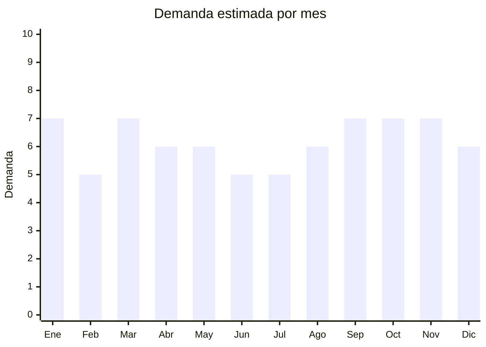

# Estanterías y racks metálicos

> **Capítulo NCM 73** — Manufacturas de fundición, hierro o acero | **Temporada:** Atemporal

<Warning>
**Producto pesado — evaluar flete cuidadosamente.** Las estanterías metálicas tienen alto peso por unidad. El costo de flete marítimo puede representar un porcentaje significativo del costo total. Calcular flete antes de cotizar.
</Warning>

## Qué es y por qué importarlo

Las estanterías y racks metálicos abarcan estanterías modulares de ángulo ranurado, racks de alambre cromado (wire shelving), estanterías industriales para depósito, organizadores metálicos para cocina y baño, y racks de almacenamiento para garage. Es un producto de demanda permanente: todo hogar, comercio, depósito y oficina necesita soluciones de almacenamiento.

China es el principal productor mundial de estanterías metálicas, con fábricas concentradas en Nanjing (Jiangsu) — hub de estanterías industriales — y Foshan (Guangdong) para modelos de hogar. Los precios FOB son competitivos (USD 5-25 por unidad) y permiten competir con marcas argentinas como Mosconi y La Font.

La tendencia de organización del hogar, el crecimiento del e-commerce (que requiere depósitos organizados) y la apertura constante de comercios generan demanda sostenida durante todo el año.

## Datos clave

| Dato | Valor |
|------|-------|
| **Posiciones NCM típicas** | 7326.90.00 (otras manufacturas de hierro o acero) |
| **Derecho de importación** | 18% (DIE) + 3% tasa estadística |
| **Rango FOB típico** | USD 5.00 — USD 25.00 por unidad |
| **Precio de venta en Argentina** | ARS 15.000 — ARS 60.000 |
| **Margen bruto estimado** | 150% — 250% |
| **MOQ típico** | 50 — 300 unidades |
| **Demanda en MercadoLibre** | Alta |
| **Competencia en MercadoLibre** | Media-Alta (marcas locales + importadores) |
| **Dificultad para importar** | Media (logística compleja por peso y volumen) |
| **Certificaciones necesarias** | Ninguna obligatoria |
| **Antidumping** | Sin antidumping vigente |

## Demanda y mercado en Argentina

- **Volumen de mercado:** Miles de publicaciones activas en MercadoLibre. Producto presente en ferreterías, grandes superficies y mayoristas.
- **Tendencia:** Estable-Creciente — el crecimiento del e-commerce genera demanda de racks para depósitos. La tendencia de organización del hogar impulsa las estanterías decorativas y modulares.
- **Perfil del comprador:** Hogares (garage, lavadero, cocina), comercios (depósito, exhibición), emprendedores e-commerce (organización de stock), talleres e industrias.
- **Canales de venta principales:** MercadoLibre, ferreterías, mayoristas de ferretería, venta B2B a comercios e industrias.

<Note>
Las marcas argentinas **Mosconi** y **La Font** tienen fuerte presencia en estanterías de ángulo ranurado. La diferenciación para importadores pasa por modelos que no fabrican localmente: racks de alambre cromado (wire shelving), estanterías modulares con ruedas, y sistemas de almacenamiento de pared tipo garage.
</Note>

## Competencia

| Aspecto | Situación |
|---------|-----------|
| **Cantidad de vendedores en ML** | +200 vendedores activos |
| **Hay marcas dominantes** | Sí: Mosconi y La Font en ángulo ranurado |
| **Tipo de competidores** | Fabricantes locales (ángulo ranurado) + Importadores (wire shelving) |
| **Rango de precios en ML** | ARS 15.000 — ARS 60.000 |
| **Posibilidad de diferenciarse** | Media-Alta |

**Cómo diferenciarse:**
- Racks de alambre cromado (wire shelving) que la industria local no produce
- Estanterías con ruedas para cocina/baño (segmento decorativo)
- Sistemas de almacenamiento de pared para garage (ganchos, paneles perforados)
- Estanterías esquineras y modelos de diseño moderno (negro mate, industrial)

## Variantes y subtipos más comunes

| Subtipo / Variante | FOB aprox. | Venta AR aprox. | Nota |
|--------------------|-----------|-----------------|------|
| Estantería ángulo ranurado 4 estantes | USD 8.00 — 15.00 | ARS 20.000 — 40.000 | Competencia local fuerte |
| Rack alambre cromado 5 estantes | USD 10.00 — 20.00 | ARS 25.000 — 50.000 | **Más vendido importado** |
| Estantería cocina/baño con ruedas | USD 5.00 — 12.00 | ARS 15.000 — 35.000 | Segmento decorativo |
| Rack industrial resistente | USD 15.00 — 25.00 | ARS 35.000 — 60.000 | Mayor margen, B2B |
| Organizador de pared garage | USD 8.00 — 18.00 | ARS 20.000 — 45.000 | Nicho creciente |

## Regulaciones y requisitos

<Tabs>
  <Tab title="Certificaciones">
    | Organismo | Requiere | Detalle |
    |-----------|----------|---------|
    | ARCA (Aduana) | Sí siempre | Despacho estándar |
    | ANMAT | No | No es cosmético ni alimento |
    | ENACOM | No | No es electrónico |
    | INTI | No | No aplica |

    Producto sin barreras regulatorias. Importación libre y directa.
  </Tab>

  <Tab title="Etiquetado">
    | Requisito | Aplica |
    |-----------|--------|
    | Idioma español | Sí |
    | Datos del importador | Sí |
    | Capacidad de carga por estante | Sí (dato de seguridad — indicar kg máx. por estante) |
    | Dimensiones | Sí (alto x ancho x profundidad) |
    | Materiales | Sí (acero, cromado, pintado epoxi, etc.) |
    | País de origen | Sí |
    | Instrucciones de armado | Sí (incluir manual en español) |
    | Garantía legal 6 meses | Sí |
  </Tab>

  <Tab title="Restricciones">
    Sin restricciones especiales. Producto de importación libre.

    **Nota:** Verificar que el recubrimiento (cromado, pintura epoxi, galvanizado) sea de buena calidad para evitar oxidación. Las estanterías para ambientes húmedos (baño, cocina, exteriores) requieren recubrimiento superior. Solicitar certificado de resistencia a corrosión al proveedor.
  </Tab>
</Tabs>

## Logística

| Dato | Valor |
|------|-------|
| **Peso típico por unidad** | 5.0 — 20.0 kg (producto pesado) |
| **Volumen típico** | Alto (producto voluminoso y pesado) |
| **Fragilidad** | Baja (estructura metálica resistente) |
| **Envío recomendado** | Marítimo LCL o FCL — obligatorio marítimo por peso |
| **Tiempo total estimado** | 50 — 80 días (marítimo) |
| **Baterías de litio** | No |
| **Requiere empaque especial** | No — embalaje estándar en caja con componentes desarmados |

<Warning>
**Evaluar flete antes de cotizar.** Las estanterías metálicas pueden pesar entre 5 y 20 kg por unidad. El flete marítimo se cobra por peso o por volumen (lo que sea mayor). Un contenedor de 20 pies puede llenarse por peso antes que por volumen. Calcular el costo de flete por unidad para verificar que los márgenes se mantengan atractivos. Considerar que el flete puede representar un 15-25% del costo total de importación.
</Warning>

## Estacionalidad



| Aspecto | Detalle |
|---------|---------|
| **Meses pico** | Enero (reorganización post-fiestas, mudanzas de verano), Marzo (aperturas de comercios), Septiembre-Noviembre (preparación de depósitos para temporada alta) |
| **Meses valle** | Junio-Julio (menor actividad comercial) |
| **Cuándo pedir** | Mantener stock permanente — reforzar en junio para tener stock en septiembre |

## Ventajas y riesgos

<CardGroup cols={2}>
  <Card title="Ventajas" icon="circle-check">
    - Demanda permanente (hogares + comercios + industria)
    - Producto resistente, baja tasa de devolución
    - Sin regulaciones ni certificaciones
    - Múltiples segmentos (hogar, comercio, industria)
    - Buenos márgenes en modelos diferenciados
  </Card>
  <Card title="Riesgos" icon="triangle-exclamation">
    - Producto muy pesado (flete alto por kg)
    - Competencia local fuerte en ángulo ranurado (Mosconi, La Font)
    - Voluminoso (ocupa mucho espacio de almacenamiento)
    - Recubrimiento de baja calidad = oxidación y reclamos
    - Requiere mayor inversión inicial por peso mínimo de envío
  </Card>
</CardGroup>

## Palabras clave para buscar en Alibaba

```
metal shelving rack wholesale, wire shelving unit chrome, storage rack steel,
kitchen storage rack wheels, garage storage system wall, industrial shelf metal,
adjustable steel shelving, 5 tier wire shelf wholesale
```

## Fuentes

- [MercadoLibre Argentina — Estanterías metálicas](https://listado.mercadolibre.com.ar/estanteria-metalica)
- [Alibaba — Metal shelving rack wholesale](https://www.alibaba.com/showroom/metal-shelving-rack-wholesale.html)
