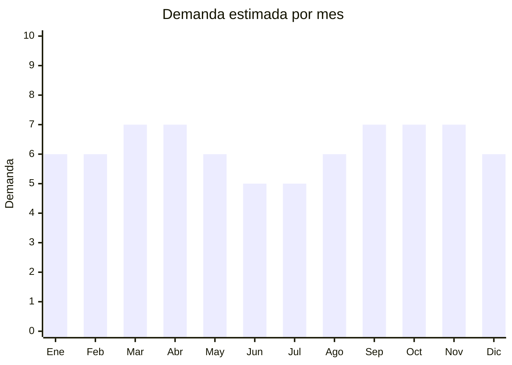

# Grifería de cocina y baño

> **Capítulo NCM 73** — Manufacturas de fundición, hierro o acero | **Temporada:** Atemporal

<Warning>
**Producto con certificación obligatoria.** La grifería debe cumplir normas de aptitud sanitaria para contacto con agua potable. Verificar requisitos antes de importar.
</Warning>

## Qué es y por qué importarlo

La grifería de cocina y baño incluye canillas monocomando, griferías de mesada, bidet, ducha, mezcladores y accesorios de conexión. Es un producto de reposición permanente: toda refacción, construcción nueva o remodelación de baño y cocina requiere grifería. La demanda es constante durante todo el año.

Foshan (Guangdong) es el hub mundial de producción de grifería, concentrando cientos de fábricas con capacidad de personalización completa (acabados cromados, negro mate, dorado, acero inoxidable). Los precios FOB son muy competitivos frente a las marcas argentinas premium como FV, Piazza y Peirano, permitiendo márgenes superiores al 150%.

Con más de 57,000 publicaciones activas en MercadoLibre y marcas importadas como FEMMTO acumulando miles de ventas, el mercado está validado para importadores que ofrezcan buena calidad a precio competitivo.

## Datos clave

| Dato | Valor |
|------|-------|
| **Posiciones NCM típicas** | 7324.90.00 (artículos de higiene/tocador de hierro o acero) |
| **Derecho de importación** | 20% (DIE) + 3% tasa estadística |
| **Rango FOB típico** | USD 3.00 — USD 20.00 por unidad |
| **Precio de venta en Argentina** | ARS 15.000 — ARS 60.000 |
| **Margen bruto estimado** | 150% — 300% |
| **MOQ típico** | 100 — 500 unidades |
| **Demanda en MercadoLibre** | Muy alta (~57,863 publicaciones activas) |
| **Competencia en MercadoLibre** | Alta (marcas locales + importadores) |
| **Dificultad para importar** | Media (requiere certificación) |
| **Certificaciones necesarias** | Aptitud sanitaria para contacto con agua potable |
| **Antidumping** | Sin antidumping vigente |

## Demanda y mercado en Argentina

- **Volumen de mercado:** Más de 57,000 publicaciones activas en MercadoLibre. Producto de altísima rotación vinculado a construcción y remodelación.
- **Tendencia:** Estable-Creciente — los acabados en negro mate y dorado cepillado son tendencia consolidada. Las griferías monocomando desplazaron casi por completo a las de doble comando.
- **Perfil del comprador:** Plomeros y gasistas (compra recurrente), personas refaccionando baño/cocina, constructoras, corralones y sanitarios.
- **Canales de venta principales:** MercadoLibre, corralones, casas de sanitarios, ferreterías, venta B2B a constructoras.

<Note>
La marca importada **FEMMTO** acumula más de 6,504 calificaciones en MercadoLibre, demostrando que una marca china con buen posicionamiento puede competir directamente con las marcas tradicionales argentinas como FV, Piazza y Peirano. La clave es ofrecer diseño moderno a precio competitivo con garantía.
</Note>

## Competencia

| Aspecto | Situación |
|---------|-----------|
| **Cantidad de vendedores en ML** | +500 vendedores activos |
| **Hay marcas dominantes** | Sí: FV (premium), Piazza, Peirano (medio), FEMMTO (importada exitosa) |
| **Tipo de competidores** | Fabricantes nacionales + Importadores directos |
| **Rango de precios en ML** | ARS 15.000 — ARS 60.000 |
| **Posibilidad de diferenciarse** | Media-Alta |

**Cómo diferenciarse:**
- Acabados modernos: negro mate, dorado cepillado, acero inoxidable cepillado
- Griferías con filtro integrado o aireador de ahorro de agua
- Sets completos (grifería + accesorios de baño coordinados)
- Garantía extendida y servicio post-venta con repuestos

## Variantes y subtipos más comunes

| Subtipo / Variante | FOB aprox. | Venta AR aprox. | Nota |
|--------------------|-----------|-----------------|------|
| Grifería monocomando cocina básica | USD 3.00 — 6.00 | ARS 15.000 — 25.000 | Volumen |
| Grifería monocomando cocina pico alto | USD 5.00 — 12.00 | ARS 20.000 — 40.000 | **Más vendido** |
| Grifería monocomando baño | USD 3.00 — 8.00 | ARS 12.000 — 30.000 | Alta rotación |
| Grifería ducha/bañera con transferencia | USD 8.00 — 20.00 | ARS 30.000 — 60.000 | Mayor margen |
| Grifería bidet | USD 3.00 — 7.00 | ARS 10.000 — 25.000 | Complemento |

## Regulaciones y requisitos

<Tabs>
  <Tab title="Certificaciones">
    | Organismo | Requiere | Detalle |
    |-----------|----------|---------|
    | ARCA (Aduana) | Sí siempre | Despacho estándar |
    | ANMAT | No | No es cosmético ni alimento |
    | ENACOM | No | No es electrónico |
    | INTI | No | No aplica para grifería |
    | Aptitud sanitaria | Recomendado | Certificación de materiales aptos para contacto con agua potable |

    La grifería debe cumplir con normas de calidad de materiales para contacto con agua. Se recomienda solicitar al proveedor chino certificados de conformidad con normas internacionales (NSF/ANSI 61 o equivalente) para facilitar el ingreso.
  </Tab>

  <Tab title="Etiquetado">
    | Requisito | Aplica |
    |-----------|--------|
    | Idioma español | Sí |
    | Datos del importador | Sí |
    | Composición / materiales | Sí (latón, acero inoxidable, zinc — indicar material del cuerpo) |
    | País de origen | Sí |
    | Instrucciones de instalación | Recomendado |
    | Garantía legal 6 meses | Sí |
  </Tab>

  <Tab title="Restricciones">
    Sin restricciones de importación específicas.

    **Nota importante:** Evitar griferías con alto contenido de plomo en el latón. Los proveedores de Foshan ofrecen opciones "lead-free" (sin plomo) a un costo ligeramente superior pero evitan problemas regulatorios y de calidad.
  </Tab>
</Tabs>

## Logística

| Dato | Valor |
|------|-------|
| **Peso típico por unidad** | 0.5 — 2.0 kg |
| **Volumen típico** | Bajo-Medio (producto compacto y pesado) |
| **Fragilidad** | Media (acabados cromados se rayan — requiere empaque individual) |
| **Envío recomendado** | Marítimo LCL — producto pesado, flete por peso no por volumen |
| **Tiempo total estimado** | 50 — 80 días (marítimo) |
| **Baterías de litio** | No |
| **Requiere empaque especial** | Sí — cada grifería en caja individual con protección de espuma |

<Warning>
**Cuidado con los acabados.** Las griferías cromadas y en negro mate se rayan fácilmente durante el transporte. Exigir al proveedor empaque individual con bolsa protectora y caja de cartón con espuma. Rechazar envíos a granel sin protección individual.
</Warning>

## Estacionalidad



| Aspecto | Detalle |
|---------|---------|
| **Meses pico** | Marzo-Abril (inicio de obras post-verano), Septiembre-Noviembre (temporada fuerte de construcción y remodelación) |
| **Meses valle** | Junio-Julio (menor actividad de construcción por frío) |
| **Cuándo pedir** | Mantener stock permanente — producto de demanda constante |

## Ventajas y riesgos

<CardGroup cols={2}>
  <Card title="Ventajas" icon="circle-check">
    - Demanda masiva y permanente (construcción + refacción)
    - Márgenes excelentes (150-300%)
    - Producto compacto y pesado (flete eficiente)
    - Fácil de personalizar con marca propia
    - Foshan ofrece enorme variedad de diseños y acabados
  </Card>
  <Card title="Riesgos" icon="triangle-exclamation">
    - Competencia fuerte de marcas locales establecidas (FV, Piazza)
    - Acabados se dañan en transporte si no hay buen empaque
    - Requiere servicio post-venta (repuestos de cartuchos)
    - Calidad variable entre proveedores de Foshan
    - Necesita certificación de aptitud sanitaria
  </Card>
</CardGroup>

## Palabras clave para buscar en Alibaba

```
kitchen faucet wholesale, bathroom faucet mixer, basin faucet black matte,
single handle kitchen tap, brass faucet chrome, pull out kitchen faucet,
bathroom mixer tap wholesale, Foshan faucet factory
```

## Fuentes

- [MercadoLibre Argentina — Grifería cocina y baño](https://listado.mercadolibre.com.ar/griferia)
- [Alibaba — Kitchen faucet wholesale](https://www.alibaba.com/showroom/kitchen-faucet-wholesale.html)
