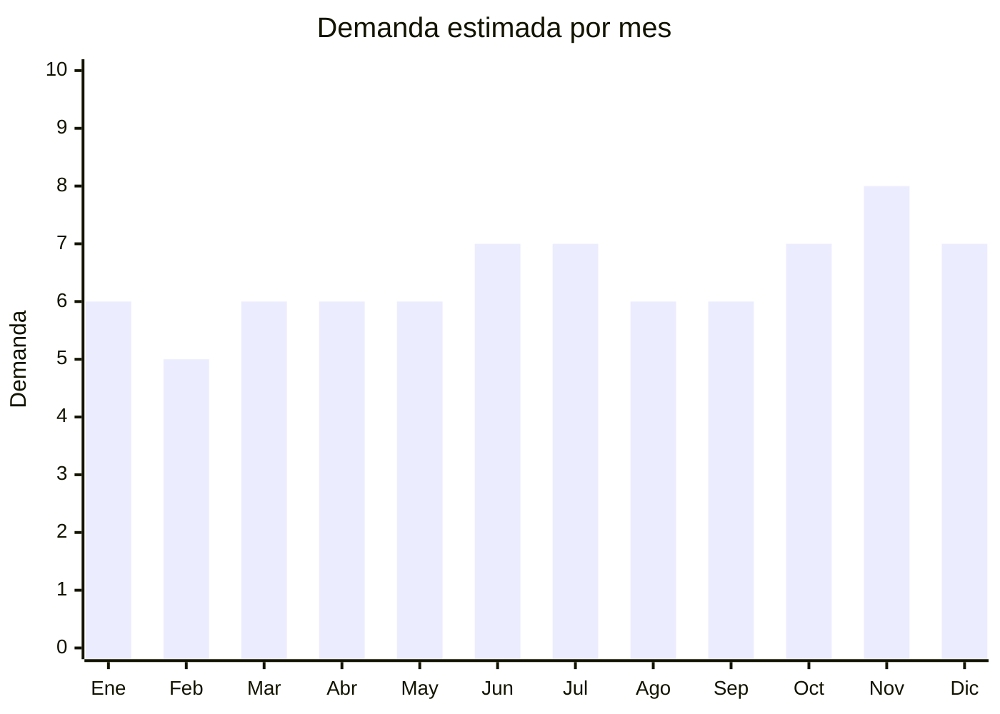

# Soportes de TV articulados

> **Capítulo NCM 73** — Manufacturas de fundición, hierro o acero | **Temporada:** Atemporal

## Qué es y por qué importarlo

Los soportes de TV son estructuras metálicas que permiten montar televisores en la pared o el techo, reemplazando el uso de muebles. Incluyen modelos fijos, inclinables y articulados (brazo extensible con giro completo). Es un producto de demanda permanente vinculado a la venta de televisores: cada TV vendida es un potencial soporte vendido.

China produce la inmensa mayoría de los soportes de TV del mundo, con fábricas concentradas en Guangdong y Zhejiang. Los precios FOB son extremadamente bajos (USD 3-15) frente a precios de venta de ARS 10.000-45.000 en Argentina, generando márgenes muy atractivos.

Este es un bestseller absoluto en MercadoLibre: vendedores como ELECTROLAND superan las 100,000 unidades vendidas y Proshop supera las 50,000. La demanda está completamente validada y el producto tiene baja tasa de devolución por ser mecánicamente simple.

## Datos clave

| Dato | Valor |
|------|-------|
| **Posiciones NCM típicas** | 7326.90.00 (otras manufacturas de hierro o acero) |
| **Derecho de importación** | 18% (DIE) + 3% tasa estadística |
| **Rango FOB típico** | USD 3.00 — USD 15.00 por unidad |
| **Precio de venta en Argentina** | ARS 10.000 — ARS 45.000 |
| **Margen bruto estimado** | 150% — 300% |
| **MOQ típico** | 100 — 500 unidades |
| **Demanda en MercadoLibre** | Muy alta (bestseller absoluto) |
| **Competencia en MercadoLibre** | Alta (pero mercado enorme) |
| **Dificultad para importar** | Fácil |
| **Certificaciones necesarias** | Ninguna obligatoria |
| **Antidumping** | Sin antidumping vigente |

## Demanda y mercado en Argentina

- **Volumen de mercado:** Ventas masivas. Los principales vendedores superan las 100,000 unidades vendidas. Cada TV nueva vendida genera demanda de soporte.
- **Tendencia:** Estable-Creciente — las pantallas son cada vez más grandes y livianas, impulsando la adopción de soportes articulados que permiten mover y girar el TV.
- **Perfil del comprador:** Hogares que compran TV nueva, oficinas, comercios, consultorios, gimnasios, bares/restaurantes.
- **Canales de venta principales:** MercadoLibre (canal dominante), ferreterías, casas de electrónica, instaladores/electricistas (B2B).

<Note>
**ELECTROLAND** supera las 100,000 unidades vendidas en MercadoLibre y **Proshop** supera las 50,000 unidades. Estos números demuestran que el mercado de soportes de TV es masivo y hay espacio para múltiples vendedores con alto volumen. La clave es precio competitivo + envío rápido + buenas fotos de producto.
</Note>

## Competencia

| Aspecto | Situación |
|---------|-----------|
| **Cantidad de vendedores en ML** | +300 vendedores activos |
| **Hay marcas dominantes** | Sí: ELECTROLAND, Proshop dominan por volumen y reputación |
| **Tipo de competidores** | Importadores directos (mayoría), sin fabricación local relevante |
| **Rango de precios en ML** | ARS 10.000 — ARS 45.000 |
| **Posibilidad de diferenciarse** | Media |

**Cómo diferenciarse:**
- Soportes para pantallas extra grandes (75"-85") que los competidores no cubren bien
- Soportes de techo (segmento menos competido)
- Kits completos con cable HDMI, nivel y organizador de cables incluidos
- Marca propia con packaging profesional y manual en español

## Variantes y subtipos más comunes

| Subtipo / Variante | FOB aprox. | Venta AR aprox. | Nota |
|--------------------|-----------|-----------------|------|
| Soporte fijo 32"-55" | USD 3.00 — 5.00 | ARS 10.000 — 18.000 | Producto de entrada |
| Soporte inclinable 32"-65" | USD 4.00 — 7.00 | ARS 12.000 — 25.000 | Buena relación precio-volumen |
| Soporte articulado brazo 32"-55" | USD 5.00 — 10.00 | ARS 18.000 — 35.000 | **Más vendido** |
| Soporte articulado brazo 55"-75" | USD 8.00 — 15.00 | ARS 25.000 — 45.000 | Mayor margen unitario |
| Soporte de techo | USD 6.00 — 12.00 | ARS 15.000 — 35.000 | Nicho menos competido |

## Regulaciones y requisitos

<Tabs>
  <Tab title="Certificaciones">
    | Organismo | Requiere | Detalle |
    |-----------|----------|---------|
    | ARCA (Aduana) | Sí siempre | Despacho estándar |
    | ANMAT | No | No es cosmético ni alimento |
    | ENACOM | No | No es electrónico (es estructura mecánica) |
    | INTI | No | No aplica |

    Producto sin barreras regulatorias. Importación libre y directa.
  </Tab>

  <Tab title="Etiquetado">
    | Requisito | Aplica |
    |-----------|--------|
    | Idioma español | Sí |
    | Datos del importador | Sí |
    | Peso máximo soportado | Sí (dato crítico de seguridad) |
    | Rango de pulgadas compatible | Sí |
    | País de origen | Sí |
    | Instrucciones de instalación | Sí (incluir manual en español) |
    | Garantía legal 6 meses | Sí |
  </Tab>

  <Tab title="Restricciones">
    Sin restricciones especiales. Producto de importación libre.

    **Nota:** Asegurarse de que la tornillería incluida sea compatible con los estándares VESA internacionales (VESA 100x100 a VESA 600x400) para garantizar compatibilidad con todas las marcas de TV.
  </Tab>
</Tabs>

## Logística

| Dato | Valor |
|------|-------|
| **Peso típico por unidad** | 1.0 — 5.0 kg (según tamaño) |
| **Volumen típico** | Bajo-Medio (producto compacto y pesado) |
| **Fragilidad** | Muy baja (estructura metálica sólida) |
| **Envío recomendado** | Marítimo LCL — producto pesado, flete se cobra por peso |
| **Tiempo total estimado** | 50 — 80 días (marítimo) |
| **Baterías de litio** | No |
| **Requiere empaque especial** | No — caja individual con tornillería incluida |

<Note>
**Ventaja logística:** Los soportes de TV son compactos, pesados y prácticamente indestructibles durante el transporte. A diferencia de productos frágiles, la tasa de daño en tránsito es casi nula. Esto permite envíos con empaque estándar sin preocupaciones.
</Note>

## Estacionalidad



| Aspecto | Detalle |
|---------|---------|
| **Meses pico** | Junio-Julio (Mundial, eventos deportivos — pico de venta de TV), Noviembre (CyberMonday/Black Friday — pico de venta de TV) |
| **Meses valle** | Febrero — demanda estable todo el año |
| **Cuándo pedir** | Mantener stock permanente — ante eventos deportivos grandes, reforzar stock 3 meses antes |

## Ventajas y riesgos

<CardGroup cols={2}>
  <Card title="Ventajas" icon="circle-check">
    - Bestseller absoluto en MercadoLibre (mercado validado)
    - Sin regulaciones ni certificaciones
    - Producto indestructible en transporte
    - Márgenes excelentes (150-300%)
    - Demanda vinculada a venta de TV (creciente)
  </Card>
  <Card title="Riesgos" icon="triangle-exclamation">
    - Competencia de vendedores con +100,000 ventas y reputación
    - Guerra de precios en modelos básicos
    - Producto pesado (flete marítimo se cobra por peso)
    - Diferenciación limitada (producto commodity)
    - Necesidad de volumen alto para competir en precio
  </Card>
</CardGroup>

## Palabras clave para buscar en Alibaba

```
TV wall mount wholesale, articulating TV bracket, full motion TV mount,
swivel TV wall bracket 55 inch, ceiling TV mount, fixed TV mount wholesale,
TV bracket factory, VESA wall mount
```

## Fuentes

- [MercadoLibre Argentina — Soportes de TV](https://listado.mercadolibre.com.ar/soporte-tv)
- [Alibaba — TV wall mount wholesale](https://www.alibaba.com/showroom/tv-wall-mount-wholesale.html)
