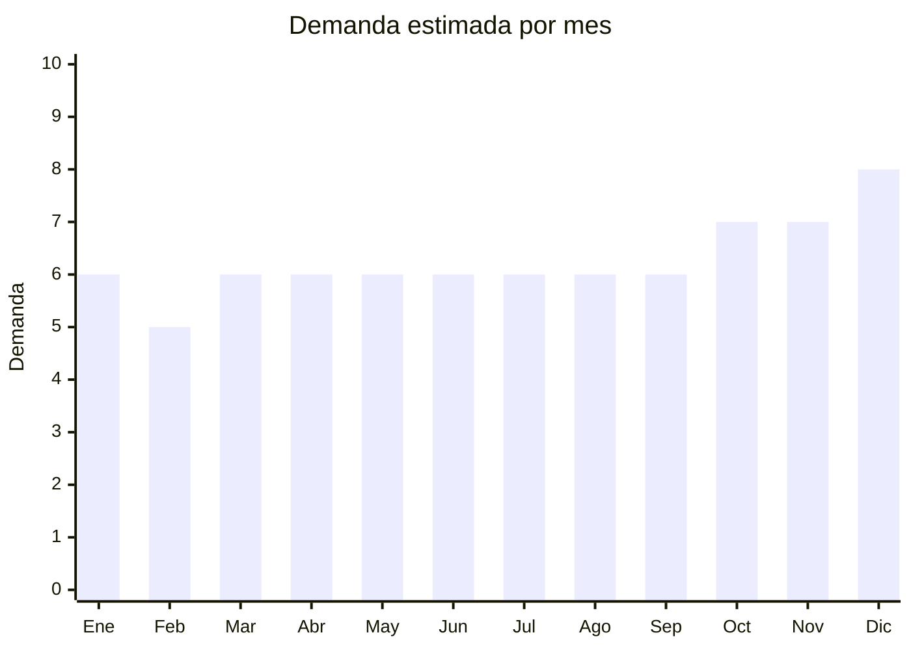

# Utensilios de cocina de acero inoxidable

> **Capítulo NCM 73** — Manufacturas de fundición, hierro o acero | **Temporada:** Atemporal

## Qué es y por qué importarlo

Los utensilios de cocina de acero inoxidable incluyen espátulas, cucharones, pinzas, espumaderas, coladores, batidores, ralladores, sets de cubiertos y accesorios de cocina profesional. Es un producto de uso diario con reposición permanente: toda cocina hogareña, restaurante y servicio gastronómico necesita utensilios.

China concentra la mayor producción mundial de utensilios de acero inoxidable, con hubs principales en Jieyang (Guangdong) — capital china del acero inoxidable para cocina — y Yongkang (Zhejiang). Los precios FOB por set son muy competitivos (USD 2-10) y el producto tiene rotación constante por ser de consumo cotidiano.

La demanda es genuinamente atemporal: las personas cocinan todos los días del año. El segmento premium (acero 18/10, mango de silicona, diseño moderno) permite márgenes superiores diferenciándose de los utensilios básicos disponibles en bazares.

## Datos clave

| Dato | Valor |
|------|-------|
| **Posiciones NCM típicas** | 7323.93.00 (artículos de uso doméstico de acero inoxidable) |
| **Derecho de importación** | 18% (DIE) + 3% tasa estadística |
| **Rango FOB típico** | USD 2.00 — USD 10.00 por set |
| **Precio de venta en Argentina** | ARS 8.000 — ARS 40.000 |
| **Margen bruto estimado** | 150% — 250% |
| **MOQ típico** | 200 — 1,000 sets |
| **Demanda en MercadoLibre** | Alta |
| **Competencia en MercadoLibre** | Media-Alta |
| **Dificultad para importar** | Fácil |
| **Certificaciones necesarias** | Aptitud para contacto con alimentos (recomendado) |
| **Antidumping** | Sin antidumping vigente |

## Demanda y mercado en Argentina

- **Volumen de mercado:** Miles de publicaciones activas. Producto de consumo masivo presente en todos los canales: MercadoLibre, bazares, supermercados, tiendas de cocina.
- **Tendencia:** Estable — el acero inoxidable es el material preferido frente al plástico (percepción de calidad superior). Tendencia creciente en utensilios con mango de silicona y sets colgantes de diseño.
- **Perfil del comprador:** Hogares (reposición), parejas jóvenes amueblando, gastronómicos (restaurantes, bares), regalos (sets de cocina como regalo de casamiento/mudanza).
- **Canales de venta principales:** MercadoLibre, bazares, ferias, tiendas de cocina y hogar, mayoristas gastronómicos.

<Note>
Los **sets colgantes** de 6-8 utensilios en barra de acero son un formato de venta muy exitoso en MercadoLibre. Permiten vender a un ticket promedio superior (ARS 15.000-30.000) frente a utensilios sueltos. Buscar en Alibaba como "kitchen utensil set hanging rack".
</Note>

## Competencia

| Aspecto | Situación |
|---------|-----------|
| **Cantidad de vendedores en ML** | +300 vendedores activos |
| **Hay marcas dominantes** | Parcialmente: Tramontina tiene presencia, pero gran parte del mercado es genérico |
| **Tipo de competidores** | Importadores + Bazares mayoristas + Tramontina |
| **Rango de precios en ML** | ARS 8.000 — ARS 40.000 |
| **Posibilidad de diferenciarse** | Media-Alta |

**Cómo diferenciarse:**
- Sets completos con diseño coordinado y packaging premium (ideal para regalo)
- Utensilios con mango de silicona antideslizante y colores modernos
- Línea gastronómica profesional (acero más grueso, terminación espejo)
- Kits temáticos: parrilla, repostería, sushi, pasta

## Variantes y subtipos más comunes

| Subtipo / Variante | FOB aprox. | Venta AR aprox. | Nota |
|--------------------|-----------|-----------------|------|
| Utensilios sueltos (espátula, cucharón) | USD 0.50 — 1.50 | ARS 3.000 — 8.000 | Alto volumen, bajo ticket |
| Set 6 utensilios con barra colgante | USD 3.00 — 6.00 | ARS 12.000 — 25.000 | **Más vendido** |
| Set 12 utensilios completo | USD 5.00 — 10.00 | ARS 20.000 — 40.000 | Ticket alto |
| Cubiertos set x24 piezas | USD 4.00 — 8.00 | ARS 15.000 — 35.000 | Regalo clásico |
| Utensilios profesionales gastronómicos | USD 2.00 — 5.00/u | ARS 8.000 — 20.000/u | Nicho B2B |

## Regulaciones y requisitos

<Tabs>
  <Tab title="Certificaciones">
    | Organismo | Requiere | Detalle |
    |-----------|----------|---------|
    | ARCA (Aduana) | Sí siempre | Despacho estándar |
    | ANMAT | Recomendado | Para productos en contacto con alimentos |
    | ENACOM | No | No es electrónico |
    | INTI | No | No aplica |

    Para utensilios en contacto directo con alimentos se recomienda contar con certificación de materiales aptos (acero inoxidable grado alimentario 304/18-8 o 18/10). Solicitar al proveedor certificado de composición del acero.
  </Tab>

  <Tab title="Etiquetado">
    | Requisito | Aplica |
    |-----------|--------|
    | Idioma español | Sí |
    | Datos del importador | Sí |
    | Composición / materiales | Sí (acero inoxidable 304, 18/10, etc.) |
    | Apto contacto alimentos | Recomendado |
    | País de origen | Sí |
    | Garantía legal 6 meses | Sí |
  </Tab>

  <Tab title="Restricciones">
    Sin restricciones de importación específicas.

    **Nota:** Verificar que el acero inoxidable sea grado 304 (18/8) o superior. Los utensilios de acero 201 (grado inferior) son más baratos pero pueden liberar níquel y cromo. Usar solo grado 304 o 316 para evitar problemas de calidad y posibles reclamos.
  </Tab>
</Tabs>

## Logística

| Dato | Valor |
|------|-------|
| **Peso típico por set** | 0.5 — 2.0 kg |
| **Volumen típico** | Bajo (producto compacto y denso) |
| **Fragilidad** | Muy baja (acero inoxidable es prácticamente indestructible) |
| **Envío recomendado** | Marítimo LCL — producto pesado y compacto |
| **Tiempo total estimado** | 50 — 80 días (marítimo) |
| **Baterías de litio** | No |
| **Requiere empaque especial** | No — caja estándar con separadores |

## Estacionalidad



| Aspecto | Detalle |
|---------|---------|
| **Meses pico** | Octubre-Diciembre (regalos de fin de año, casamientos, mudanzas de verano) |
| **Meses valle** | Febrero — demanda estable todo el año |
| **Cuándo pedir** | Mantener stock permanente — reforzar en agosto para temporada de regalos |

## Ventajas y riesgos

<CardGroup cols={2}>
  <Card title="Ventajas" icon="circle-check">
    - Demanda permanente (producto de uso diario)
    - Producto indestructible en transporte
    - FOB muy bajo, márgenes atractivos
    - Ideal para armar sets y kits (aumenta ticket)
    - Sin regulaciones complejas
  </Card>
  <Card title="Riesgos" icon="triangle-exclamation">
    - Competencia de bazares con producto genérico barato
    - Tramontina tiene fuerte posicionamiento de marca
    - Calidad del acero variable (grado 201 vs 304)
    - Producto pesado (flete se cobra por peso)
    - Margen individual bajo en utensilios sueltos
  </Card>
</CardGroup>

## Palabras clave para buscar en Alibaba

```
stainless steel kitchen utensil set, cooking utensils set wholesale,
kitchen tool set hanging rack, stainless steel spatula wholesale,
304 stainless steel utensils, kitchen accessories set, cutlery set wholesale,
cooking tools stainless steel
```

## Fuentes

- [MercadoLibre Argentina — Utensilios cocina acero](https://listado.mercadolibre.com.ar/utensilios-cocina-acero-inoxidable)
- [Alibaba — Stainless steel kitchen utensil set](https://www.alibaba.com/showroom/stainless-steel-kitchen-utensil-set.html)
