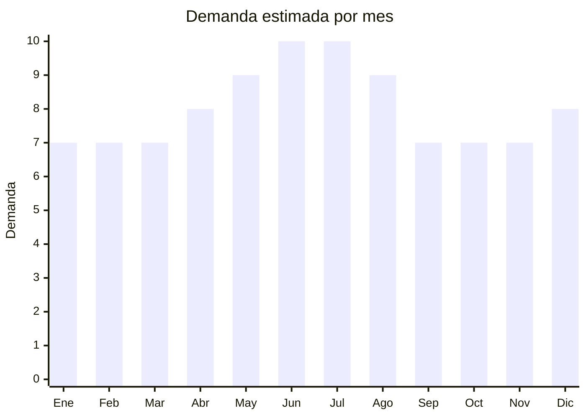

# Botellas térmicas y termos

> **Capítulo NCM 76** — Aluminio y sus manufacturas | **Temporada:** Atemporal

<Warning>
**Producto con demanda MASIVA.** Argentina es el mayor consumidor de mate del mundo. El termo es un artículo de uso diario para millones de personas. La competencia es alta pero el volumen lo compensa. Verificar que el aislamiento térmico mantenga temperatura por al menos 12 horas antes de hacer un pedido grande.
</Warning>

## Qué es y por qué importarlo

Las botellas térmicas y termos de aluminio (con interior de acero inoxidable o doble pared al vacío) incluyen termos cebadores para mate, botellas térmicas deportivas y termos clásicos de tapa-vaso. Argentina tiene una cultura matera única en el mundo: más del 90% de los hogares consume mate, lo que convierte al termo en un producto de consumo masivo con reposición constante.

China es el principal fabricante mundial de termos y botellas térmicas, con hubs productivos en Yongkang (Zhejiang) — conocida como "la capital del vacuum flask" — y Guangzhou. Las fábricas chinas producen para marcas globales como Stanley, Thermos y Contigo, y ofrecen OEM/ODM con MOQ accesibles para marca propia.

Los bestsellers en Argentina son el Rolan Autocebante (N.1 en ventas), Stanley Clásico (N.2) y Waterdog (N.3), lo que demuestra que tanto marcas nacionales como importadas conviven en el mercado.

## Datos clave

| Dato | Valor |
|------|-------|
| **Posiciones NCM típicas** | 7612.90.00 (recipientes de aluminio para bebidas), 7615.10.00 (artículos de uso doméstico de aluminio) |
| **Derecho de importación** | 18% (DIE) + 3% tasa estadística |
| **Rango FOB típico** | USD 2.00 — USD 10.00 por unidad |
| **Precio de venta en Argentina** | ARS 15.000 — ARS 50.000 |
| **Margen bruto estimado** | 150% — 250% |
| **MOQ típico** | 200 — 1.000 unidades |
| **Demanda en MercadoLibre** | Muy Alta |
| **Competencia en MercadoLibre** | Alta |
| **Dificultad para importar** | Media |
| **Certificaciones necesarias** | Certificado "Food Grade" del proveedor (recomendado) |
| **Antidumping** | No |

## Demanda y mercado en Argentina

- **Volumen de mercado:** Decenas de miles de publicaciones activas en MercadoLibre. Los vendedores top superan las 10,000+ unidades vendidas. El termo es uno de los productos más vendidos en la plataforma.
- **Tendencia:** Estable-Creciente — la cultura del mate no baja nunca. La tendencia de termos "premium" (tipo Stanley) elevó el ticket promedio.
- **Perfil del comprador:** Cualquier persona que tome mate (90%+ de la población), trabajadores, estudiantes, deportistas, viajeros.
- **Canales de venta principales:** MercadoLibre, bazares, ferreterías, artículos de camping, supermercados, tiendas de regalos.

<Note>
El fenómeno **Stanley** en Argentina disparó la demanda de termos premium. Termos que antes se vendían a ARS 8.000-10.000 ahora tienen versiones "estilo Stanley" que se venden a ARS 25.000-50.000. Esto abrió un segmento premium que antes no existía.
</Note>

## Competencia

| Aspecto | Situación |
|---------|-----------|
| **Cantidad de vendedores en ML** | +1.000 vendedores activos |
| **Hay marcas dominantes** | Sí: Rolan (N.1), Stanley (N.2), Waterdog (N.3). Genéricos importados dominan el volumen medio-bajo |
| **Tipo de competidores** | Importadores directos + marcas nacionales |
| **Rango de precios en ML** | ARS 10.000 — ARS 50.000 |
| **Posibilidad de diferenciarse** | Media |

**Cómo diferenciarse:**
- Termo autocebante (sistema de vertido cebador para mate, sin salpicar)
- Marca propia con diseños exclusivos (estampados, colores pastel, ediciones temáticas)
- Termos con sistema pico cebador + manija ergonómica
- Packaging premium tipo gift box (ideal para regalos)
- Grabado láser personalizado (servicio de customización)

## Variantes y subtipos más comunes

| Subtipo / Variante | FOB aprox. | Venta AR aprox. | Nota |
|--------------------|-----------|-----------------|------|
| Termo clásico 1L tapa-vaso | USD 2.00 — 4.00 | ARS 15.000 — 25.000 | Alta rotación |
| Termo autocebante pico cebador | USD 3.00 — 6.00 | ARS 20.000 — 35.000 | **Más vendido en Argentina** |
| Botella térmica deportiva 500ml | USD 2.00 — 5.00 | ARS 10.000 — 25.000 | Público joven/fitness |
| Termo estilo Stanley 1.2L | USD 5.00 — 10.00 | ARS 30.000 — 50.000 | Segmento premium |
| Mate térmico con termo integrado | USD 4.00 — 8.00 | ARS 25.000 — 45.000 | Producto 2 en 1 |

## Regulaciones y requisitos

<Tabs>
  <Tab title="Certificaciones">
    | Organismo | Requiere | Detalle |
    |-----------|----------|---------|
    | ARCA (Aduana) | Sí siempre | Despacho estándar |
    | ANMAT | No obligatorio | Recomendable si se comercializa para contacto con alimentos |
    | INTI | No obligatorio | Test de retención térmica opcional como argumento de venta |
    | ENACOM | No | No es electrónico |

    **Recomendación:** Solicitar al proveedor chino certificados de "Food Grade" (FDA o equivalente), test de retención térmica (horas a temperatura) y certificado de materiales (acero 304 / 316). Estos documentos no son obligatorios para la aduana pero generan confianza en el comprador final y protección legal.
  </Tab>

  <Tab title="Etiquetado">
    | Requisito | Aplica |
    |-----------|--------|
    | Idioma español | Sí |
    | Datos del importador | Sí |
    | Composición / materiales | Sí ("Aluminio exterior, acero inoxidable 304 interior") |
    | Capacidad en ml/L | Sí |
    | Instrucciones de uso y limpieza | Recomendado |
    | País de origen | Sí |
    | Garantía legal 6 meses | Sí |
    | Tiempo de retención térmica | Recomendado (argumento de venta) |
  </Tab>

  <Tab title="Restricciones">
    Sin restricciones especiales. No hay antidumping ni licencias previas para termos de aluminio.

    **Atención:** Si el termo tiene componentes electrónicos (pantalla de temperatura LED, por ejemplo), podría requerir intervención de ENACOM y clasificar parcialmente en Cap. 85.
  </Tab>
</Tabs>

## Logística

| Dato | Valor |
|------|-------|
| **Peso típico por unidad** | 0.30 — 0.60 kg |
| **Volumen típico** | Medio-Alto (termos son cilíndricos y huecos — volumen mayor al peso) |
| **Fragilidad** | Baja (aluminio y acero son resistentes a golpes) |
| **Envío recomendado** | Marítimo LCL (hasta 500 u.) / FCL (desde 1,000 u.) |
| **Tiempo total estimado** | 45 — 75 días (marítimo) |
| **Baterías de litio** | No (salvo modelos con pantalla LED) |
| **Requiere empaque especial** | Sí — cajas individuales para evitar abolladuras y rayones en el aluminio |

## Estacionalidad



| Aspecto | Detalle |
|---------|---------|
| **Meses pico** | Mayo-Agosto (invierno — mayor consumo de mate caliente y bebidas calientes), Diciembre (regalos de fin de año) |
| **Meses valle** | Enero-Marzo (verano — menor uso de bebidas calientes, aunque no cae significativamente porque el mate se toma todo el año) |
| **Cuándo pedir** | Febrero-Marzo para tener stock en mayo (inicio de temporada fría) |

## Ventajas y riesgos

<CardGroup cols={2}>
  <Card title="Ventajas" icon="circle-check">
    - Demanda masiva y constante (cultura del mate)
    - Producto de reposición (se abolla, pierde vacío, se regala)
    - Segmento premium en crecimiento (efecto Stanley)
    - Ideal para marca propia y personalización
    - Sin barreras regulatorias complejas
  </Card>
  <Card title="Riesgos" icon="triangle-exclamation">
    - Competencia muy alta con marcas establecidas
    - Termos baratos que pierden vacío térmico generan devoluciones
    - Abolladuras en transporte si el packaging no es adecuado
    - Marcas como Stanley tienen propiedad intelectual — no copiar diseños
    - Peso y volumen aumentan el costo de flete
  </Card>
</CardGroup>

<Warning>
**Verificar retención térmica antes de comprar.** La queja N.1 en termos importados es "no mantiene la temperatura". Pedir al proveedor test de retención (idealmente 12+ horas a más de 60°C) y verificar con muestras propias. Un termo que no retiene calor destruye tu reputación en MercadoLibre.
</Warning>

## Palabras clave para buscar en Alibaba

```
vacuum flask wholesale, thermos bottle stainless steel, mate thermos Argentina,
double wall vacuum insulated bottle, thermal bottle 1 liter OEM,
yerba mate thermos flask, stainless steel water bottle vacuum,
travel thermos flask custom logo, insulated bottle manufacturer
```

## Fuentes

- [MercadoLibre Argentina — Termos](https://listado.mercadolibre.com.ar/termo)
- [Alibaba — Vacuum flask thermos wholesale](https://www.alibaba.com/showroom/vacuum-flask-thermos.html)
