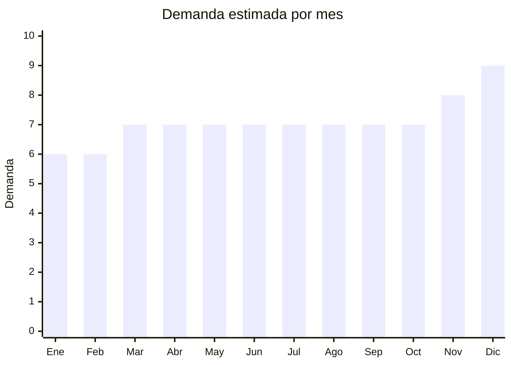

# Papel aluminio y bandejas descartables

> **Capítulo NCM 76** — Aluminio y sus manufacturas | **Temporada:** Atemporal

## Qué es y por qué importarlo

El papel aluminio (foil) en rollos y las bandejas descartables de aluminio son productos de consumo masivo utilizados diariamente en hogares, restaurantes, rotiserías, servicios de catering y delivery. El papel aluminio se usa para envolver alimentos, cubrir fuentes y cocinar al horno. Las bandejas descartables se usan para envasar comidas preparadas, delivery de viandas y presentación de alimentos en eventos.

El boom del **delivery y las dark kitchens** en Argentina post-pandemia multiplicó la demanda de bandejas descartables de aluminio, que son preferidas sobre las plásticas por ser aptas para horno/microondas y percibidas como más higiénicas. Es un producto de **consumo recurrente** — quien lo usa, lo compra todos los meses en cantidad.

China es el mayor productor mundial de papel aluminio y bandejas de aluminio, con costos FOB muy por debajo de la producción local argentina. Los principales hubs son Henan (Zhengzhou) para foil y Guangdong para bandejas conformadas.

## Datos clave

| Dato | Valor |
|------|-------|
| **Posiciones NCM típicas** | 7607.11.00 (hojas y tiras delgadas de aluminio, sin soporte, laminadas) |
| **Derecho de importación** | 14% — 18% (DIE) + 3% tasa estadística |
| **Rango FOB típico** | USD 0.02 — USD 0.10 por unidad (bandejas) / USD 0.80 — USD 2.50 por rollo (foil hogareño) |
| **Precio de venta en Argentina** | ARS 1.000 — ARS 8.000 (según presentación y cantidad) |
| **Margen bruto estimado** | 100% — 200% |
| **MOQ típico** | 5.000 — 50.000 unidades (bandejas) / 1.000 — 10.000 rollos (foil) |
| **Demanda en MercadoLibre** | Alta |
| **Competencia en MercadoLibre** | Media-Alta |
| **Dificultad para importar** | Fácil |
| **Certificaciones necesarias** | Certificado "Food Grade" del proveedor (recomendado) |
| **Antidumping** | No |

## Demanda y mercado en Argentina

- **Volumen de mercado:** Producto de consumo masivo presente en todos los supermercados y mayoristas. En MercadoLibre las ventas mayoristas (packs de 100-1.000 bandejas) dominan. Distribuidores gastronómicos mueven miles de unidades mensuales.
- **Tendencia:** Estable-Creciente — el crecimiento del delivery, catering y dark kitchens impulsa la demanda de bandejas. El papel aluminio es un básico de cocina que no baja nunca.
- **Perfil del comprador:** Restaurantes y rotiserías (B2B mayorista), servicios de catering, dark kitchens y delivery, hogares (consumo minorista), empresas de viandas.
- **Canales de venta principales:** MercadoLibre (packs mayoristas), distribuidores gastronómicos, supermercados mayoristas (Vital, Makro, Diarco), casas de cotillón y descartables.

<Note>
**El negocio real está en la venta mayorista B2B.** Mientras que el consumidor hogareño compra 1 rollo por mes, un restaurante consume 50-100 bandejas por semana. Apuntar a distribución gastronómica (restaurantes, rotiserías, catering) genera volumen y recurrencia que el retail no iguala.
</Note>

## Competencia

| Aspecto | Situación |
|---------|-----------|
| **Cantidad de vendedores en ML** | +300 vendedores activos |
| **Hay marcas dominantes** | Sí en foil: Aluplata, Alupack son marcas conocidas. En bandejas genéricas la competencia es más atomizada |
| **Tipo de competidores** | Fabricantes locales + importadores + distribuidores mayoristas |
| **Rango de precios en ML** | ARS 1.000 — ARS 8.000 según presentación |
| **Posibilidad de diferenciarse** | Media |

**Cómo diferenciarse:**
- Packs mayoristas con precio agresivo para gastronómicos
- Bandejas con tapa de aluminio o tapa plástica transparente incluida
- Variedad de tamaños (desde porción individual hasta bandeja familiar)
- Marca propia con packaging profesional
- Foil extra grueso (18-20 micrones vs. 11 estándar) como producto premium

## Variantes y subtipos más comunes

| Subtipo / Variante | FOB aprox. | Venta AR aprox. | Nota |
|--------------------|-----------|-----------------|------|
| Bandeja aluminio porción individual (250ml) | USD 0.02 — 0.04/u | ARS 50 — 150/u (pack x100) | Delivery, viandas |
| Bandeja aluminio medio gastronómico (750ml) | USD 0.03 — 0.06/u | ARS 80 — 200/u (pack x100) | **Más vendido** — restaurantes |
| Bandeja aluminio familiar (1.5L) con tapa | USD 0.05 — 0.10/u | ARS 150 — 350/u (pack x50) | Catering, eventos |
| Rollo papel aluminio hogareño (30cm x 5m) | USD 0.80 — 1.50/rollo | ARS 1.500 — 3.000/rollo | Consumo hogar |
| Rollo papel aluminio gastronómico (30cm x 100m) | USD 2.00 — 5.00/rollo | ARS 5.000 — 8.000/rollo | Restaurantes, rotiserías |

## Regulaciones y requisitos

<Tabs>
  <Tab title="Certificaciones">
    | Organismo | Requiere | Detalle |
    |-----------|----------|---------|
    | ARCA (Aduana) | Sí siempre | Despacho estándar |
    | ANMAT | Recomendable | Al ser contacto directo con alimentos, idealmente contar con certificado "Food Grade" del proveedor |
    | INAL (código alimentario) | Consultar | El Código Alimentario Argentino regula materiales en contacto con alimentos |
    | ENACOM | No | No es electrónico |

    **Recomendación:** Solicitar al proveedor certificado de conformidad con normas de contacto alimentario (FDA 21 CFR 175-178 o equivalente europeo EN 602/2004). Verificar que el aluminio no contenga niveles de plomo o cadmio fuera de norma. Estos certificados protegen legalmente y son requeridos por clientes gastronómicos grandes.
  </Tab>

  <Tab title="Etiquetado">
    | Requisito | Aplica |
    |-----------|--------|
    | Idioma español | Sí |
    | Datos del importador | Sí |
    | Composición / materiales | Sí ("Aluminio grado alimentario") |
    | Dimensiones (largo x ancho) | Sí |
    | Espesor en micrones | Recomendado |
    | Apto para horno/microondas | Recomendado (argumento de venta) |
    | País de origen | Sí |
    | Cantidad por pack | Sí |
  </Tab>

  <Tab title="Restricciones">
    Sin restricciones especiales de importación. No hay antidumping ni licencias previas.

    **Atención:** Verificar que el aluminio cumpla con los estándares de contacto alimentario del Código Alimentario Argentino (CAA). Aunque no se exige certificación formal en aduana, la ANMAT puede intervenir si hay denuncias de producto no apto para contacto con alimentos.
  </Tab>
</Tabs>

## Logística

| Dato | Valor |
|------|-------|
| **Peso típico** | Bandejas: 0.01 — 0.05 kg/u. Rollos: 0.15 — 1.00 kg/rollo |
| **Volumen típico** | Alto (bandejas apiladas ocupan volumen significativo por ser huecas) |
| **Fragilidad** | Media (bandejas se deforman fácilmente si se aplastan — apilar correctamente) |
| **Envío recomendado** | Marítimo LCL o FCL (el volumen alto justifica FCL si el pedido es grande) |
| **Tiempo total estimado** | 45 — 75 días (marítimo) |
| **Baterías de litio** | No |
| **Requiere empaque especial** | Sí — bandejas apiladas en cajas rígidas con refuerzo para evitar aplastamiento |

<Warning>
**El flete pesa más que el producto.** Las bandejas de aluminio son extremadamente livianas pero ocupan mucho volumen (son huecas). El costo de flete se calcula por CBM (volumen), no por peso. Optimizar el apilamiento y la cantidad por caja es fundamental para que los números cierren. Pedir al proveedor que maximice la cantidad de bandejas por caja.
</Warning>

## Estacionalidad



| Aspecto | Detalle |
|---------|---------|
| **Meses pico** | Noviembre-Diciembre (fiestas — catering, eventos, cenas familiares consumen enormes cantidades de bandejas y foil) |
| **Meses valle** | Enero-Febrero (vacaciones — menor actividad gastronómica y de catering) |
| **Cuándo pedir** | Agosto para tener stock en noviembre (temporada de fiestas y eventos) |

## Ventajas y riesgos

<CardGroup cols={2}>
  <Card title="Ventajas" icon="circle-check">
    - Consumo masivo y recurrente (compra repetitiva)
    - Mercado enorme: hogares + gastronomía + catering
    - Producto simple sin certificaciones complejas
    - Crecimiento del delivery impulsa la demanda
    - FOB extremadamente bajo — alta cantidad por envío
  </Card>
  <Card title="Riesgos" icon="triangle-exclamation">
    - Margen individual bajo — necesita volumen para ser rentable
    - Competencia con fabricantes locales establecidos
    - Volumen alto vs. peso bajo = flete por CBM costoso
    - Bandejas se deforman fácilmente en transporte
    - Producto commodity — difícil diferenciar por marca
  </Card>
</CardGroup>

## Palabras clave para buscar en Alibaba

```
aluminum foil container wholesale, disposable aluminum tray food,
aluminum foil roll food grade, takeaway aluminum container with lid,
aluminum foil pan catering, household aluminum foil roll,
food packaging aluminum tray OEM, aluminum foil container manufacturer
```

## Fuentes

- [MercadoLibre Argentina — Bandejas aluminio descartables](https://listado.mercadolibre.com.ar/bandeja-aluminio-descartable)
- [Alibaba — Aluminum foil container wholesale](https://www.alibaba.com/showroom/aluminum-foil-container.html)
