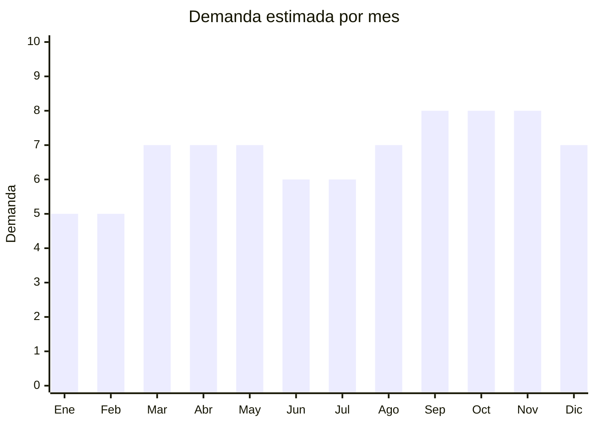

# Perfiles de aluminio para tiras LED

> **Capítulo NCM 76** — Aluminio y sus manufacturas | **Temporada:** Atemporal

## Qué es y por qué importarlo

Los perfiles de aluminio para tiras LED son canaletas extruidas de aluminio (con difusor de policarbonato, tapas laterales y clips de montaje) diseñadas para alojar y proteger tiras LED. Cumplen triple función: disipan el calor de los LEDs (extendiendo su vida útil), protegen la tira de polvo y golpes, y difuminan la luz para un acabado profesional sin puntos visibles.

Este es un **producto nicho complementario** a las tiras LED (Cap. 85), cuyo mercado explotó en Argentina con la tendencia de iluminación decorativa en cocinas, bajo mesadas, muebles, escaleras y locales comerciales. Todo el que compra una tira LED necesita un perfil para instalarla correctamente, lo que genera demanda recurrente y cruzada.

Vendedores como DEMASLED superan las 5,000 unidades vendidas, demostrando que aunque es un producto de nicho, el volumen es significativo. China (especialmente Foshan y Shenzhen, Guangdong) concentra la producción mundial de perfiles de aluminio.

## Datos clave

| Dato | Valor |
|------|-------|
| **Posiciones NCM típicas** | 7604.29.00 (perfiles de aleación de aluminio) |
| **Derecho de importación** | 14% — 18% (DIE) + 3% tasa estadística |
| **Rango FOB típico** | USD 0.50 — USD 3.00 por metro |
| **Precio de venta en Argentina** | ARS 2.000 — ARS 15.000 por metro o kit |
| **Margen bruto estimado** | 200% — 300% |
| **MOQ típico** | 500 — 2.000 metros |
| **Demanda en MercadoLibre** | Media-Alta |
| **Competencia en MercadoLibre** | Media |
| **Dificultad para importar** | Fácil |
| **Certificaciones necesarias** | Ninguna obligatoria |
| **Antidumping** | No |

## Demanda y mercado en Argentina

- **Volumen de mercado:** Cientos de publicaciones activas en MercadoLibre. Los vendedores especializados en iluminación LED (como DEMASLED) superan las 5,000+ unidades. Es un mercado en expansión constante.
- **Tendencia:** Creciente — cada vez más arquitectos, diseñadores de interiores y dueños de locales comerciales usan tiras LED con perfil profesional. TikTok e Instagram impulsan la estética de "luz indirecta".
- **Perfil del comprador:** Electricistas e instaladores (B2B), arquitectos/diseñadores, dueños de locales comerciales, DIY hogareños, carpinteros (muebles con iluminación).
- **Canales de venta principales:** MercadoLibre, casas de iluminación, ferreterías especializadas, distribuidores eléctricos.

<Note>
**Venta cruzada obligatoria.** Quien compra un perfil de aluminio necesita también la tira LED, la fuente de alimentación y el controlador. Ofrecer kits completos (perfil + tira + fuente) aumenta el ticket promedio entre 3x y 5x. Los vendedores más exitosos venden el "sistema completo", no componentes sueltos.
</Note>

## Competencia

| Aspecto | Situación |
|---------|-----------|
| **Cantidad de vendedores en ML** | +150 vendedores activos |
| **Hay marcas dominantes** | Parcialmente: DEMASLED y algunos distribuidores especializados. No hay marcas de perfil dominantes como tal |
| **Tipo de competidores** | Importadores directos + distribuidores de iluminación |
| **Rango de precios en ML** | ARS 2.000 — ARS 15.000 por metro/kit |
| **Posibilidad de diferenciarse** | Alta |

**Cómo diferenciarse:**
- Vender kits completos (perfil + difusor + tapas + clips + tira LED + fuente)
- Ofrecer perfiles especiales (esquineros, empotrados, colgantes) que la competencia no tiene
- Corte a medida (servicio de corte personalizado)
- Guías de instalación y videos tutoriales como valor agregado
- Perfiles extra anchos para tiras LED dobles (no comunes en Argentina)

## Variantes y subtipos más comunes

| Subtipo / Variante | FOB aprox. | Venta AR aprox. | Nota |
|--------------------|-----------|-----------------|------|
| Perfil superficie plano (17x7mm) | USD 0.50 — 1.00/m | ARS 2.000 — 5.000/m | **Más vendido** — bajo mesada, estantes |
| Perfil esquinero 45° (16x16mm) | USD 0.60 — 1.20/m | ARS 3.000 — 7.000/m | Rincones de cocina, vitrinas |
| Perfil empotrable (para yeso/durlock) | USD 0.80 — 1.50/m | ARS 4.000 — 8.000/m | Obra nueva, cielorraso |
| Perfil colgante circular/ovalado | USD 1.50 — 3.00/m | ARS 8.000 — 15.000/m | Oficinas, locales comerciales |
| Perfil flexible (tiras curvas) | USD 1.00 — 2.50/m | ARS 5.000 — 12.000/m | Diseño de interiores premium |

## Regulaciones y requisitos

<Tabs>
  <Tab title="Certificaciones">
    | Organismo | Requiere | Detalle |
    |-----------|----------|---------|
    | ARCA (Aduana) | Sí siempre | Despacho estándar |
    | INTI | No | No es un producto eléctrico (es solo la canaleta de aluminio) |
    | ENACOM | No | No tiene componentes electrónicos |
    | ANMAT | No | No es contacto con alimentos |

    **Recomendación:** Solicitar al proveedor ficha técnica con especificaciones del aluminio (aleación 6063-T5 es el estándar), espesor de pared, y acabado superficial (anodizado o pintado). Estos datos son útiles para la venta técnica a electricistas y arquitectos.
  </Tab>

  <Tab title="Etiquetado">
    | Requisito | Aplica |
    |-----------|--------|
    | Idioma español | Sí |
    | Datos del importador | Sí |
    | Composición / materiales | Sí ("Aluminio 6063-T5, difusor policarbonato") |
    | Dimensiones | Sí (largo, ancho, alto del perfil) |
    | Compatibilidad con tiras LED | Recomendado (ancho máximo de tira que acepta) |
    | País de origen | Sí |
    | Garantía legal 6 meses | Sí |
  </Tab>

  <Tab title="Restricciones">
    Sin restricciones especiales. No hay antidumping ni licencias previas para perfiles de aluminio.

    **Atención:** Importar solo los perfiles (sin tiras LED ni fuentes) simplifica enormemente el despacho aduanero. Si se importan kits con componentes eléctricos (tiras LED, transformadores), esos componentes sí requieren intervención de ENACOM y clasifican en Cap. 85.
  </Tab>
</Tabs>

## Logística

| Dato | Valor |
|------|-------|
| **Peso típico por metro** | 0.15 — 0.50 kg |
| **Volumen típico** | Bajo-Medio (barras largas de 1-2 metros — largos pero poco volumen) |
| **Fragilidad** | Baja (aluminio es resistente, pero los difusores de policarbonato pueden rayarse) |
| **Envío recomendado** | Marítimo LCL |
| **Tiempo total estimado** | 45 — 75 días (marítimo) |
| **Baterías de litio** | No |
| **Requiere empaque especial** | Sí — protección individual con film para evitar rayones en el anodizado y en los difusores |

<Warning>
**Cuidado con las medidas de corte.** Los perfiles vienen en barras de 1, 2 o 3 metros. Barras de 3 metros pueden generar problemas de embalaje y sobrecostos de flete. El estándar más práctico para importar y vender es **barras de 1 metro** (fácil de embalar, enviar por correo y almacenar).
</Warning>

## Estacionalidad



| Aspecto | Detalle |
|---------|---------|
| **Meses pico** | Marzo-Mayo (inicio de obras, refacciones post-verano), Septiembre-Noviembre (refacciones de primavera, preparación de locales para fiestas) |
| **Meses valle** | Enero-Febrero (vacaciones, obra parada) |
| **Cuándo pedir** | Diciembre para tener stock en marzo (arranque de temporada de obra) |

## Ventajas y riesgos

<CardGroup cols={2}>
  <Card title="Ventajas" icon="circle-check">
    - Margen muy alto (200-300%)
    - Producto liviano y fácil de almacenar
    - Complementario a tiras LED (venta cruzada)
    - Competencia media — nicho no saturado
    - Sin certificaciones obligatorias
    - Ideal para especializarse en un nicho
  </Card>
  <Card title="Riesgos" icon="triangle-exclamation">
    - Nicho específico — mercado más chico que productos masivos
    - Requiere conocimiento técnico para asesorar al cliente
    - Difusores baratos amarillean con el calor del LED
    - Perfiles de baja calidad no disipan bien el calor
    - Dependencia del mercado de tiras LED
  </Card>
</CardGroup>

## Palabras clave para buscar en Alibaba

```
LED aluminum profile wholesale, LED strip channel extrusion,
LED profile diffuser cover, corner LED aluminum channel 45 degree,
recessed LED profile plaster, aluminum LED housing manufacturer,
LED strip light aluminum extrusion OEM, surface mount LED channel
```

## Fuentes

- [MercadoLibre Argentina — Perfil aluminio tira LED](https://listado.mercadolibre.com.ar/perfil-aluminio-tira-led)
- [Alibaba — LED aluminum profile](https://www.alibaba.com/showroom/led-aluminum-profile.html)
